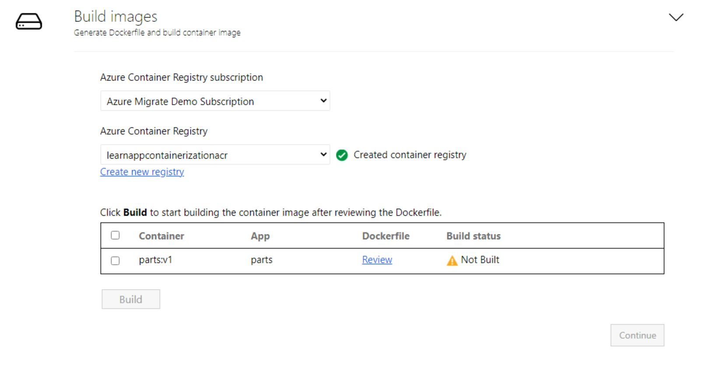

For this exercise, we'll use Azure Container Registry and its features to build and store the container images. Azure Container Registry allows you to build, store, and manage container images and artifacts in a private registry for all types of container deployments. Azure Migrate: App Containerization uses Azure Container Registry Tasks to build container images in Azure on-demand and then store those images.

## Build container image

1. **Create Azure Container Registry**: Create a new Azure Container Registry to build and store the container images for the apps. Select the **Create new registry** option to create a new ACR called **learnappcontainerizationacr**.

    

2. **Review the Dockerfile**: The Dockerfile needed to build the container images for each selected application is generated at the beginning of the build step. Select **Review** to review the Dockerfile. You can also add any necessary customizations to the Dockerfile in the review step and save the changes before starting the build process. We won't be making any changes to the Dockerfile in this exercise.

3. **Trigger build process**: Select the application for which to build images, then select **Build**. This will start the container image build for each application. The tool keeps monitoring the build status continuously and will let you proceed to the next step upon successful completion of the build.

4. **Track build status**: You can also monitor progress of the build step by selecting the **Build in Progress** link under the status column. The link takes a couple of minutes to be active after you've triggered the build process.  

5. Once the build is completed, select **Continue** to specify deployment settings.
