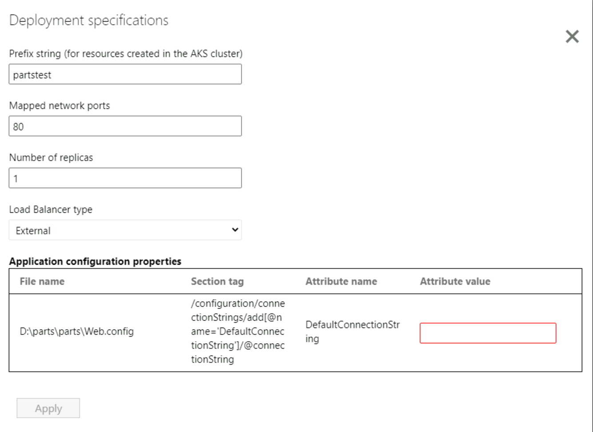

Once the container image is built, the next step is to deploy the application as a container on AKS.

AKS simplifies deploying a managed Kubernetes cluster in Azure by offloading the operational overhead to Azure. As a hosted Kubernetes service, Azure handles critical tasks, like health monitoring and maintenance. Since Kubernetes masters are managed by Azure, you only manage and maintain the agent nodes.

## **Create the Azure Kubernetes Service Cluster**

The tool provides an option to select an existing AKS cluster but for this exercise we will create a new AKS cluster.

1. Select **Create new AKS cluster**.  
2. Select the Azure subscription with which you want to work.
3. Select the **LearnAppContainerization** resource group.
4. Specify the AKS cluster name as **LearnAppContainerizationAKSCluster**.
5. Select any available location and SKU for the AKS cluster to be created.  

Once you select **Create**, the tool triggers the AKS cluster creation process. The tool will create an AKS cluster with a Windows node pool and configure the cluster to have permissions to pull images from the Azure Container Registry that was selected to store the images.

## **Specify secret store**

Because you opted to parameterize the application configurations (database connection string), you can choose Azure Key Vault or Kubernetes secrets for managing your application secrets.

1. Select the option to **Create new Azure Key Vault** and specify the name as **learnappcontainerizationkeyvault**. The tool will automatically assign the necessary permissions for managing secrets through the Key Vault.
2. Create a new managed identity called **learnappcontainerizationmanagedidentity**. AKS will use this managed identity to access Key Vault to mount secrets for your application.

## **Specify Azure file share**

If you added more folders and selected the Persistent Volume option, then specify the Azure file share that the Azure Migrate: App Containerization tool should use during the deployment process. The tool will create new directories in this Azure file share to copy over the application folders that are configured for Persistent Volume storage. Once the application deployment is complete, the tool will clean up the Azure file share by deleting the directories it had created.

Because this application didn't have any file system dependencies that we chose to externalize, you can click **Continue** to proceed.

## **Application deployment configuration**

Once you've completed the steps above, you'll need to specify the deployment configuration for the application. Click **Configure** to customize the deployment for the application. In the configure step, you can provide the following customizations:

1. **Prefix string**: Specify a prefix string to use in the name for all resources that are created for the containerized application in the AKS cluster. Use **partstest** as the prefix string for this exercise.
2. **Replica Sets**: Specify the number of application instances (pods) that should run inside the containers. Use the value **1**.
3. **Load balancer type**: Select **External** so that the containerized application is reachable from public networks.
4. **Application Configuration**: For any application configurations that were parameterized, use the following value for the current deployment:
    - **URL**: To create the URL to be specified, navigate to the *LearnAppContainerization* resource group and copy the name of the SQL server.
        - The SQL server will name will be in the following format: *appcontainerization-lab0000*.
        - Replace the SQL Server name in the following connection string and paste it in the App Containerization tool:  
        Server=tcp:{SQLSERVERNAME}.database.windows.net,1433;Initial Catalog=partsunlimiteddb;Persist Security Info=False;User ID=adminuser;Password=Password@123;MultipleActiveResultSets=False;Encrypt=True;TrustServerCertificate=False;Connection Timeout=30;

5. Select **Apply** to save the deployment configuration.
6. Select **Continue** to deploy the application.

    

## **Deploy the application**

Once the deployment configuration for the application is saved, the tool will generate the Kubernetes deployment YAML file for the application. The file will be created based on the inputs specified in the deployment specification steps.

1. Select **Edit** to review and customize the Kubernetes deployment YAML for the applications. The tool provides the option to customize the YAML file, but for this exercise we'll stick with the default file generated by the tool.
2. Select the application to deploy.
3. Select **Deploy** to start deployments for the selected applications.
4. Once the application is deployed, you can select the **Deployment status** column to track the resources that were deployed for the application.

## **Browse the deployed application**

Now that your application container is deployed, you can browse the migrated application as follows:

1. Copy the IP address displayed in the **Deployment status** column.
2. Paste the IP address in a new browser tab.

You should be able to access your application.