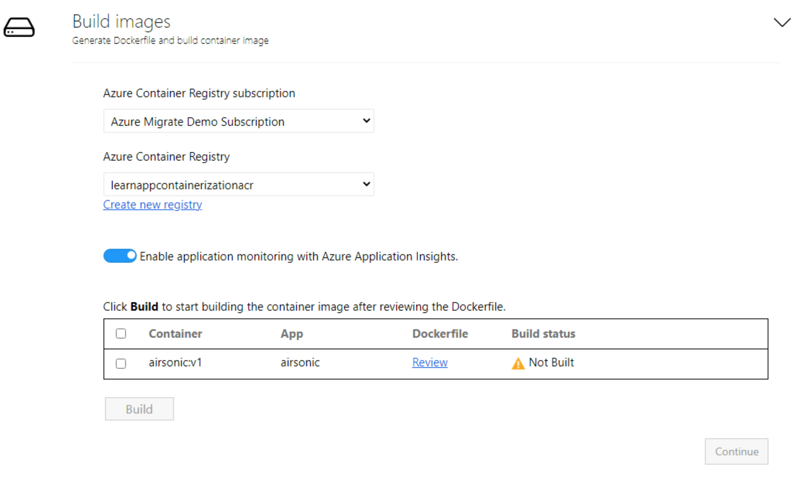

For this exercise, we use Azure Container Registry and its features to build and store the container images. 

The Azure Container Registry (ACR) allows you to build, store, and manage container images and artifacts in a private registry for all types of container deployments. App Containerization uses Azure Container Registry Tasks to build container images in Azure on-demand and then store those images.

## Build container image

1. **Create Azure Container Registry**: Create a new Azure Container Registry to build and store the container images for the apps. Select the **create new registry** option to create a new ACR **learnappcontainerizationacr**.

    

1. **Configure Application Insights**: You can enable monitoring for your Java apps without instrumenting your code. The tool installs the Java standalone agent as part of the container image. Once the Java agent is configured during deployment, it automatically collects a multitude of requests, dependencies, logs, and metrics for your application that can be used for monitoring with Application Insights. This option is enabled by default for all Java applications, so we can leave it as is.

1. **Review the Dockerfile**: The Dockerfile needed to build the container images for each selected application are generated at the beginning of the build step. Select **Review** to review the Dockerfile. You can also add any necessary customizations to the Dockerfile in the review step and save the changes before starting the build process. For this exercise, we don't make any changes to the Dockerfile.

1. **Trigger build process**: Select the application to build images for and select **Build**. Selecting **Build** starts the container image build for each application. The tool keeps monitoring the build status continuously and will let you proceed to the next step upon successful completion of the build.

1. **Track build status**: You can also monitor progress of the build step by clicking the **Build in Progress** link under the status column. The link takes a couple of minutes to be active after you trigger the build process.  

1. Once the build is completed, select **Continue** to specify deployment settings.
