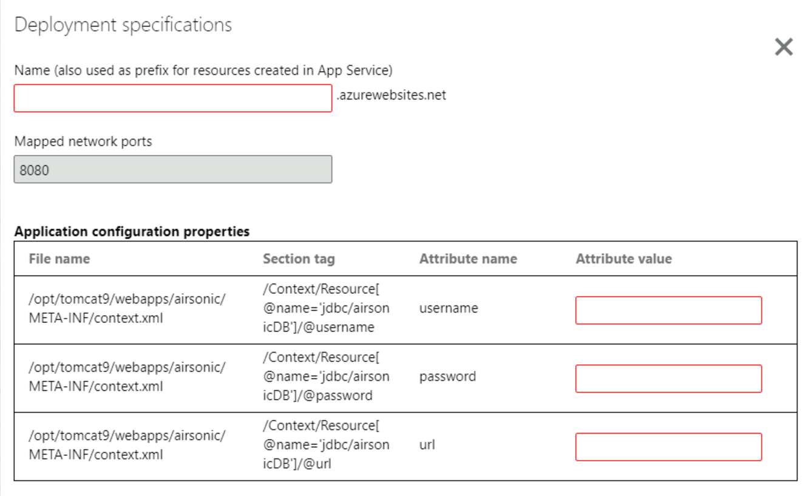

Once the container image is built, the next step is to deploy the application as a container on Azure App Service.

Azure App Service is an HTTP-based service on Azure that you can use to host web applications and REST APIs. This service provides benefits such as:
- Autoscaling to help your app scale to meet demand, based on the parameters you specify, and then automatically reduce the scale when demand decreases.
- High availability to help ensure that your application remains available in case of server or datacenter failures or downtime. Azure makes use of zones, regions, and availability sets to help achieve this.
- Support on the Windows and Linux platforms.
- Integration with automated deployment models using Azure DevOps or GitHub repos.

## **Create new App Service plan** 

The tool provides an option to select an existing App Service plan but for this exercise we will create a new App Service plan. 

1. Click **Create new App Service plan**.  
2. Select the Azure subscription you want to work with. 
3. Select the **LearnAppContainerization** resource group.
4. Specify the AKS cluster name as **LearnAppContainerizationAppServiceplan**.
5. Select any available location and SKU for the App Service plan to be created.  
6. Once you click **Create**, the tool triggers the App Service plan creation. 

## **Specify secret store**

Since you had opted to parameterize application configurations (database connection string), you can choose Azure Key Vault or Kubernetes secrets for managing your application secrets.

1. Select the option to **create new Azure Key Vault** and specify the name as **learnappcontainerizationkeyvault**. The tool will automatically assign the necessary permissions for managing secrets through the Key Vault.

## **Create Application Insights resource**

To monitor the containerized Java web application, we'll need to create a new Application Insights resource.

1. Select the option to **create new Azure Application Insights** and specify the name as **learnappcontainerizationappinsight**. The tool will create the resource and the configuration will be performed automatically during deployment. 

## **Specify Azure file share** 

If you had added more folders and selected the Persistent Volume option, then specify the Azure file share that should be used by Azure Migrate: App Containerization tool during the deployment process. The tool will create new directories in this Azure file share to copy over the application folders that are configured for Persistent Volume storage. During deployment, these directories will be mounted to the application container. 

1. Select the option to **create new Storage Account and Azure file share**. 
2. Specify a name for storage account and select the location and SKU for the storage account. 
3. Specify the Azure file share name as **learnappcontainerizationfileshare**. 
4. Click **create**.

## **Application deployment configuration** 

Once you've completed the steps above, you'll need to specify the deployment configuration for the application. Click **Configure** to customize the deployment for the application. In the configure step, you can provide the following customizations:

1. **Name**: Specify a unique app name for the application. This name will be used to generate the application URL and used as a prefix for other resources being created as part of this deployment. 
2. **Application Configuration**: For application configurations that were parameterized, use the following value for the current deployment. 
    - Navigate to the *LearnAppContainerization* resource group [Azure portal](https://portal.azure.com). 
    - Copy the name of the MySQL server. The MySQL server will name will be in the following format - "airsonic-mysql-server-0000000000". 
        - **Username**: Generate the username as **mysqladmin@${MYSQL_SERVER_NAME}**.
        - **Password**: Specify the value as **SuperS3kretPasSw0rd**.
        - **URL**: To create the URL to be specified, replace the MySQL Server name in the following connection string and paste it in the App Containerization tool.  
        **jdbc:mysql://${MYSQL_SERVER_NAME}.mysql.database.azure.com:3306/airsonic?useSSL=false&amp;sessionVariables=sql_mode=ANSI_QUOTES**
3. Click **Apply** to save the deployment configuration.
4. Click **Continue** to deploy the application.

    

## **Deploy the application** 

Once the deployment configuration for the application is saved, the tool will generate deployment file for the application. The file will be created based on the inputs specified in the deployment specification steps. 

1. Click **Review** to review the deployment specifications for the application. 
2. Select the application to deploy.
3. Click **Deploy** to start deployments for the selected applications.
4. Once the application is deployed, you can click the **Deployment status** column to track the resources that were deployed for the application. 

## **Browse the deployed application**

Now that your application container is deployed, you can browse the migrated application as follows - 

1. Copy the URL displayed in the **Deployment status** column.
2. Paste the URL in a new browser tab. 
3. Append the URL with the following string - */airsonic*

You should be able to access your application. 
