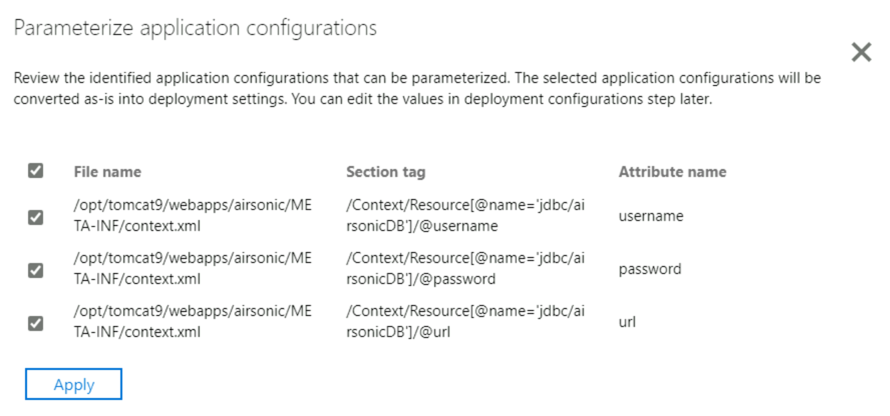

In this exercise, we use the App Containerization tool to discover the Java web application that needs to be containerized and migrated. 

## Complete tool prerequisites 

1. Select **Java web apps** as the type of application you want to containerize.
1. To specify target Azure service, select **Containers on Azure App Service**.

    

1. Accept the **License terms**, and read the license information.
1. The tool automatically checks for internet connectivity and installs the latest version of the App Containerization tool.  
1. The tool informs you to enable SSH on the application server, which was done as part of the setup. Select **Continue**.

## Sign in to Azure

Select **Sign in** to sign in to your Azure account.

1. You need a device code to authenticate with Azure. Selecting **Sign in** opens a modal dialog with the device code.
1. Select on **Copy code & sign in** to copy the device code and open an Azure sign-in prompt in a new browser tab. If it doesn't appear, make sure to disable the pop-up blocker in the browser.
1. On the new tab, paste the device code and complete sign in using your Azure account credentials. You can close the browser tab after sign in is complete and return to the App Containerization tool's web interface.
1. Select the **Azure tenant** that you want to use.
1. Specify the **Azure subscription** that you want to use.

## Discover Java web applications

The App Containerization helper tool connects remotely to the application servers using the provided credentials and attempts to discover Java web applications hosted on the application servers.

1. To discover the Parts Unlimited application, use the following values.

    - **Server IP/FQDN**: In your **LearnAppContainerization** resource group, navigate to *TomcatServer* virtual machine. Copy the private IP address and specify this value in the App Containerization tool.
    - **Credentials**: Specify **adminUser** as the username and **Password@123** as the password. 

1. Select **Validate** to verify that the application server is reachable from the machine running the tool and that the credentials are valid. Upon successful validation, the status column shows the status as **Mapped**.  

    

1. Select **Continue** to start application discovery on the selected application servers.

1. Upon successful completion of application discovery, you can select the list of applications to containerize.

    

1. Use the checkbox to select the **Airsonic** application to containerize.
1. **Specify container name**: Specify a name for the target container for each selected application. The container name should be specified as <*name:tag*> where the tag is used for the container image. For example, you can specify the target container name as `airsonictest:v1`.

### Parameterize application configurations

Parameterizing the configuration makes it available as a deployment time parameter. Parameterizing allows you to configure this setting while deploying the application as opposed to having it hard-coded to a specific value in the container image. For example, this option is useful for parameters like database connection strings.

1. Select **App configurations** to review detected configurations.
1. Select all checkboxes to parameterize the configuration (username, password, and url).
1. Select **Apply** after selecting the configurations to parameterize.

   

### Externalize file system dependencies

 You can add other folders that your application uses. Specify if they should be part of the container image or are to be externalized through persistent volumes on Azure file share. Using persistent volumes works great for stateful applications that store state outside the container or have other static content stored on the file system.

1. Select **Edit** under App Folders to review the detected application folders. The detected application folders are identified as mandatory artifacts needed by the application and are copied into the container image.
1. Select **Add folders** and specify the folder paths to be added.
1. Add **/var/airsonic** as the folder path in the text box.
1. Select **Azure file share** as the storage option to store the folder outside the container on a persistent volume.

    :::image type="content" source="../media/discovered-app-folders.png" alt-text="Screenshot for externalizing app folders for Java web application.":::

1. Select **Save**.
