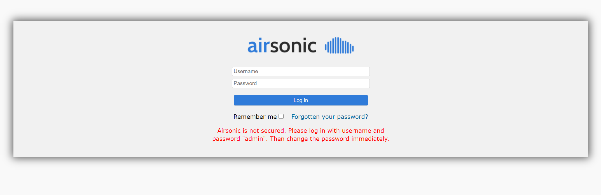

For this module, we will try to containerize and migrate the Airsonic application. Airsonic is a free, web-based music streaming application. We will deploy Airsonic in a two-tier configuration with the application front end running on Apache Tomcat on a Linux server and the application backend running on Azure Database for MySQL.

## Prepare your Azure account

If you don't have an Azure subscription, create a [free account](https://azure.microsoft.com/pricing/free-trial/) before you begin.

Once your subscription is set up, you'll need an Azure user account with:
- Owner permissions on the Azure subscription
- Permissions to register Azure Active Directory apps

If you just created a free Azure account, you're the owner of your subscription. If you're not the subscription owner, work with the owner to assign the permissions as follows:

1. In the Azure portal, search for "subscriptions", and under **Services**, select **Subscriptions**.

    

2. In the **Subscriptions** page, select the subscription in which you want to create an Azure Migrate project. 
3. In the subscription, select **Access control (IAM)** > **Check access**.
4. In **Check access**, search for the relevant user account.
5. In **Add a role assignment**, click **Add**.

    

6. In **Add role assignment**, select the Owner role, and select the account (azmigrateuser in our example). Then click **Save**.

    

7. Your Azure account also needs **permissions to register Azure Active Directory apps.**
8.  In the Azure portal, navigate to **Azure Active Directory** > **Users** > **User Settings**.
9.  In **User settings**, verify that Azure AD users can register applications (set to **Yes** by default).

      

10.  In case the 'App registrations' settings is set to 'No', request the tenant/global admin to assign the required permission. Alternately, the tenant/global admin can assign the **Application Developer** role to an account to allow the registration of Azure Active Directory App. 

## Setup Airsonic application

1. To deploy the workshop environment, begin by navigating to the [Azure portal](https://portal.azure.com).
2. Launch Azure Cloud Shell and run the following commands.   

    ```
    git clone https://github.com/MicrosoftDocs/mslearn-azuremigrate-appcontainerization-javatomcat.git
    cd mslearn-azuremigrate-appcontainerization-javatomcat/Java\ Containerization/
    chmod +x scripts/deploy.sh
    ./scripts/deploy.sh 'westus2' 'LearnAppContainerization'
    ```

4. Once the deployment is complete, you will see the following resources in your resource group. 

    


5. To browse the application, select **TomcatServer** virtual machine resource, copy the public IP address of the server and paste it in a browser window. Append the server IP with **:8080/airsonic**.

    

6. You can log in to the application using the following credentials. 
    - Username: admin
    - Password: admin

## Download and install Azure Migrate: App Containerization tool

1. In your resource group, select **tomcatMigrate-toolclient** virtual machine resource and log in to it using bastion. Use **adminuser** as the username and **Password@123** for password. You'll be using this machine to run the Azure Migrate: App Containerization tool to migrate the Java web application hosted on *TomcatServer*.
2. After logging in, [download](https://go.microsoft.com/fwlink/?linkid=2134571) the Azure Migrate: App Containerization installer on the Windows machine.
3. Launch PowerShell in administrator mode and run the following commands to install the tool.

   ```powershell
   cd Downloads
   .\AppContainerizationInstaller.ps1
   ```
4. Open Microsoft Edge browser and launch the tool by browsing to **https://toolclient:44369**. If you encounter a warning, click *advanced* and *continue to toolclient*. 