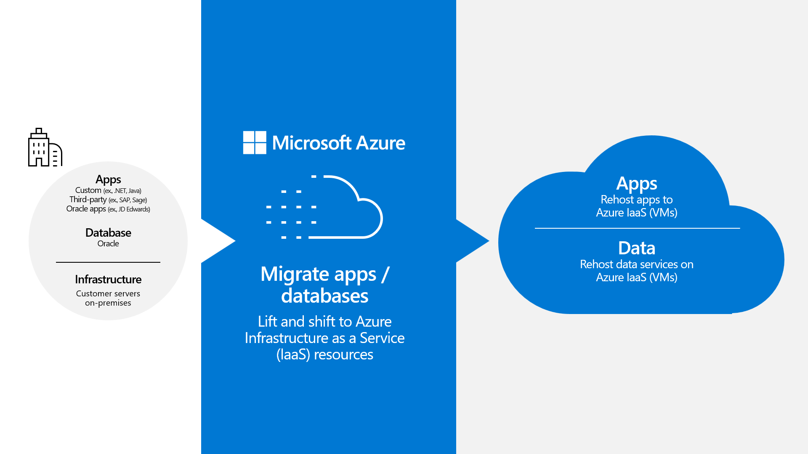

Your plan is to identify how to move your packaged applications and Oracle databases to Azure IaaS. In a [rehosting](/azure/cloud-adoption-framework/adopt/migrate-or-modernize#migrate-rehost) (or lift-and-shift) scenario, you're trying to recreate your existing on-premises environment's configuration using Azure IaaS resources, such as VMs and Azure virtual networks. You know that rehosting helps you achieve your objective to reduce the IT and dev effort in migration. The rehosting model requires minimal configuration changes to your applications or databases. 

As you explore the rehosting model, you learn about Azure and its [globally distributed datacenter facilities](https://azure.microsoft.com/explore/global-infrastructure/geographies/#overview) that host the underlying physical hardware and networking infrastructure that support workloads. The distributed nature of these datacenters allows you to deploy assets to a wide variety of locations for redundancy and data-residency scenarios. The built-in security and management capabilities of Azure enable you to monitor, back up, and secure your servers and networks with a fraction of the IT resources you'd need in your own datacenter. 

You need to create a landing zone to host your migrated application. The [Azure landing zone](/azure/cloud-adoption-framework/ready/landing-zone/), a concept documented in the [Microsoft Cloud Adoption Framework](/azure/cloud-adoption-framework/overview), represents the Azure environment where you'll deploy your migrated application and database. This landing zone contains the secure virtual network your resources will connect to, in addition to the VMs that will host your application and database workloads. 

You'll run an assessment of your existing infrastructure to determine landing zone requirements, including how to [rightsize](https://azure.microsoft.com/blog/rightsize-to-maximize-your-cloud-investment-with-microsoft-azure/) the VMs for your workload. To help create your VMs with all the required software preinstalled, you can use prebuilt [Oracle Database on Oracle Linux VM images](/azure/virtual-machines/workloads/oracle/oracle-overview#oracle-databases-on-azure-infrastructure). 

Note that deploying Oracle products on Azure VMs assumes a [bring-your-own-license model](/azure/virtual-machines/workloads/oracle/oracle-overview#licensing). You need to ensure that your Oracle license covers the amount of resources you're deploying as part of the migration, including, for example, the number of servers and CPUs.

After deploying your landing zone infrastructure, you'll create your databases and install and set up your applications as you would on your existing infrastructure. After the application and database are configured and working together, you can then migrate your data to the new environment to complete the process.

## Know when a rehost migration is the right approach

A rehost migration model is one of several approaches to moving Oracle workloads to Azure. 

Typically, rehosting makes sense when you want to:

- Move to the cloud as quickly as possible.
- Minimize any custom development or application refactoring related to migration.
- Continue to maintain control of the servers running your workloads.
- Rightsize your workloads and CPUs to utilize the optimal number of compute resources and Oracle licenses.

[Your choice of a migration approach](/azure/cloud-adoption-framework/adopt/migrate-or-modernize) depends on your workload requirements, along with your team's business needs, budget, and technical skills. To explore alternative approaches for migrating Oracle workloads, review [Migrate an Oracle workload to Oracle Database@Azure](/training/modules/migrate-oracle-workload-azure-odaa) and [Migrate Oracle-powered applications by using Azure PaaS database services](/training/modules/migrate-oracle-application-azure-paas). 

You confirm that rehosting enables you to migrate with a minimum of churn and gives you control over the IaaS VMs that will run your database and applications. 

## Related information

- Learning path: [Migrate virtual machines and apps using Azure Migrate](/training/paths/m365-azure-migrate-virtual-machine/)
- Article: [Azure migration guide](/azure/cloud-adoption-framework/migrate/#migrate-overview)
- Article: [Azure cloud migration checklist](/azure/cloud-adoption-framework/migrate/#cloud-migration-checklist)
