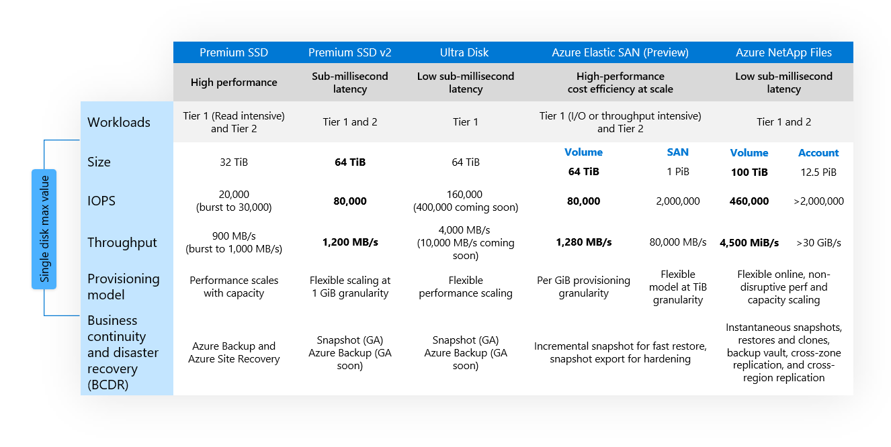
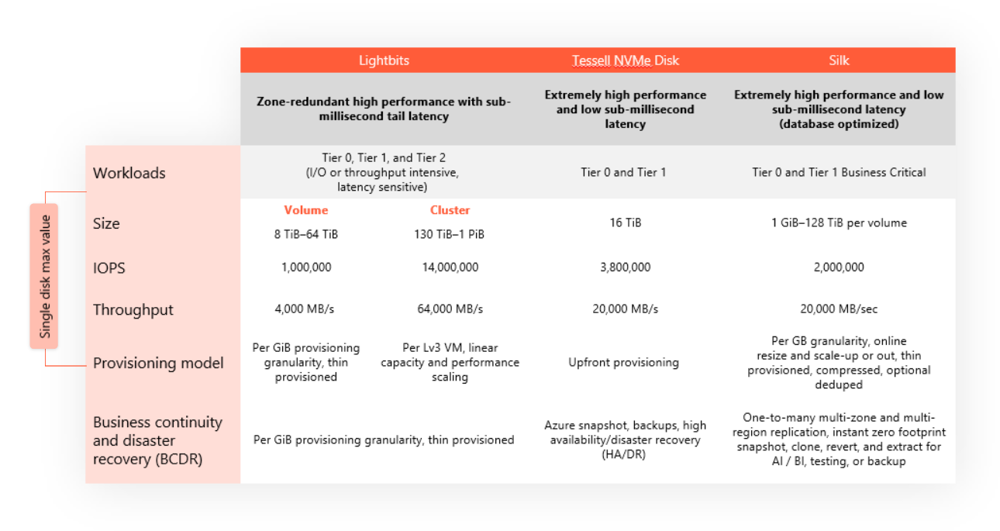

Before you can successfully migrate your application, you want to understand the resources that host your workloads today and then plan how you'll host them using Azure IaaS resources. 

In this section, you'll assess your on-premises environment, identify the necessary resources to deploy, and then map out your migration landing zone requirements. These requirements include:

- The [Azure subscription and resource group](/azure/cloud-adoption-framework/ready/azure-setup-guide/organize-resources) structure where your resources will live.
- The [Azure regions](/azure/cloud-adoption-framework/ready/azure-setup-guide/regions) you'll deploy to.
- The [access controls](/azure/cloud-adoption-framework/ready/azure-setup-guide/manage-access) you'll put in place. 
- The secure [Azure Virtual Network](/azure/virtual-network/virtual-networks-overview) you'll create, which provides connectivity to and between your virtual resources. 

Optimizing your cloud usage, or _[rightsizing](https://azure.microsoft.com/blog/rightsize-to-maximize-your-cloud-investment-with-microsoft-azure/)_ your server capacity, is essential to your migration's success, from a cost and management perspective. You need to analyze both your database and application layers to determine the number and size of Azure resources you'll need to create when migrating. 

Your databases may be running on a mix of bare-metal VMs, Oracle dedicated Real Application Cluster (RAC) software, and RAC running on third-party hardware. Your applications are running on dedicated on-premises VM servers. You need to use different processes and approaches to properly understand how you'll migrate both parts of the workloads. 

Find design principles and guidance for this type of rehosting migration in the Azure documentation covering the [Oracle on Azure Virtual Machines landing zone accelerator](/azure/cloud-adoption-framework/scenarios/oracle-iaas/introduction-oracle-landing-zone). The guidance includes networking, security, business continuity and disaster recovery, and resource management recommendations. You'll use this guidance as a baseline to help ensure the success of your organization's Oracle database migration.

## Assessing your database server's infrastructure

For your existing database servers, you'll use the [Oracle Automatic Workload Repository (AWR)](https://docs.oracle.com/iaas/operations-insights/doc/analyze-automatic-workload-repository-awr-performance-data.html) tool to generate reports on CPU usage, memory requirement, throughput, and IO performance (IOPS) of your Oracle databases. You'll gather this data when your database is under peak load to help ensure that you're correctly identifying the capacity you need when you move to Azure.

As illustrated in the graphic, you use the [Oracle Migration Automation Tool (OMAT)](https://github.com/Azure/Oracle-Workloads-for-Azure/tree/main/omat) to help you better understand your Oracle resource usage and how Azure resources can support that load. OMAT reads your AWR reports and generates a report that helps you rightsize your Azure VM requirements and configuration based on your usage. 

For the high-performance, IO-intensive database workloads, you want to be able to assure your managers that your Azure-based storage meets your performance requirements. As part of the migration planning process, you need to evaluate your IO, throughput, and latency requirements. OMAT also analyzes and recommends the best storage to support your workload, based on your AWR data. You'll use this information to choose from [Azure Storage options](/azure/virtual-machines/workloads/oracle/oracle-performance-best-practice), which are listed in the following table.

In addition to these options, many Oracle workloads can benefit from specialized third-party cloud data services offered through Azure, summarized in the following table. For example, [Lightbits](https://azuremarketplace.microsoft.com/marketplace/apps/lightbitslabsinc1670948060485.lightbits?tab=Overview) offers a high-performance managed block storage solution, and both [Silk](https://azuremarketplace.microsoft.com/marketplace/apps/silk.silk_cloud_data_platform?tab=Overview) and [Tessell](https://azuremarketplace.microsoft.com/marketplace/apps/tessellinc1655919615020.tessell_database_service?tab=Overview) provide a managed storage experience for Oracle databases. Before deciding on a final storage solution, make sure you [fully understand your performance needs](/azure/virtual-machines/workloads/oracle/oracle-third-party-storage).

After adding your OMAT VM and storage recommendations to your landing zone requirements for your database servers, you're ready to move on to assessing your application servers.

## Assessing your application servers

For your application layer, the [Azure Migrate: Discovery and assessment tool](/azure/migrate/concepts-assessment-calculation) is useful for identifying the high-level architecture of the VMs you need to create. It can help you determine:

- The suitability of existing on-premises application servers for migration to Azure.
- The size and number of VMs you need on Azure.
- The costs for running these VMs on Azure.
- Any additional cross-server dependencies and optimization strategies for moving interdependent servers to Azure. 

You'll document the information Azure Migrate generates and add it to your landing zone requirements.

For more details on the best way to create and use this assessment information, consult the [Azure Migrate documentation](/azure/migrate/best-practices-assessment).

## Additional considerations and finalizing your plan

You've gathered your assessment data, and now you're ready to finish defining your landing zone requirements and create your migration plan. 

To do this, you'll review each of the following considerations that help inform your plan:

- [Landing zone architecture.](/azure/cloud-adoption-framework/scenarios/oracle-iaas/introduction-oracle-landing-zone#design-guidelines) Define your landing zone configuration based on the guidance you previously reviewed.
- [Rightsizing VMs.](https://github.com/Azure/Oracle-Workloads-for-Azure/tree/main/levelup-oracle-on-iaas/lab1) Make sure you've determined the correct Azure VM sizes using OMAT for your database server and Azure Migrate for your application servers.
- [Recommended migration steps.](/azure/virtual-machines/workloads/oracle/oracle-migration) Review recommended migration processes and steps detailing how to move your on-premises Oracle workload to the Azure IaaS.
- [Access control.](/azure/role-based-access-control/overview) Use Azure role-based access control (RBAC) to manage who has access to Azure resources and what they can do with those resources.
- [Networking.](/azure/virtual-network/virtual-networks-overview) Manage network traffic in much the same way you would use an on-premises network with Azure virtual networks. [Network virtual appliances](https://azure.microsoft.com/solutions/network-appliances) can offer firewall and gateway/router capabilities. Connect your virtual network to your on-premises or other cloud networks by using [Azure VPN Gateway](/azure/vpn-gateway/vpn-gateway-about-vpngateways) or [Azure ExpressRoute](https://azure.microsoft.com/products/expressroute).

After performing OMAT and Azure Migrate assessments and reviewing the listed items, you have the details you need to start deploying: infrastructure sizing, estimated costs, and recommended landing architecture.
