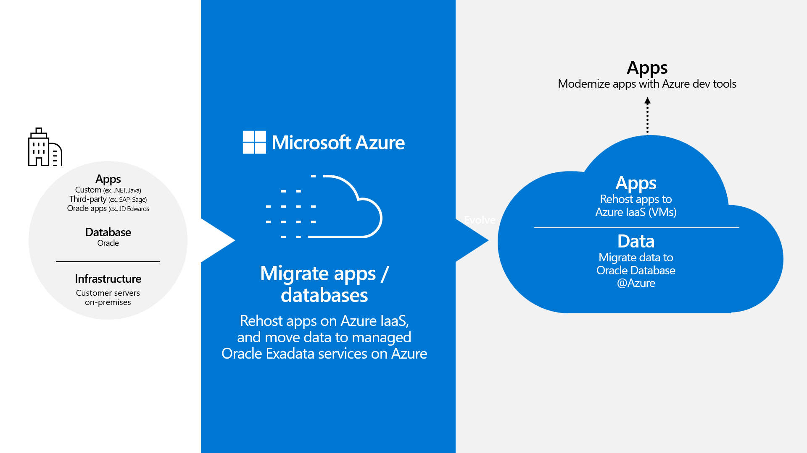
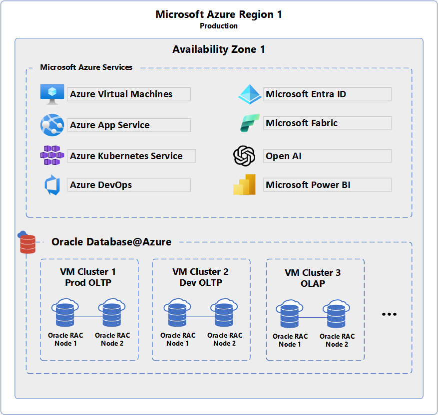

You want to understand how to migrate Oracle E-Business Suite to Azure. You consider three objectives to help you measure success:

- Achieve the highest level of database performance on the new infrastructure.

- Minimize any customization or custom development.

- Reduce ongoing management and maintenance tasks.

You'll break up your migration into two parts: database and application layer.

**Database layer:** Your existing on-premises hosting uses Oracle Exadata Database Machine hardware for high-performance data capabilities. When you move to the cloud, you require comparable performance. For the critical database hosting, you plan to use [Oracle Database@Azure](/azure/oracle/oracle-db/database-overview).

Oracle Database@Azure is a service offering enabled on Oracle Cloud Infrastructure (OCI) that is physically colocated in Azure datacenters. It offers a full Oracle Exadata infrastructure with the same or better performance as your on-premises systems, without the need to manage the compute or storage resources yourself. The service allows you to continue using standard Oracle tools, such as  [Data Guard](https://www.oracle.com/database/data-guard/) and [GoldenGate,](https://www.oracle.com/integration/goldengate/) to support your data workloads. 

Although it's built on Oracle infrastructure, Oracle Database@Azure is fully integrated with your Azure subscription. Most tasks take place in Azure, including:

- Subscribe to the Oracle Database Service.

- Create and manage your Exadata infrastructure and resources using the Azure portal or management APIs.

- Configure access management and networking as you would other Azure resources.

When you're finished setting it all up, however, you manage your databases using the OCI portal, as with any other Exadata database.

Since Oracle Database@Azure is hosted in Azure datacenters, you can run your database services in the same physical facilities as your other Azure workloads, minimizing potential latency between your databases and the VMs running your applications. The physical networking infrastructure is managed by Azure, and you can [securely integrate](/azure/security/fundamentals/isolation-choices) your databases into your Azure Virtual Network configuration.

**Application layer:** For your Oracle-powered applications, your migration options are straightforward. You find that the most efficient approach is a standard [rehosting](/azure/cloud-adoption-framework/adopt/migrate-or-modernize#migrate-rehost) (or _lift-and-shift_) model. The model requires minimal changes or configuration adjustments. The Azure VMs you create will host the applications in a way that's similar to how you host in your on-premises datacenter using physical servers.

After your database services and VMs are provisioned and running, you'll migrate your data and switch over to your cloud-based infrastructure.

## Know when Oracle Database@Azure is a good fit for your migration

There are several approaches to moving Oracle workloads to Azure. Typically, Oracle Database@Azure is a good fit when you need to:

- Take advantage of Exadata performance and features.

- Minimize custom development or application refactoring related to the migration.

- Offload some of the management of your database hosting resources.

Other workloads may not be a good fit for this option. To explore other methods for migrating Oracle workloads, review [Migrate Oracle workloads to Azure IaaS virtual machines](/training/modules/migrate-oracle-workload-azure-iaas) and [Migrate Oracle-powered applications by using Azure PaaS database services](/training/modules/migrate-oracle-application-azure-paas).

Oracle Database@Azure allows you to minimize migration churn and preserve critical performance and latency capabilities, all while streamlining your IT maintenance load.
