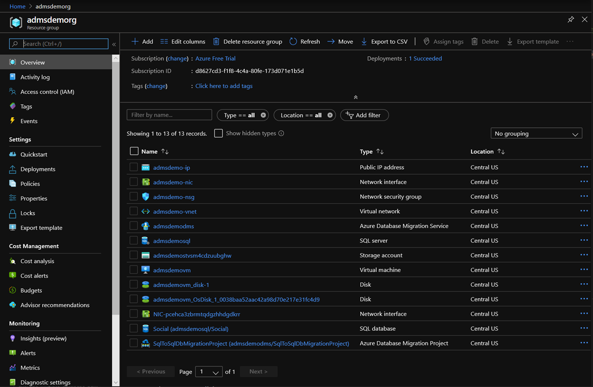

In this exercise, you'll lay the groundwork for using the Azure Data Migration Assistant. You'll use the Azure Cloud Shell to deploy a template that will create resources you'll need to perform the exercises, including a virtual machine, an Azure SQL Database, and other supporting resources.

[!INCLUDE [azure-exercise-subscription-prerequisite](../../../includes/azure-exercise-subscription-prerequisite.md)]

## Deploy the template

1. Select the **Deploy to Azure** button below to open the Azure portal and deploy the resources needed for the exercises.

    

1. Complete the template with the following values:

    |Parameter  |Value  |
    |---------|---------|
    |**BASICS**| |
    |Subscription     | Select the Azure subscription you would like to use |
    |Resource group     | Select **Create new**, enter **admsdemorg**, and select **OK**.        |
    |Location     | Select a [location that supports the Azure Database Migration Servivce](https://azure.microsoft.com/global-infrastructure/services/?products=database-migration&regions=all&azure-portal=true)        |
    |**SETTINGS**     |         |
    |Source Windows Admin User Name     |  windowsadmin       |
    |Source Windows Admin Password     | Enter a complex password        |
    |Source SQL Admin User Name | sqladmin |
    |Source SQL Authentication Password     | Enter a complex password        |
    |Target SQL DB Administrator Login     | azuresqladmin        |
    |Target SQL DB Administrator Password     | Enter a complex password        |

1. Select **I agree to the terms and conditions stated above** and select **Purchase**.

Make note of the passwords you used for the accounts, you will use them later. This deployment will take 10 to 15 minutes. While this is in progress, continue to the next unit to learn about the migration process.

<!-- When finished, you can navigate to your Azure Portal and open the newly created **admsdemorg** Resource Group. You should see something similar to the image below. Note that not all names will match exactly, as some names are dynamically generated at creation time.

 -->
