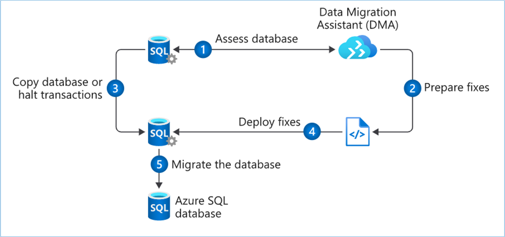
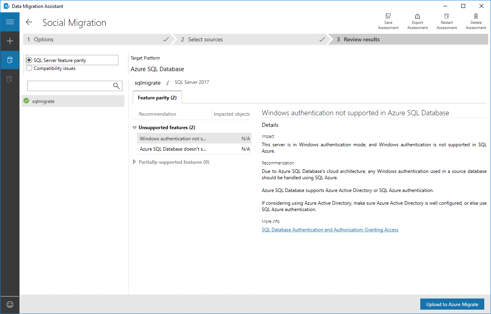
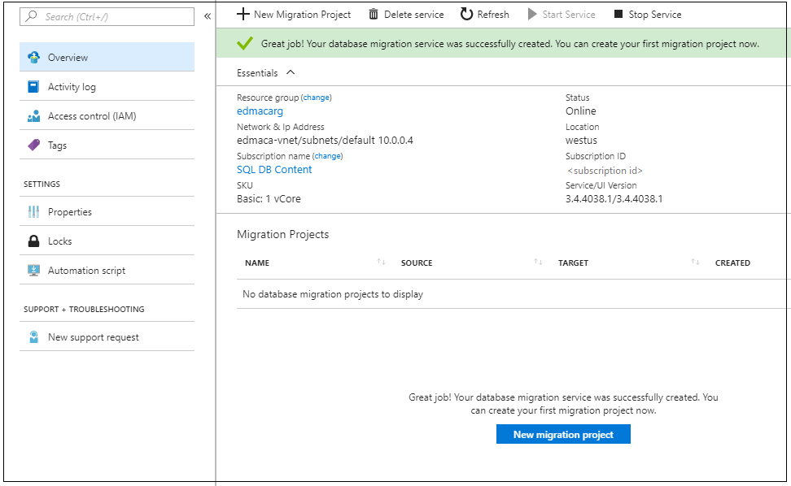

Migrating your company's social media database is a multi-step process. The workflow begins with a *pre-migration* phase, in which you determine which databases need to be migrated. You also look for any compatibility issues between your existing database and Azure SQL Database.

After you resolve any incompatibility issues, you're ready for the *migration* phase. First, you migrate the schema to the Azure SQL Database Service. Then, you're ready to migrate the data itself by using Azure Database Migration Service.

The last step in your workflow is the *post-migration* phase. During this phase, you do any required testing. Then you update apps, reports, and other tools that will need to use the new database for their data.

## Pre-migration

The pre-migration phase begins with *discovery*, or taking inventory of your existing databases and the tools and apps that rely on them. For this simple exercise, we're concerned with only a single social database. In practice, it can be a much more complex step.

You need to identify everything that uses your existing database. Apps, SQL Server Report Services reports, Power BI reports, and export jobs written in PowerShell are all examples of things to note so you can update them, after the migration, to point to the new Azure SQL Database.

The second step in the pre-migration phase is the *assessment*. During the assessment, you examine the database for any incompatibilities between it and the Azure SQL Database platform. Because this can be a difficult task to perform manually, Microsoft has provided Data Migration Assistant. You can use Data Migration Assistant to automatically examine your source database for any compatibility issues with Azure SQL Database.

Data Migration Assistant provides a report that you can use as a guide to update your database. As you make changes, you can rerun Data Migration Assistant to track your progress and to uncover any new issues that might arise as you make changes. The assessment phase is covered in steps 1 and 2 of the migration workflow previously illustrated.

The final stage in the pre-migration is *convert*. In the convert phase, you make any changes for compatibility that Data Migration Assistant has recommended. Then, you create the SQL scripts for deploying to the SQL Server instance. Data Migration Assistant can be of help to you here as well. It generates all of the SQL scripts needed to deploy your schema to the target SQL Server instance.

## Migration

The migration phase involves migrating two elements: *schema* and *data*. In the convert phase of pre-migration, the Data Migration Assistant tool generated all of the code. Data Migration Assistant can run these scripts for you. Or, you can save these scripts, and run them on your own by using a tool such as SQL Server Management Studio, Azure Data Studio, or the sqlcmd utility. The schema migration can be found in step 4 of the migration workflow.

After your database schema has been migrated, you're ready to migrate your data (steps 3 and 5 in the workflow). For this step, you'll use Azure Database Migration Service to move your data up to the Azure SQL Database Service.

Database Migration Service can be run in two modes, online and offline. When it's running in online mode, there are two additional steps. The first is *sync*, in which any changes made to the data in the source system after the migration are brought into the target database. The other is *cutover*, in which the source database is taken offline, and the new Azure SQL Database becomes available.

## Post-migration

The post-migration phase is a process that consists of several steps. First, you need to remediate any applications, updating any affected by the database changes. For example, you might need to update the connection strings to point to the new Azure SQL Database.

In addition, make sure there's thorough and complete testing. Validation testing will ensure that your application did not break because of changes at the database level. Construct tests to return data from both the source and target. Compare the data to ensure that queries are returning from the Azure SQL Database as they would with the original source database. Next, create performance tests that will:

- Validate that your application returns data in the times required by your organization.
- Enable you to do further optimizations, if necessary.

The post-migration phase is critical because it ensures that your data is both accurate and complete. In addition, it alerts you to any performance issues that might arise with the workload in the new environment.

## Data migration tools in Azure

The core of data migration in Azure is the Azure Database Migration Service. You can use this service to move bulk amounts of data in a timely way. As part of Database Migration Service, Microsoft provides Data Migration Assistant. Just as its name implies, Data Migration Assistant *assists* the service by preparing the target database.

### Data Migration Assistant

Data Migration Assistant is a client-side tool that you can install on a Windows-compatible workstation or server. It has two major functions in the migration of the social database to the Azure SQL Database platform in this module.

First, it assesses your existing database and identifies any incompatibilities between that database and Azure SQL Database. It then generates a report of the things you need to fix before you can migrate. As you make changes, you can rerun Data Migration Assistant to generate an updated report of changes that you need to make. This capability helps you to not only track your progress, but also catch any new issues that might have been introduced during your coding phase.

After Data Migration Assistant completes the assessment and you've made any changes, you need to migrate the database schema to Azure SQL Database. Data Migration Assistant can help with this as well. It generates the required SQL, and then gives you the option of running the code, or saving it so you can run it yourself later.

Using Data Migration Assistant is not a requirement to use Azure Database Migration Service. You have the option of coding your new database in the Azure SQL Database service manually without trying to convert an existing database.

As an example, let's say you're creating a staging database in Azure SQL Database that will later feed data into Azure Synapse Analytics. The staging database will be sourced from multiple systems, but it will migrate only small portions of the source data. In this situation, you might be better off manually crafting the new database directly on the Azure SQL Database service rather than trying to automate the job.

### Azure Database Migration Service

After you've migrated your database schema by using Data Migration Assistant, or created a target database manually, you're ready to move your data. To do that, you'll use Azure Database Migration Service.

Azure Database Migration Service is a fully-managed Azure service that provides automated, seamless data migrations from multiple sources into the Azure data platforms.

Database Migration Service runs on the Azure platform, as opposed to being a client application like Data Migration Assistant. It's capable of moving large amounts of data quickly and is not dependent upon installation of a client application. Database Migration Service can operate in two modes, offline and online.

In offline mode, no more changes can be made to your source database. Data is migrated, and then your applications can begin using the new Azure SQL Database.

In online mode, your source database can remain in use while the bulk of the data is migrated. At the end of the migration, you'll take the source system offline momentarily while any final changes to the source are synced to the new Azure SQL Database. At this point, your applications can cut over to use the SQL database.
