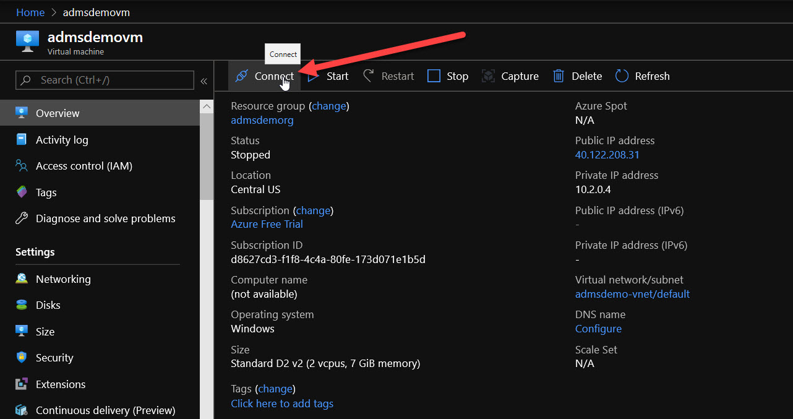
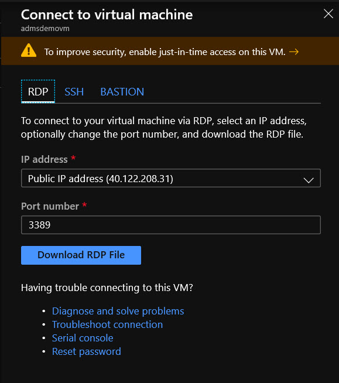
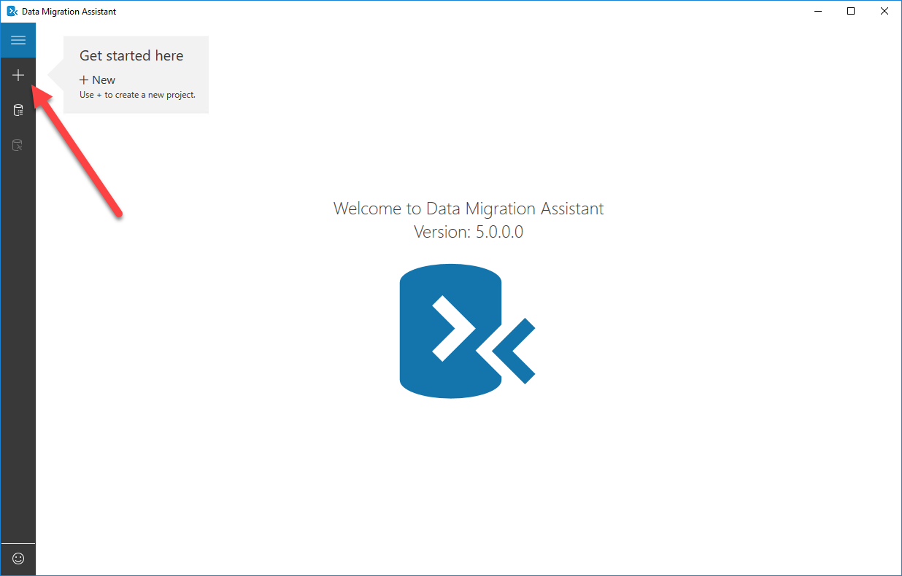
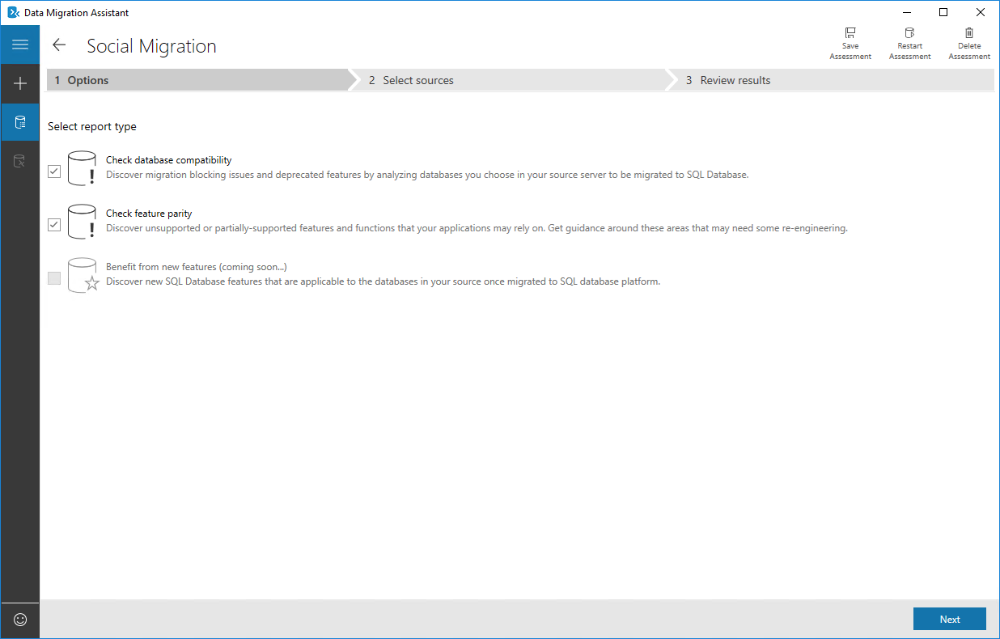
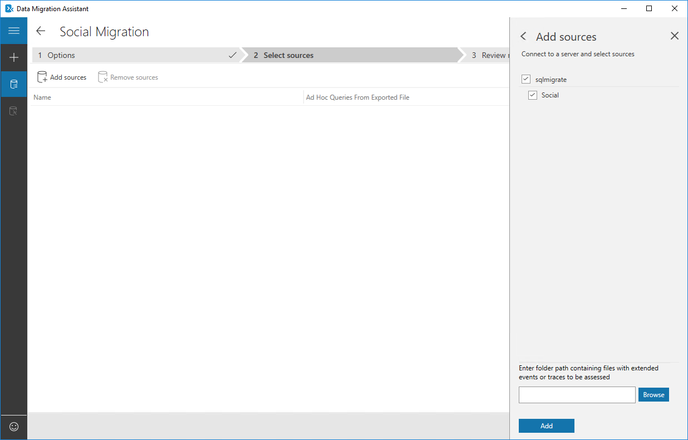

In this exercise, you will use the Azure Data Migration Assistant to assess your existing social database for any issues and ensure it is compatible with Azure SQL Database. This is an important step to ensure your company's database can be successfully migrated to Azure.

## Install the Azure Data Migration Assistant

1. You'll need to install the Data Migration Assistant on your virtual machine, so begin by opening the [Azure Portal](https://portal.azure.com?azure-portal=true) if you don't already have it open. Then select the link to open up the **admsdemorg** resource group.

1. In the list of resources in the resource group, select the **admsdemovm** virtual machine.

1. In the toolbar above the VM info, select **Connect**.

    

1. In the pane that appears to the left, select the **Download RDP File** button and save it to your computer in a location of your choosing.

    

1. Select the RDP file to open it. Select the **Connect** button, and supply the credentials. Use the **windowsadmin** account and use the password you specified for this account.

<!-- 1. Before you can download the Data Migration Assistant, you will want to disable the server's IE security setting or it will block the download. Since this is just a learning environment, you will be safe in doing so, but avoid doing this in production. Instead, download on another computer and copy up to your server. -->

<!-- 1. By default, the Server Manager should be open, but if you closed it, use the **Start** menu to open it.

1. Select **Local Server** in the side bar.

1. In the upper right, find the _IE Enhanced Security Configuration_ setting and select **On**.

1. Change the setting to **Off** for Administrators. Select **OK** to close. -->

1. Open Internet Explorer and navigate to the [Azure Data Migration Assistant download page](https://www.microsoft.com/download/details.aspx?id=53595). 

1. Download and install the migration assistant.

## Select the project type

1. Open the Data Migration Assistant.

1. Select **+** in the left menu to begin a new assessment.

    

1. In the blade that opens, make sure the Project type is set to **Assessment**.

1. For the Project name, enter **Social Assessment**.

1. For this particular project, you can take the defaults for the remaining fields. Assessment type will be **Database Engine**, Source server type will be **SQL Server**, and Target server type will be **Azure SQL Database**.

1. When done, select **Create**.

    

## Configure the project

1. The next screen begins the workflow. Step one is to select options. Leave all of the options set for this exercise, then select **Next**.

    

1. In the next step you will configure the source to convert. To do so, you need to connect to a server. A blade will appear on the right, Connect to a server. For the server name, we'll use the name of the VM and enter **admsdemovm**.

1. Under Authentication type, leave **Windows Authentication** selected.

1. Under Connection properties, leave the **Encrypt** connection checked, and add a check beside **Trust server certificate**.

1. Select **Connect** at the bottom to test your connection.

    

1. The blade updates to show the list of databases on the server. Place a check beside the **Social** database.

1. Select **Add**.

    

1. The **Select Sources** page now updates to show the database you have selected. Select **Start Assessment** to begin the assessment.

    

## Review the results of the assessment and address issues

Allow the analysis to run. When it completes, it will produce results and break them into SQL Server feature parity issues or compatibility issues. Start by looking at the SQL Server feature parity results, which is the default.

  

In the middle of the page you will see the section **Unsupported features**. The second and third items show **N/A** under the impacted objects, meaning nothing was found in the source system for these two items.

Look closer at the first row, though, and you will see that **Service Broker feature is not supported in Azure SQL Database**. It includes instructions on how to solve this. The database you are migrating doesn't need this feature, so you can disable it without any problems.

1. Open SQL Server Management Studio and connect to the **admsdemovm** server, then to the **social** database.

1. Select **New Query**.

1. Enter and execute the following query:

    ```sql
    ALTER DATABASE [Social] SET DISABLE_BROKER;
    ```

    In a moment you will rerun the assessment, but first select **Compatibility issues**. It will show that there were no compatibility issues with the database. If there had been, it would have listed them and you would need to resolve them before you could continue the migration.

    

## Rerun the assessment

1. Select **Restart Assessment** to have the Data Migration Assistant re-assess the fixed database.

1. When it completes, you should still be on the **Compatibility Issues** page, and it should still show there are none.

1. Select **SQL Server feature parity**. It should now show the issue has been resolved.

    

    At this point you have completed the assessment. Select the left arrow in the upper left side of the screen to return to the list of completed assessments.
