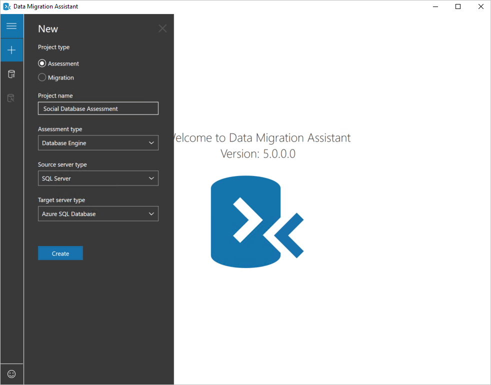
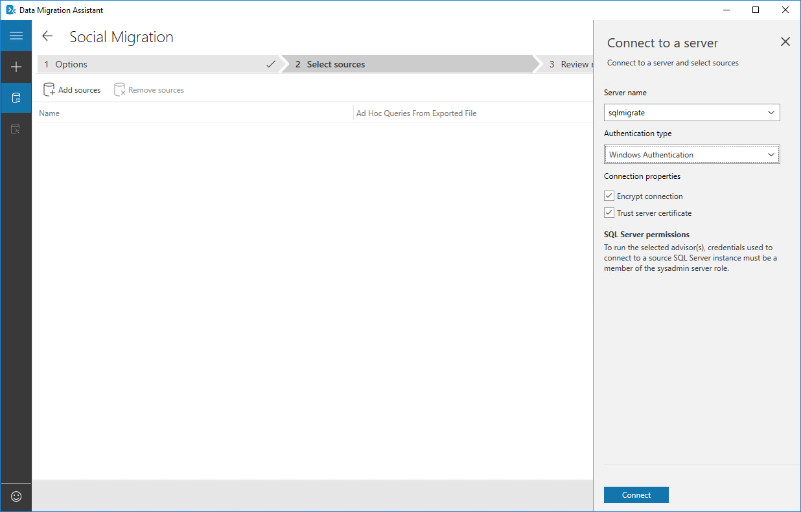
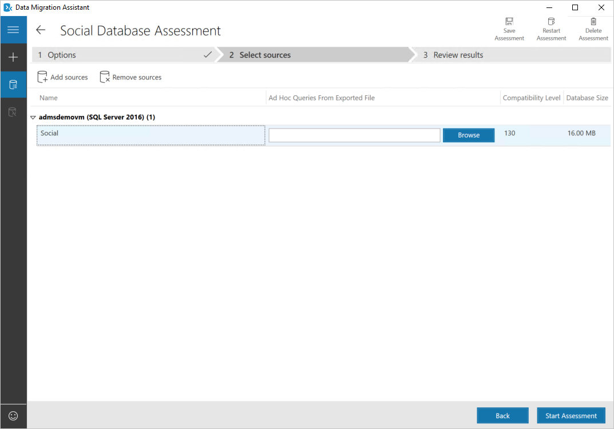
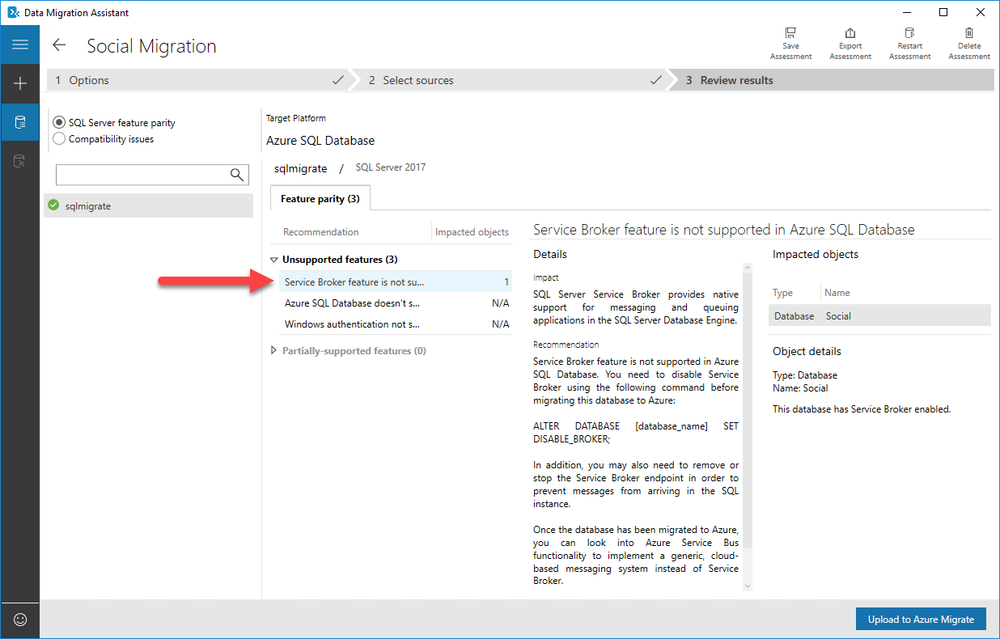
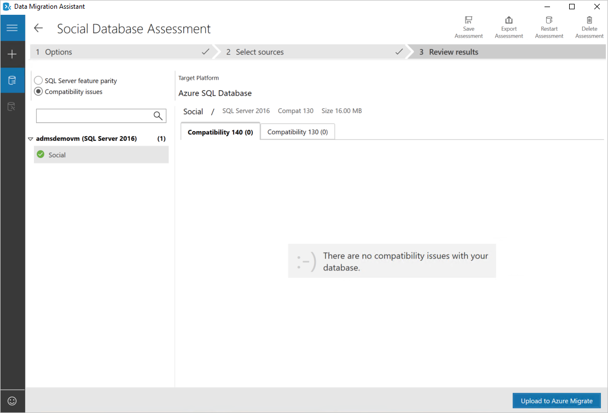

In this exercise, you will use the Azure Data Migration Assistant to assess your existing social database for any issues and ensure it is compatible with Azure SQL Database. This is an important step to ensure your company's database can be successfully migrated to Azure.

You'll start by installing the Data Migration Assistant on your SQL Server.

## Connect to VM

1. Open the [Azure portal](https://portal.azure.com?azure-portal=true) if you don't already have it open. 

1. Select **Resource groups** then select the **admsdemorg** resource group you deployed.

1. In the list of resources in the resource group, select the **admsdemovm** virtual machine.

1. In the toolbar above the VM info, select **Connect**.

1. In the **Connect to virtual machine** pane, select **Download RDP File** and save it to your computer in a location of your choosing.

1. Select the RDP file to open it. Select the **Connect** button, and supply the credentials. Use the **windowsadmin** account and use the password you specified for this account.

## Disable IE Enhanced Security Configuration

Before you can download the Data Migration Assistant, you will need to disable IE Enhanced Security Configuration or it will block the download.

1. By default, the Server Manager should be open, but if you closed it, use the **Start** menu to open it.

1. Select **Local Server** in the left menu.

1. Select the setting for **IE Enhanced Security Configuration**.

1. Change the setting to **Off** for Administrators, then select **OK**.

## Download and install and run the Azure Data Migration Assistant

1. Once you are connected to the VM, open Internet Explorer and navigate to the [Azure Data Migration Assistant download page](https://www.microsoft.com/download/details.aspx?id=53595).

1. Select **Download** and install the migration assistant, accepting the defaults through the installation dialog.

1. Select the Microsoft Data Migration Assistant on the desktop to start the assistant.

1. Select **+** in the left menu to begin a new assessment.

1. Select a **Project type** of **Assessment**.

1. For the Project name, enter **Social Database Assessment**.

1. Leave the remaining fields at their default values and select **Create**.

    

## Configure the project

1. On the **Select report type** pane, ensure both **Check database compatibility** and **Check feature parity** are selected, then select **Next**.

1. Next, you will configure the source database to connect to.In the **Connect to a server** pane, configure the following settings:

    | | |
    |---------|---------|
    | **Server name** | admsdemovm |
    | **Authentication type** | Windows Authentication |
    | **Encrypt connection** | Selected        |
    | **Trust server certificate** | Selected        |
    | | |

    

1. Select **Connect**.

1. On the **Add sources** pane, select the **Social** database, then select **Add**.

1. The assessment now shows the database you have selected. Select **Start Assessment** to begin the assessment.

    

## Review the assessment results and address issues

Allow the analysis to run. When it completes, it will produce results and break them into SQL Server *feature parity* issues or *compatibility issues*. Start by looking at the SQL Server feature parity results, which is the default.

  

In the middle of the page you will see the section **Unsupported features**. The second and third items show **N/A** under the impacted objects, meaning nothing was found in the source system for these two items.

Look closer at the first row, though, and you will see that **Service Broker feature is not supported in Azure SQL Database**. It includes instructions on how to solve this. The database you are migrating doesn't need this feature, so you can disable it without any problems.

Select **Compatibility issues**. It will show that there were no compatibility issues with the database. If there had been, it would have listed them and you would need to resolve them before you could continue the migration.

    

1. Open SQL Server Management Studio and connect to the **admsdemovm** server with Windows authentication, then to the **social** database.

1. Select **New Query**.

1. Enter and execute the following query:

    ```sql
    ALTER DATABASE [Social] SET DISABLE_BROKER;
    ```

## Rerun the assessment

1. Switch back to the Data Migration Assistant. Select **Restart Assessment** to have the Data Migration Assistant re-assess the fixed database.

1. When it completes, you should still be on the **Compatibility Issues** page, and it should still show there are none.

1. Select **SQL Server feature parity**. It should now show the issue has been resolved.

    

At this point you have completed the assessment. Select the left arrow in the upper left side of the screen to return to the list of completed assessments.
