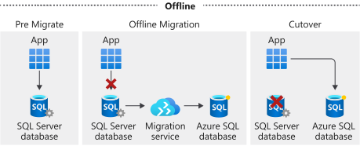
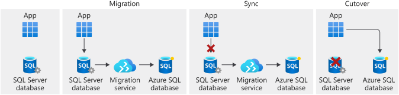

There are two options for doing a migration: *offline* and *online*.

With the offline option, the source database is removed from service during the entire migration process.

With the online option, also known as *migration with minimal downtime*, the database remains in operation until the end of the migration. After you start the cutover, the source database is taken offline and any final changes are brought into the target database. This process minimizes downtime. 

Let's look closely at both options and how the tools work with them.

## Offline

With offline mode, you take the source database offline. You place it in a state where no more updates are being made. You can then use Azure Database Migration Service to do the migration.

## Online

During an online migration, the service takes a backup of the source database and migrates the data to the target platform. This enables the source database to continue to receive incoming transactions and return data. When the main part of the migration is complete, the user starts the cutover process. The source database is then taken offline, rendering it unavailable for use.

Database Migration Service then reads the data from the transaction log to bring the target database into sync. When this process is complete, the new target database becomes available for use. This is why the online option is sometimes called *minimal downtime*. There is some downtime, but it's minimal compared to doing an offline migration.

Although the online option looks attractive, there's a major downside - cost. The online option requires creating a SQL Server instance that's based on the Premium price tier. This can become cost prohibitive, especially when you don't need any of the features of the Premium tier except its support of online migrations.

Because of this downside, we recommend that you first test by using the offline option to see whether it can run in an acceptable time frame.

## Migration exercises

In the next two exercises, you'll begin the migration process for your company's social database. In the first, you'll use Data Migration Assistant to analyze the database for any inconsistencies and repair them. You'll then migrate the database schema to the Azure SQL Database service.

In the second exercise, you'll use Azure Database Migration Service to move the data from your social database to its new home in Azure SQL Database.
