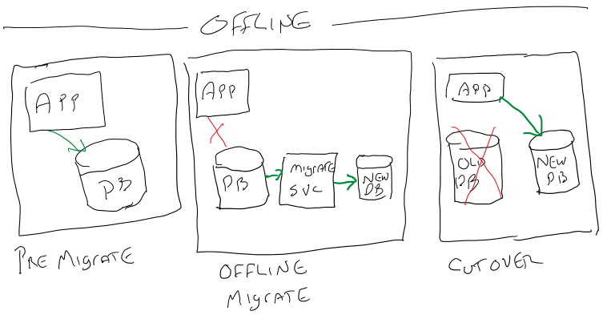
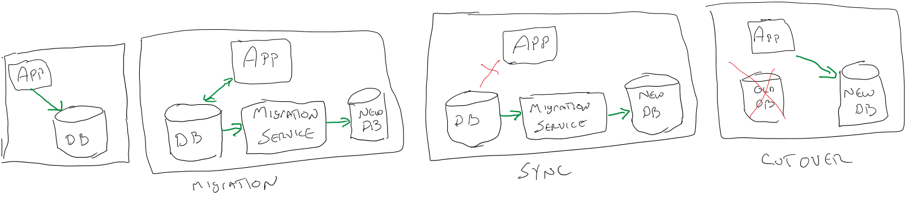

There are two options for doing a migration: offline and online. With the **offline** option, the source database is removed from service during the entire migration process. With the **online** option, also known as **migration with minimal downtime**, the database remains in operation until the very end of the migration. Once you initiate the cutover, the source database is taken offline and any final changes are brought into the target database, minimizing downtime. 

Let's look deeper at both options and how the tools work with them.

## Offline

With the offline mode, the source database must be taken offline. It must be placed in a state where no more updates are being made. Once this is done, the Azure Data Migration Service can be used to do the migration.

## Online

During an online migration, the service takes a backup of the source database and migrates the data to the target platform. This allows the source database to continue to receive incoming transactions and return data. When the main part of the migration is complete, the user initiates the cutover process. The source database is then taken offline, rendering it unavailable for use.

The Data Migration Service will then read the data from the transaction log to bring the target database into sync. Once completed, the new target database will become available for use. This is why the online option is sometimes referred to as **minimal downtime**. There is indeed some downtime, but it is minimal compared to doing an offline migration.

While the online option appears attractive, there is a major downside: cost. The online option requires creating an instance of your Azure SQL Server that is based on the Premium price tier. This can become cost prohibitive, especially in situations where you don't need any of the features of the Premium tier except its support of online migrations.

Because of this, it is a recommended best practice to first test using the offline option to ascertain whether it can run in an acceptable time frame.

## Migration Exercises

In the next two exercises you'll begin the migration process for your company's social database. In the first, you'll use the Azure Data Migration Assistant to analyze the database for any inconsistencies, repair them, and finally migrate the database schema to our target Azure SQL Database service.

In the second exercise, you'll use the Azure Data Migration Service to move the data from your social database to its new home in Azure SQL Database.

## Knowledge Check

- content: What is the chief obstacle to performing online migrations?
  choices:
  - content: "The requirement of the Premium module for Azure SQL."
    isCorrect: true
    explanation: "The Premium model for Azure SQL is very expensive. This cost can be a big obstacle to doing online migrations."
  - content: "Online migrations are slower."
    isCorrect: false
    explanation: "While it is true that an online may take just a _little_ longer, this is not considered an obstacle as the source system is able to remain online during the migration."
  - content: "Online migrations require more personnel to complete."
    isCorrect: false
    explanation: "Online migrations do not require any more resources than offline migrations."

- content: What is the best practice for doing migrations?
  choices:
  - content: "Attempt to do an offline first."
    isCorrect: true
    explanation: "Attempt to do an offline migration first to see if it will run in acceptable time frame in order not to incur the cost of the Premium database tier."
  - content: "Attempt to perform an online migration first."
    isCorrect: false
    explanation: "Due to the requirement of a Premium database tier for on line, online migrations can be expensive. As such, it is best to attempt an offline migration first to see if it can be run in an acceptable time frame."
  - content: "Attempt to perform a manual migration first."
    isCorrect: false
    explanation: "Manual migrations can be problematic. It is very easy to miss compatibility issues and should be avoided."

- content: Which service is used to perform the data migration?
  choices:
  - content: "Azure Data Migration Service"
    isCorrect: true
    explanation: "The Azure Data Migration Service is used to perform both offline and online data migrations."
  - content: "Azure Data Migration Assistant"
    isCorrect: false
    explanation: "The Azure Data Migration Assistant is used to analyze the existing database for incompatibilities with Azure SQL Database. It can also be used to generate the schema, but is not typically used to migrate data."
  - content: "Azure Data Movement Service"
    isCorrect: false
    explanation: "The Azure Data Movement Service is not a real service."
