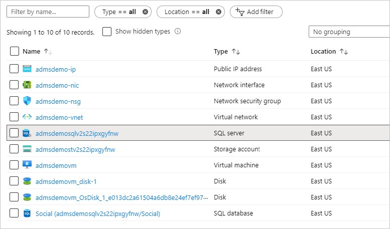
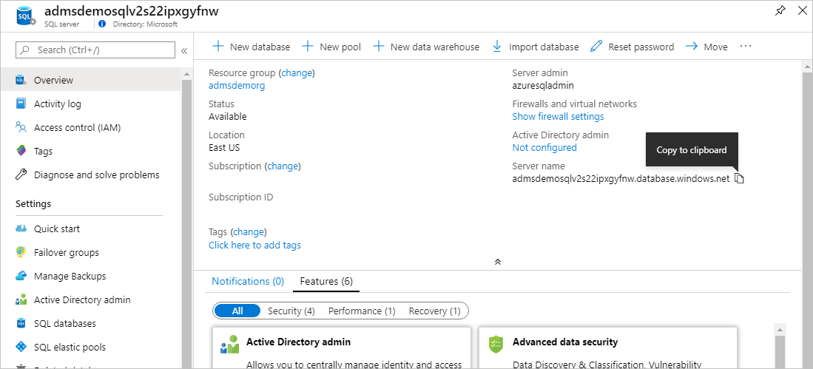

In this exercise, you'll create a migration project using the Azure Data Migration Assistant and move your database into Azure SQL. For this exercise, we'll be using the offline migration option, accepting downtime. This way we will not incur the cost associated with the premium database, a requirement of online migrations.

## Create a new project

1. If you are not already, connect to the **admsdemovm** VM through RDP.

1. Open the Data Migration Assistant.

1. Select the **+** in the left menu.

1. In the pane that appears, select a **Project type** of **Migration**.

1. In the **Project name**, enter **Social Database Migration**.

1. Leave the **Source server type** set to **SQL Server** and the **Target server type** to **Azure SQL Database**.

1. Change the **Migration scope** to **Schema only** and select **Create**.

## Select the source database

1. In the **Connect to source server** area, enter **admsdemovm** for the source server. Leave the other settings at their default values and select **Connect**.

1. Once connected, you will see a list of databases. In the list, you are allowed to select only one database to migrate. In this case you have only one, **Social**, and it is already checked.

    

1. Select **Next** to continue.

## Select the target database

1. First, you need to get the name of your Azure SQL server that was created earlier. Open the [Azure portal](https://portal.azure.com?azure-portal=true) if you don't already have it open.

1. Open the **admsdemorg** resource group, and locate the _SQL server_. Select the server name to open the **Overview** pane.

    

1. Move the mouse to the end of the **Server name** and select **Copy to clipboard**.

1. Switch back to the Data Migration Assistant on your VM. Paste the name of your Azure SQL server into the **Server name** box.

    

1. For **Authentication type** select **SQL Server Authentication**.

1. Enter **azuresqladmin** into the username field and enter the password you specified for this account.

1. Select **Connect**.

1. The screen now updates to show a list of databases on the target server. From here you can select a database that will be the target of the migration.

1. You should see the **Social** database you created during the setup exercise, and it should be selected by default. Select **Next** to proceed to the next step.

    

## Select objects to migrate and deploy schema

In this step, you can select the database objects you want to migrate and deselect the ones you don't. In this exercise, we only have one object, the table `dbo.Twitters`.

1. Select the **dbo.Twitters** line, and you will see there are no issues found for this object. This is in part because we fixed any issues during the assessment phase of the migration.

    

1. Select **Generate SQL script** to proceed. This will generate a T-SQL script that will recreate the selected database objects on the target server. Note the warning provided about SQL logins that may have been selected as part of the migration.

    

1. Select **Deploy Schema** to deploy the schema to the target server.

    Once the target database has been updated, it will display the results on the right.

    

    You've now completed the schema migration and can close the Data Migration Assistant.
