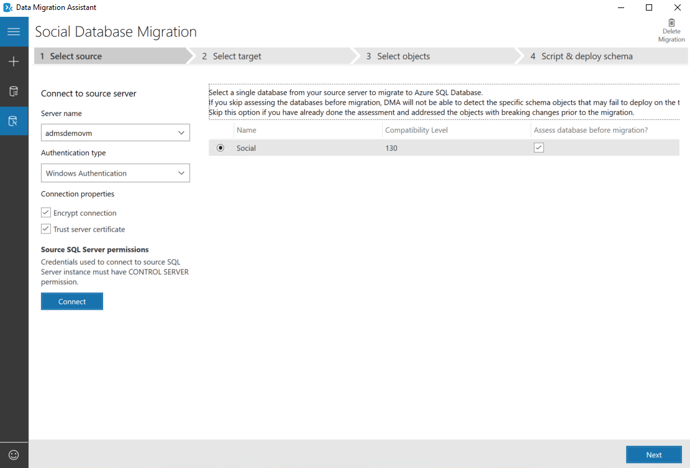
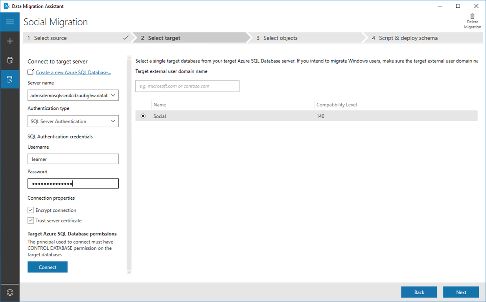
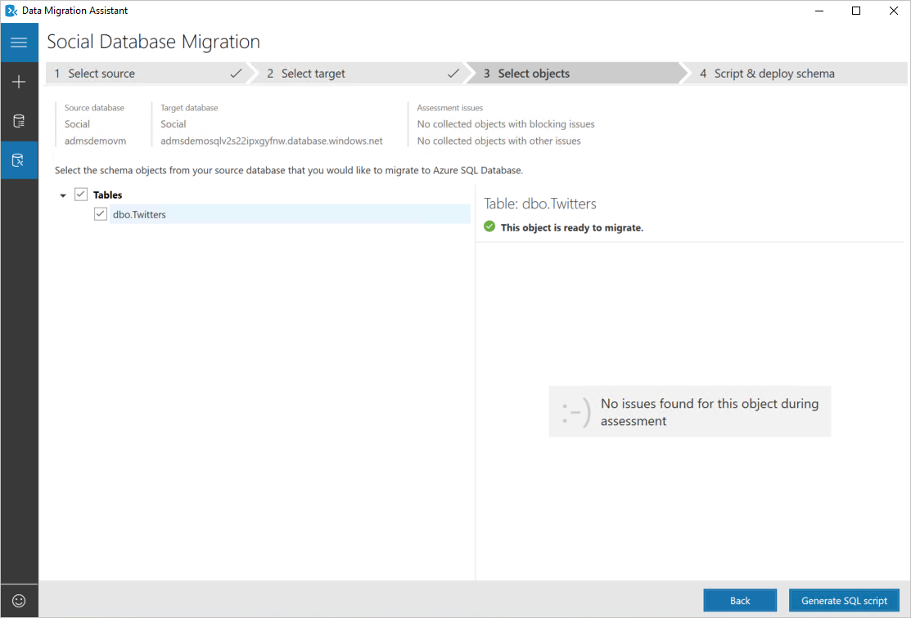
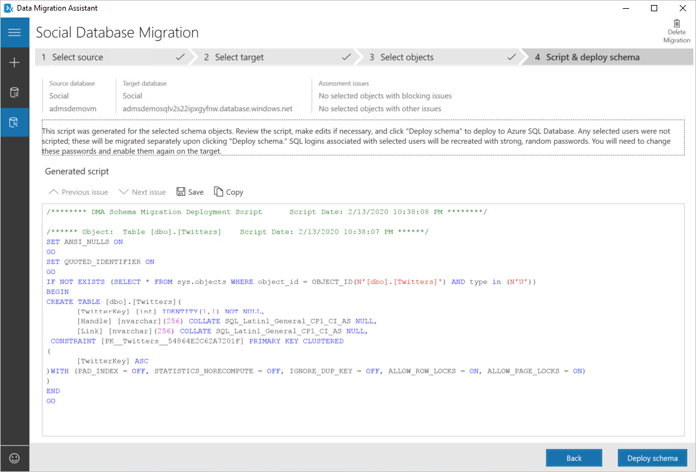
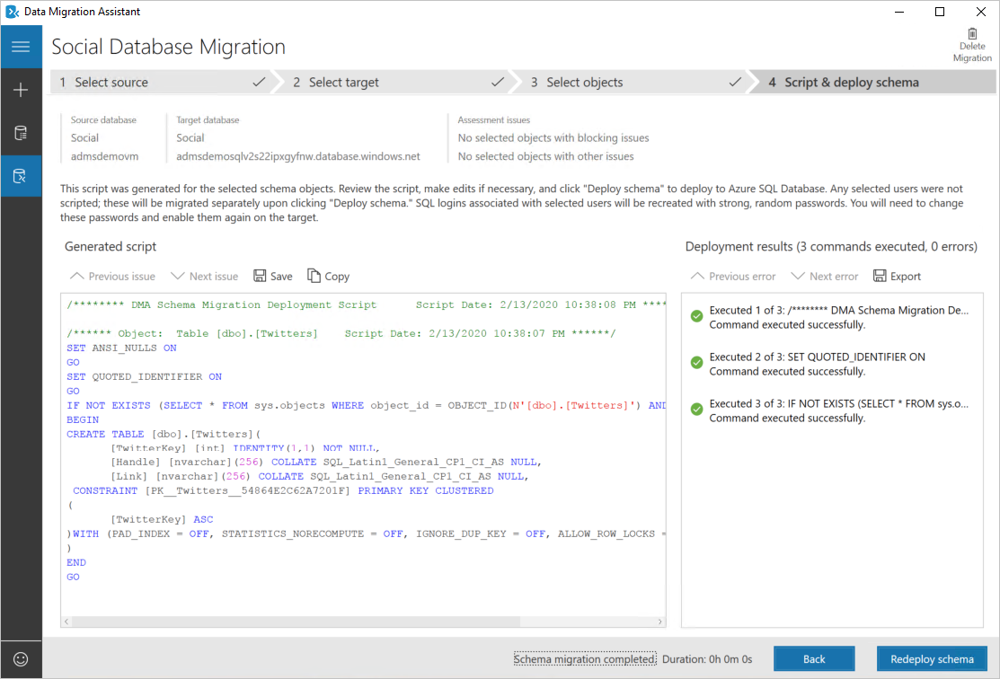

In this exercise, you'll create a migration project using the Azure Data Migration Assistant and move your database into Azure SQL. For this exercise, we'll be using the offline migration option, accepting downtime. This way we will not incur the cost associated with the premium database, a requirement of online migrations.

## Create a New Project

1. Open the Data Migration Assistant.

1. Click the **+** (New) button in the left side toolbar.

1. In the blade that appears, select **Migration** for the Project type.

1. In the Project name, enter **Social Migration**.

1. Leave the Source server type set to **SQL Server** and the Target server type to **Azure SQL Database**.

1. Change the Migration scope set to **Schema only** and click the **Create** button.

## Select the Source

1. In the Connect to source server area, enter **admsdemovm** for the source server and accept the other defaults. 

1. Click the **Connect** button. After clicking connect, you will see a list of databases. 

1. In the list, you are allowed to select only one database to migrate. In this case you have only one, **Social**, and it is already checked.

1. Click **Next** to continue.

## Select the Target

1. Every Azure SQL Server must have a unique name. When you ran the environment setup, the script took care of it for you and generated a unique name beginning with **admsdemosql**, followed by a sequence of random characters, followed by **.database.windows.net**. 
   
   To find yours, go to your Azure Portal, open the admsdemorg resource group, and locate the _SQL server_ (note: not the SQL database, but the server). Enter that server name into the Server name box. As an example, it might look something like **admsdemosqlvsm4cdzuubghw.database.windows.net**.

2. The authentication type should automatically update to **SQL Server Authentication**.

3. Enter **learner** into the username field.

4. Use **SecureP@ssW0rd** for your password.

5. Click the **Connect** button.

6. The screen now updates to show a list of databases on the target server. From here you can select a database that will be the target of the migration.

7. In this exercise there should only be one database on the server, the empty **Social** database you created during the setup, and it should be selected by default. Click **Next** to proceed to the next step.

## Select Objects to Migrate

In this step, you can select the database objects you want to migrate and uncheck the ones you don't. In this exercise, we only have one object, the table dbo.Twitters.

1. Click on the dbo.Twitters line, and you will see there are no issues found for this object. This is in part because we fixed any issues during the assessment phase of the migration.

1. Click the **Generate SQL script** button to proceed.

## Script and Deploy Schema

In this step, a SQL script has been generated that will recreate the selected database objects on the target server. Note the warning provided about SQL logins that may have been selected as part of the migration.

1. Click on the **Deploy Schema** link to deploy the schema to the target server.

Once the target database has been updated, it will display the results on the left.

You've now completed the schema migration and can close the Data Migration Assistant.
