In this exercise, you migrate the data in your database by using Azure Database Migration Service. This is a two-step process. First, you create a new instance of Database Migration Service. Within that instance, you then create a new migration project.

## Create the Database Migration Service instance

1. On a new tab, open the [Azure portal](https://portal.azure.com?azure-portal=true), and then select **+ Create a resource**.

1. In the **Search the Marketplace** box, search for **Azure Database Migration Service**, and select **Create**.

1. On the **Basics** tab, configure the following values.

    |  |  |
    |---------|---------|
    | **Subscription** | Select your subscription |
    | **Resource group** | admsdemorg |
    | **Migration service name** | admsdemodms |
    | **Location**     | Select the same region where your resources are located |
    | **Pricing tier** | Standard 1 vCores |
    |||

1. Select **Next : Networking**.

1. Select the **admsdemo-vnet/default** virtual network, and then select **Review + create**.

1. To create the Database Migration Service instance, select **Create**.

1. Wait for the deployment to finish. It might take 15 minutes. Then, select **Go to resource**.

    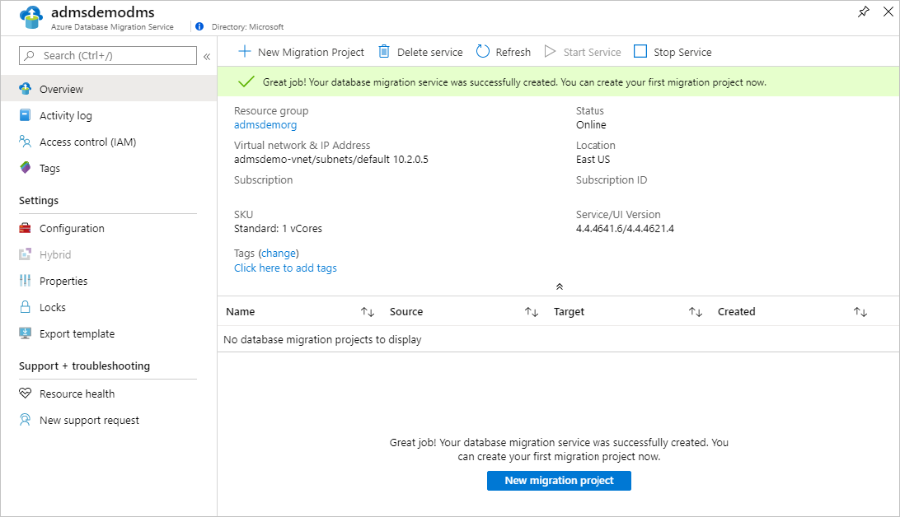

## Create a migration project

After the service instance is created, you create a project to migrate the database.

1. In the migration project, select **New Migration Project**.

1. On the **New migration project** pane, configure the following values.

    |  |  |
    |---------|---------|
    | **Project name** | SocialDatabaseMigration |
    | **Source server type** | SQL Server |
    | **Target server type** | Azure SQL Database |
    | **Choose type of activity**     | Offline data migration |
    |||

    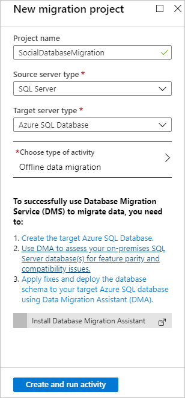

1. Select **Create and run activity**.

1. For the source database, complete the **New migration project** pane with the following values:

    |  |  |
    |---------|---------|
    | **Source SQL Server instance name** | admsdemovm |
    | **Authentication type** | Windows Authentication |
    | **User Name** | admsdemovm\windowsadmin |
    | **Password**     | Enter the password for the windowsadmin account |
    | **Encrypt connection** | Selected |
    | **Trust server certificate** | Selected |
    | | |

    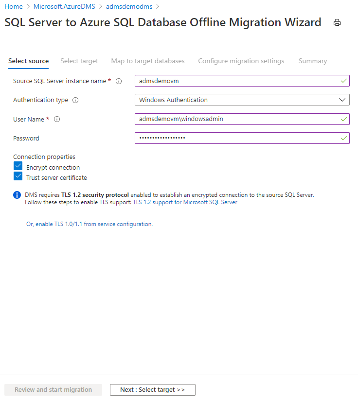

Select **Next : Select target**.

1. For the target Azure SQL Database instance, complete the **Migration target details** pane with the following values:

    |  |  |
    |---------|---------|
    | **Target server name** | Enter the DNS name of your Azure SQL server (for example, admsdemosqlmfe4eev3ubxlo.database.windows.net). |
    | **Authentication type** | SQL Authentication |
    | **User Name** | azuresqladmin |
    | **Password**     | Enter the password for the azuresqladmin account |
    | **Encrypt connection** | Selected |
    | | |

    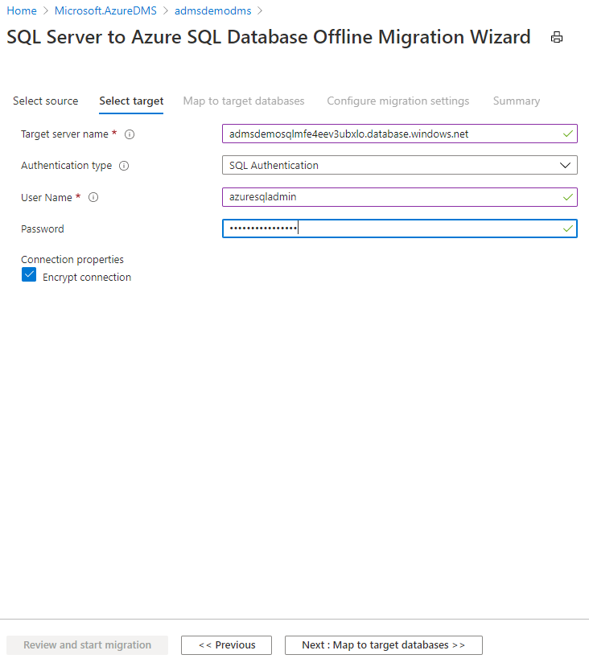

1. Select **Next : Map to target databases**.

1. For the **Social** database, select **Set Source DB Read-Only**.

    Make sure you're not logged in to the database elsewhere, such as from SQL Server Management Studio in the virtual machine. If you are, the migration will fail.

    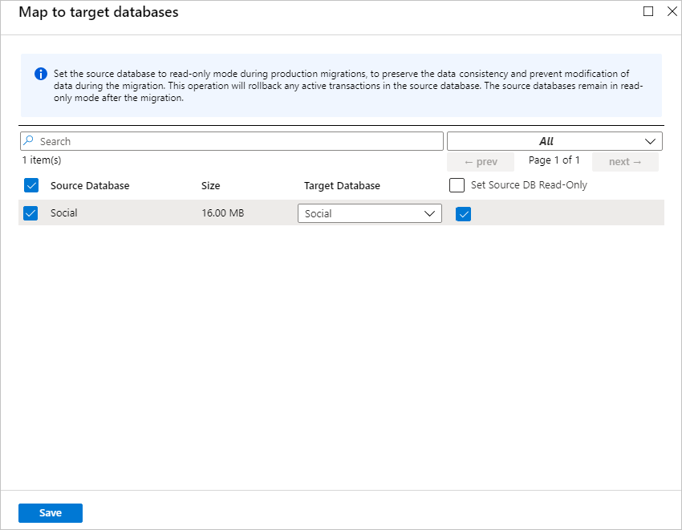

1. Select **Next : Configure migration settings**.

1. To see the list of tables, next to **Social 1 of 1**, select the arrow.

    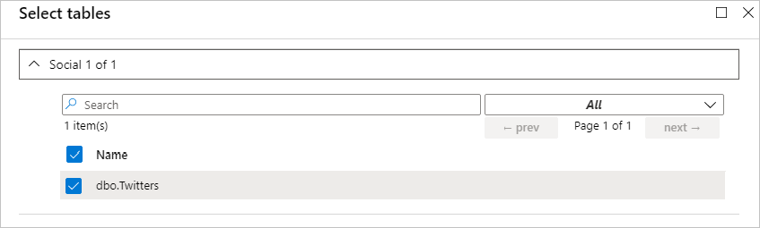

1. Make sure the `dbo.Twitters` table is selected.

1.  Select **Next : Summary**.

1. In the **Activity name** box, enter **MigrateSocialDatabase**.

    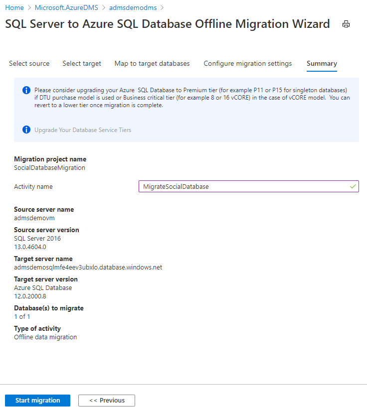

1. To start the migration, select **Start migration**.

1. A new pane appears with the status of the migration. To update the status until it shows that the process is finished, at the top, select **Refresh**.

    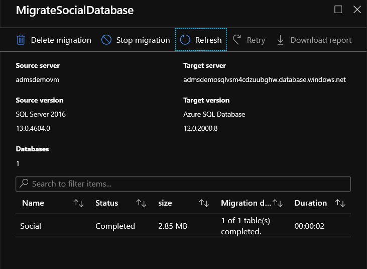

## View data in the new database

You can now go to the Azure SQL database and view your migrated data.

1. Go back to your **admsdemorg** resource group, and select the **Social (admsdemosqlv2v2s22x.../Social)** SQL database.

    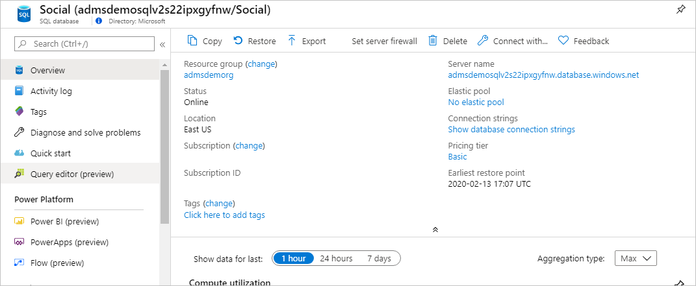

1. Select **Set server firewall**.

1. On the **Firewall settings** pane, select **+ Add client IP**, and then select **Save**.

    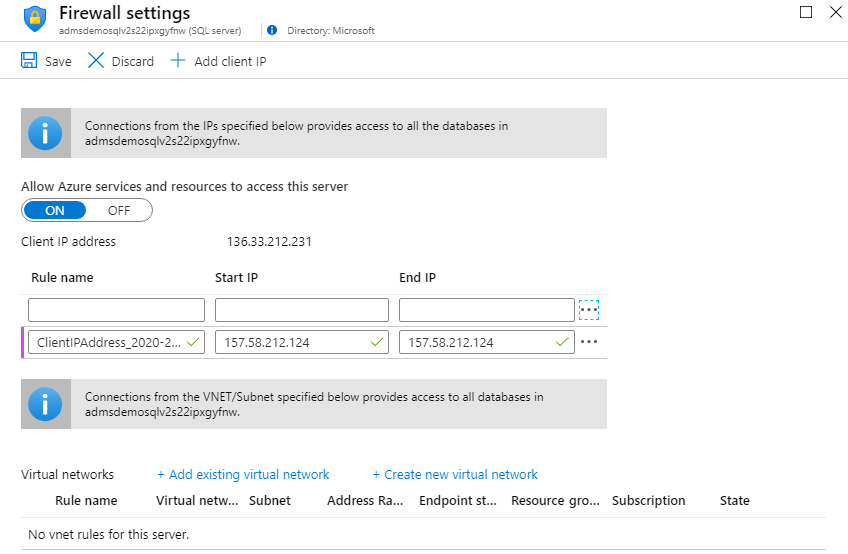

1. To return to the overview for your database, close the **Firewall settings** pane.

1. Select **Query editor (preview)**.

1. Log in with the **azuresqladmin** username and password.

1. Enter the following query, and select **Run**.

    ```sql
    SELECT * FROM [dbo].[Twitters];
    ```

    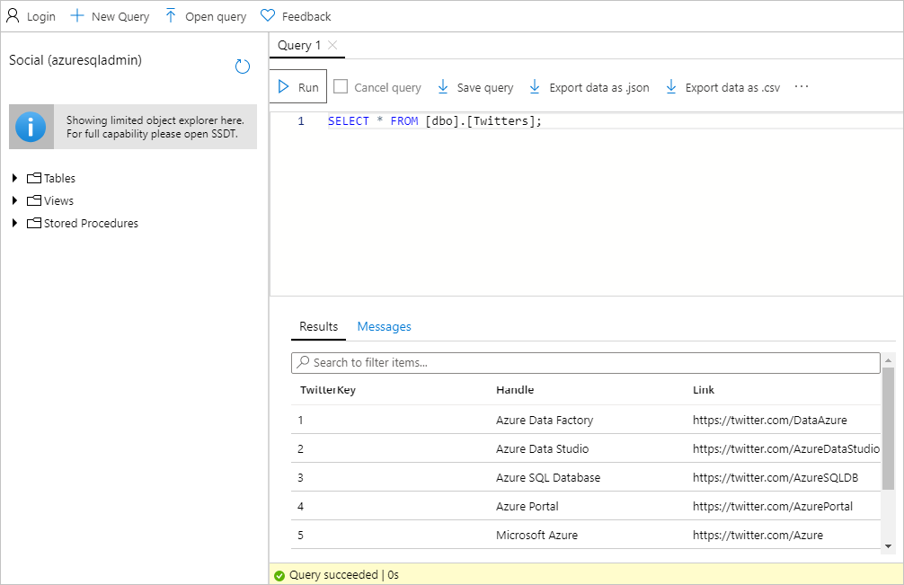

    You should see data from your database, which indicates a successful migration.