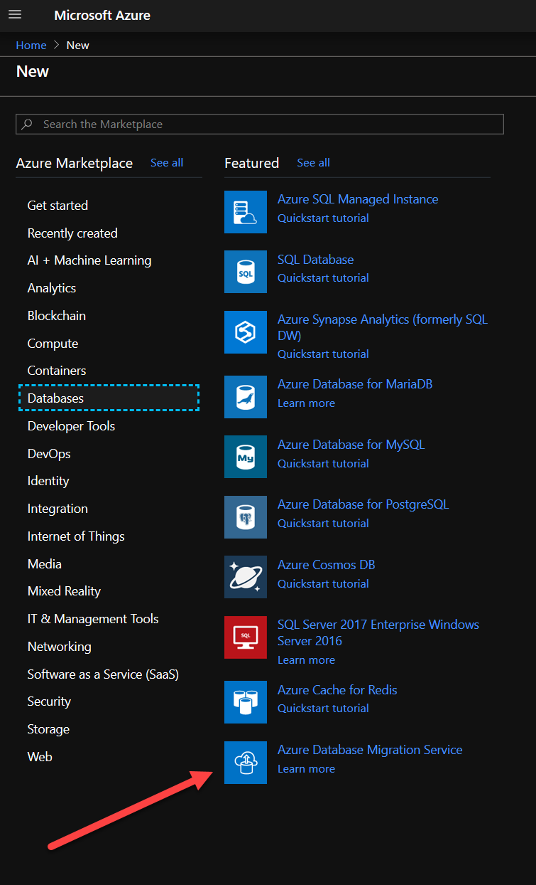
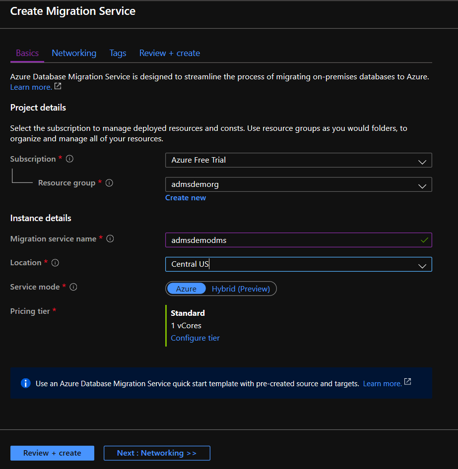
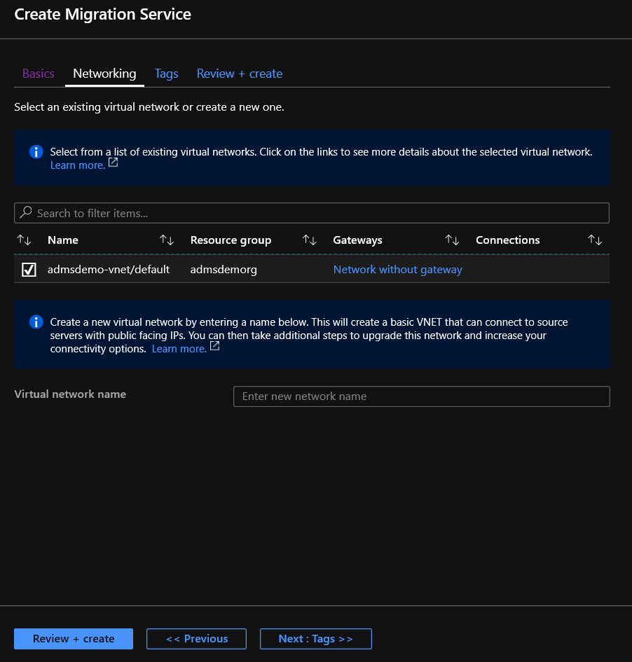
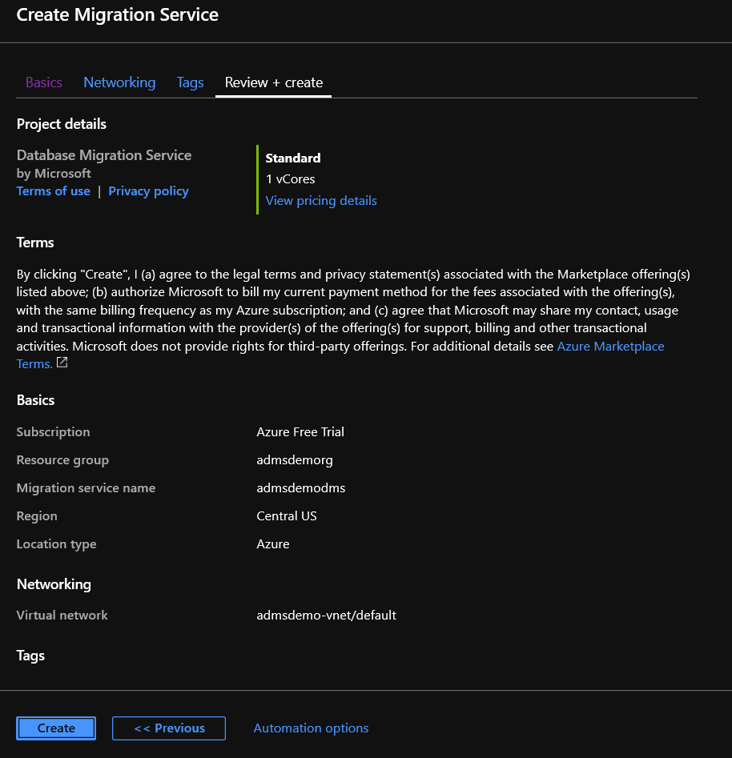
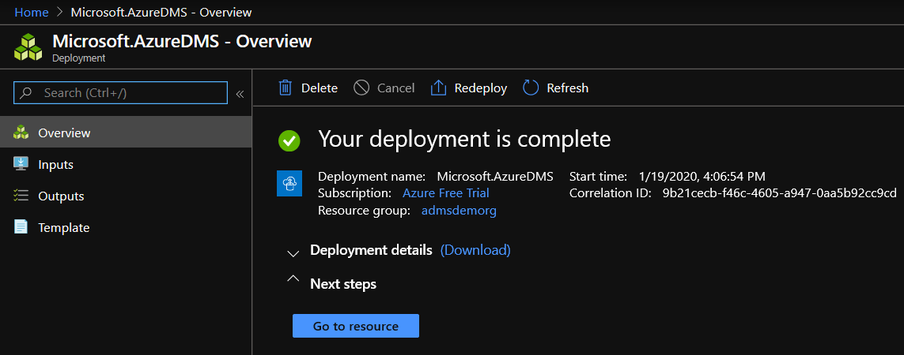
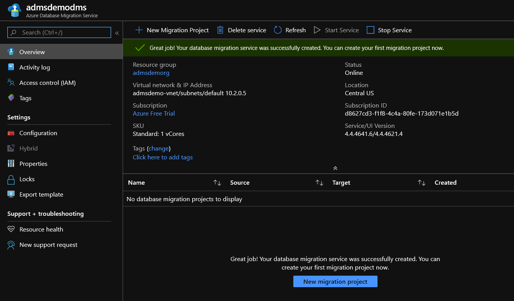

In this exercise, you will migrate the data in your database using the Azure Data Migration Service. This is a two-step process. First, you'll need to create a new instance of a Database Migration Service. Once it has been created, within it you will create a new migration project.

## Create The Database Migration Service

1. Open the Azure Portal, and on the home page click the **Create a resource** button.

1. In the left column, click on **Databases**.

1. In the **Featured** list on the right, click on **Azure Database Migration Service**. (Note: If you don't see it in the **Featured** list, use the **Search the Marketplace** box at the top, enter "Azure Database Migration Service", and press enter or click on it in the results.)
Click on the **Create** button.

    

1. In the basics tab, select your subscription.

1. Next, select **admsdemorg** for the Resource Group.

1. Under Instance details, use **admsdemodms** for the service name.

1. Change the location to **Central US**.

1. Accept the rest of the defaults, then at the bottom click the **Next:Networking** button.

    

1. Place a check in the box beside **admsdemo-vent/default**, then click the **Review + create** button at the bottom (skip the tags as they're not needed for this lesson).

    

Click the **Create** button to create the new Database Migration Service.

   

Wait for the deployment to complete. Once done, click the **Go to resource** button to proceed. 

   

## Create a Migration Project

Now that the service has been created, you will create a project in the service to migrate the database.

1. In the migration project, click the **New Migration Project** button.

    

1. Enter **AdmsDemoDMS** for the Project Name.

1. Take the defaults for the Source and Target server types.

1. For the type of activity you will be doing the default, **Offline data migration**.

1. Click the **Create and run activity** button at the bottom.

    

1. Next, you will fill out the information on the source, in this case the virtual machine. For the Source SQL Server instance name, enter **admsdemovm**.

1. You can use Windows Authentication to connect to the virtual machine.

1. For the user name, use **admsdemovm\learner**.

1. For the password, use **SecureP@ssW0rd**.

1. Ensure the **Encrypt connection** box is checked, as well as the **Trust server certificate**.

1. Click the **Save** button to proceed to the next step.

    

1. Next, you need to supply information to the target, the Azure SQL Database. If you didn't write it down earlier, you can look it up by going to the resource group page. As an example, it will look something like **admsdemosqlvsm4cdzuubghw.database.windows.net**. The string between _admsdemosql_ and _.database.windows.net_ will vary, as it is dynamically generated when the environment setup is executed.

1. For the authentication type, use **SQL Authentication**.

1. User **learner** for the user name and **SecureP@ssW0rd** for the password.

1. Ensure the **Encrypt connection** is checked, then click the **Save** button to proceed.

    

1. Check the **Set Source DB Read-Only** check box. As a reminder, make sure you are not logged into the database elsewhere, such as from SQL Server Management Studio in the virtual machine, or the migration will fail.

1. Click the **Save** button to proceed to configure the migration settings.

    

1. Click the down arrow next to **Social 1 of 1** to see the list of tables.

1. Make sure the dbo.Twitters table is checked, then click **Save** to proceed.

    

1. In the **Activity name** box, enter **MigrateSocialDatabase**.

1. Click on **Validation Options**, select **Do not validate my database(s)**, and click **Save** at the bottom of the blade.

1. Click the **Run migration** button at the bottom.

    

1. A new window will appear showing the status of the migration. Every so often, click the **Refresh** button at the top to update the status until it shows the process is complete.

    
