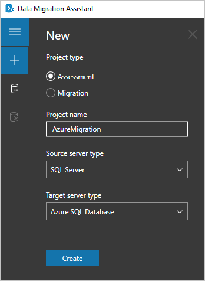

In this unit, you'll assess an existing database using the Data Migration Assistant and review any features used in the local SQL Server instance that aren't currently supported by Azure SQL Database.

## Setup

1. [Install the **Data Migration Assistant**](https://www.microsoft.com/download/details.aspx?id=53595) if you haven't done so already.

1. You'll need a SQL Server instance running, ensure you have connection details available.

<!-- TODO: replace with an LOD VM -->

1. Open a browser and navigate to https://docs.microsoft.com/sql/samples/adventureworks-install-configure?view=sql-server-2017.

1. In **OLTP downloads**, click **AdventureWorks2008R2.bak** and save it to your local machine.

1. In Management Studio, restore *AdventureWorks 2008R2* to your default instance.

## Create an assessment

1. Start the **Microsoft Data Migration Assistant**.

1. In the app's left-hand navigation, click __+__ to create a new Data Migration Assistant project.

1. Specify the following options:

    - **Project type** - Select *Assessment*
    - **Project name** - Enter a name for your project - for example, "Bicycle DB Assessment"
    - **Source server type** - Select *SQL Server*
    - **Target server type** - Select *Azure SQL Database*

1. Click **Create**.
    

1. Select the assessment report type - check both:
    - Check database compatibility
    - Check feature parity

1. Click **Next**.

## Add databases to assess

1. If **Connect to a Server** is not showing on the right-hand side, click **Add Sources** to open the connection menu.

1. Do the following:
    - Enter your existing SQL server instance name
    - Select the **Authentication** type
    - Specify the connection properties for your server

1. Click **Connect**.

1. In **Add sources**, select the databases to assess. For this exercise, select **AdventureWorks2008R2**.

1. Click **Add**.
    > [!NOTE]
    > To add databases from multiple SQL Server instances, use the **Add Sources** button. To remove multiple databases, hold the SHIFT+CTRL keys to select the databases you want to remove, then click **Remove Sources**.

1. Click **Start Assessment**.

## View results

If there are multiple databases, the results for each database appears as soon as it is available. You don't need to wait for all database assessments to complete.

1. Once the assessment for **AdventureWorks** is complete, click** Compatibility issues** and **SQL Server feature parity** radio buttons to view the results.
    - The SQL Server feature parity category lists features that might not be fully supported and steps to remedy these issues. Feature parity issues will not stop a migration.
    - The Compatibility issues category lists features that would block a migration and steps to remedy these issues.

## Summary

In this unit, you assessed a locally installed SQL Server database to verify if any features would be unavailable when you migrate the database to Azure SQL Database.