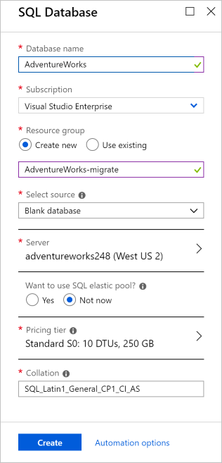
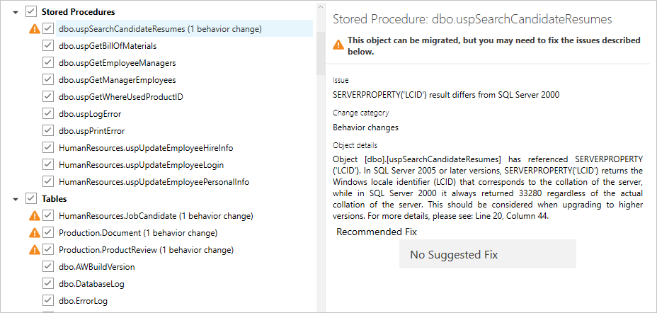

Now that you have assessed your database and fixed any errors reported, you're ready to migrate your database. In this unit, you will migrate your SQL database to Azure SQL Database.

## Setup

The first step is to download the sample data. You can skip this setup if you already have the data installed locally.

1. Start an internet browser and navigate to https://docs.microsoft.com/sql/samples/adventureworks-install-configure?view=sql-server-2017.

1. In **OLTP downloads**, click **AdventureWorks2008R2.bak**.

1. In Management Studio, restore **AdventureWorks 2008R2** to your default instance.

## Create an Azure SQL Database

1. Sign in to your Azure portal account.

1. Click **Create a resource** in the upper left-hand corner of the portal.

1. Click **Databases** > **SQL Database**.

1. Enter the following fields on the SQL Database form:

    |Field|Description|
    |-----|---|
    |Database name|Enter a name for your database. This can be the name of your existing database that you're migrating or any new name of your choice|
    |Resource group|Select a resource group or enter a new resource group name|
    |Select source|Select *Blank database*|

1. Under **Server**, either select an existing server or, enter a globally unique **Server name**, a **Server admin login**, a **Password** (which you should confirm), and a **Location**.

    > [!NOTE]
    > You will use the server name, login name, and password to connect to your database.

1. Click **Select**.

1. In **Pricing tier**, you can select a database with higher performance, but for this tutorial, select default.

1. Click **Create**. Wait until the database has been provisioned before continuing the tutorial.

    The following screenshot shows a possible configuration for your new SQL database.

    

## Create a new migration project

1. Start **Data Migration Assistant**.

1. Click the **New** icon, and specify the following options:

    - **Project type** - Select  the *Migration* option.
    - **Project name** - Enter a memorable name for your project.
    - **Source server type** - Select *SQL Server*.
    - **Target server type** - Select *Azure SQL Database*.
    - **Migration scope** - Select *Schema and data*.

1. Click **Create**.

## Specify the source server and database

1. Under **Connect to source server**, in the **Server name** field, enter the name of the source SQL Server instance.

1. Select the **Authentication type** supported by the source SQL Server instance.
    > [!TIP]
    > It is recommended that you select the **Encrypt connection** check box under Connection properties to encrypt the connection.

1. Select **Connect**.

> [!NOTE]
> If authentication to the server fails because you do not have permission from your IP address, open the SQL Server instance in **Azure Management Studio**, go to **Firewalls and Virtual Networks** and add a rule. Name it whatever you wish, for example, **Allow Azure**. Set up a range of IP addresses that are allowed to access this instance. The range can be 0.0.0.0 to 255.255.255.255. Save this new rule, and you should be able to access the Azure SQL Server instance. 

1. Select a single source database to migrate to Azure SQL Database and click **Next**.

## Specify the target server and database

1. Under **Connect to target server**, in the **Server name** field, enter the name of the Azure SQL Database instance. Add **.database.windows.net** to the database instance.

1. Select the Authentication type supported by the target Azure SQL Database instance. For this tutorial, select **SQL Server Authentication**.
    > [!TIP]
    > It is recommended that you select the **Encrypt connection** check box under Connection properties to encrypt the connection.

1. Enter the **Username** and **Password** that you defined when you created the Azure SQL Database.

1. Click **Connect**.

1. Select a single target database to which to migrate.
    > [NOTE] If you intend to migrate Windows users, in the **Target external user domain name** field, make sure that the target external user domain name is specified correctly.

1. Click **Next**.

## Select schema objects

1. Select the schema objects from the source database that you want to migrate to Azure SQL Database.

    > [!NOTE]
    > Some of the objects that cannot be converted as-is are presented with automatic fix opportunities. Clicking these objects on the left pane displays the suggested fixes on the right pane. Review the fixes and choose to either apply or ignore all changes, object by object. Note that applying or ignoring all changes for one object does not affect changes to other database objects. Statements that cannot be converted or automatically fixed are reproduced to the target database and commented.

    

1. Click **Generate SQL script**.

## Deploy schema

1. Click **Deploy schema**.

1. Review the results of the schema deployment.

## Migrate data

1. Click **Migrate data** to start the data migration process.

1. Select the tables with the data you want to migrate.

1. Click **Start data migration**.

The final screen shows the overall status.

## Summary

In this unit, you created an empty Azure SQL Database and migrated a local SQL Server database to this new database.