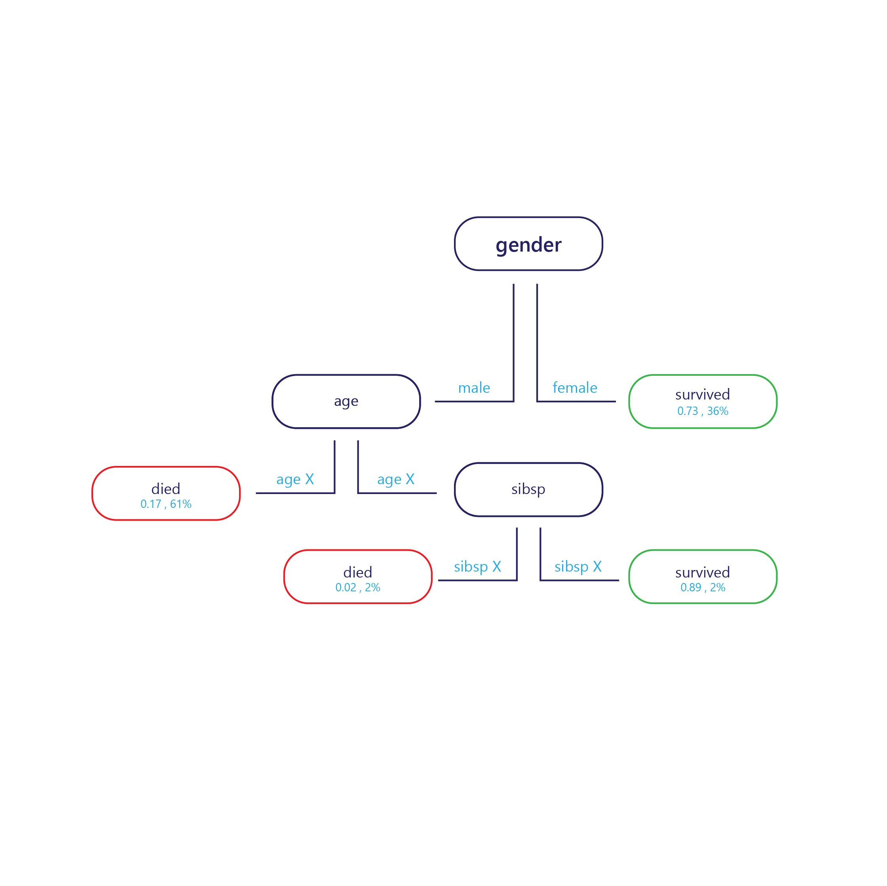

When we talk of architecture, we often think of buildings. Architecture is responsible for how a building is structured – it’s height, depth, the number of floors, and how things are connected internally. This also dictates how we use a building – where we enter it, and what we can “get out of it”, practically speaking.

In machine learning, architecture refers to a similar concept. How many parameters does it have, and how are they linked together to achieve a calculation? Do we calculate a lot in parallel (width) or do we have serial operations that rely on a previous calculation (depth)? How can we provide inputs to this model, and how can we receive outputs? Such architectural decisions only typically apply to more complex models, and architectural decisions can range from quite simple to quite complex. These decisions are usually made before the model is trained, though in some circumstances there is room to make changes post-training.

Let’s explore this more concretely with decision trees as an example.

## What's a decision tree?

In essence, a decision tree is a flow chart. Decision trees are a categorisation models that break decisions down into multiple steps.

The sample if provided at the entry point (top, in the diagram above) and each exit point has a label (bottom in the diagram). At each node, a simple ‘if’ statement decides which branch the sample passes to next. Once the branch has reached the end of the tree (the leaves) it will be assigned to a label.

### How are decision trees trained?

Decision trees are trained one node (decision point) at a time. At the first node, the entire training-set is assessed and a feature is selected that can best separate the set into two sub-sets that have more homogenous labels. For example, imagine our training set was as follows:

| Weight (Feature)  | Age (Feature) | Won a medal (Label) |
|----------------------|-----------------|------------|
| 90                   | 18              | No         |
| 80                   | 20              | No         |
| 70                   | 19              | No         |
| 70                   | 25              | No         |
| 60                   | 18              | Yes        |
| 80                   | 28              | Yes        |
| 85                   | 26              | Yes        |
| 90                   | 25              | Yes        |

If we were to do out best to find a simple rule to split this data, we might split by age, at around 24 years old, because most medal winners were over 24. This would give us two sub-sets of data.

**Subset 1**

| Weight (Feature)  | Age (Feature) | Won a medal (Label) |
|----------------------|-----------------|------------|
| 90                   | 18              | No         |
| 80                   | 20              | No         |
| 70                   | 19              | No         |
| 60                   | 18              | Yes        |

**Subset 2**

| Weight (Feature)  | Age (Feature) | Won a medal (Label) |
|----------------------|-----------------|------------|
| 70                   | 25              | No         |
| 80                   | 28              | Yes        |
| 85                   | 26              | Yes        |
| 90                   | 25              | Yes        |

If we stop here, we have a simple model with one node and two leaves. Leaf 1 contains non-medal winners, and is 75% accurate on our training set. Leaf 2 contains medal winners, and is also 75% accurate on the training set.

We don’t need to stop here, though. We can continue this process, however by splitting these leaves further.

The first new node, which applies to the first table above, could split by weight, because the only medal winner had a weight less than those who did not. The rule might be set to “weight < 65”. Those with weight < 65 are predicted to have won a medal, while those who have weight ≥65 do not meet this criterion might be predicted to have not won a medal.

The second new node, which applies to the second table above, might also split by weight, but this time predict than anyone with a weight over 70 would have won a medal, while those under it would not.

This would provide us with a tree that could achieve 100% accuracy on the training set.

### Strengths and weaknesses of decision trees

Decision trees are considered to have low bias. This means that they are usually quite good at identifying features that are important in order to label something correctly.

The major weakness of decision trees is overfitting. Consider the example given above: the model gives a very exact way to calculate who is likely to win a medal, and this will predict 100% of the training dataset correctly. This is unusual for machine learning models, which normally make numerous errors on training dataset. Good training performance is not a bad thing in itself, but at the end of the day the tree has become so specialized to the training set that it probably will not do well on the test set. This is because the tree has managed to learn relationships in the training set that probably are not real – such as that having a weight of 60 kg guarantees a medal if you are under 25 years old.

## Model architecture affects overfitting

How we structure our decision tree is key to avoiding its weaknesses. The deeper the tree is, the more likely it is to overfit the training set. For example, in the simple tree above, if we limited the tree to only the first node, it would make errors on the training set, but probably do better on the test set. This is because it would have more general rules about who wins medal (“athletes over 24”) rather than extremely specific rules that might only apply to the training set.

Although we are focussed on trees here, other complex models often have similar weakness that can be mitigated through decisions about how they are structured, or how they are allowed to be manipulated by the training.