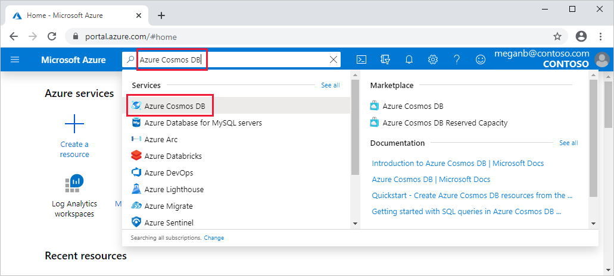
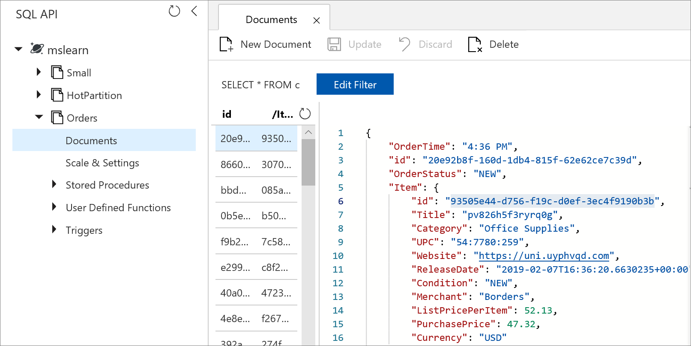
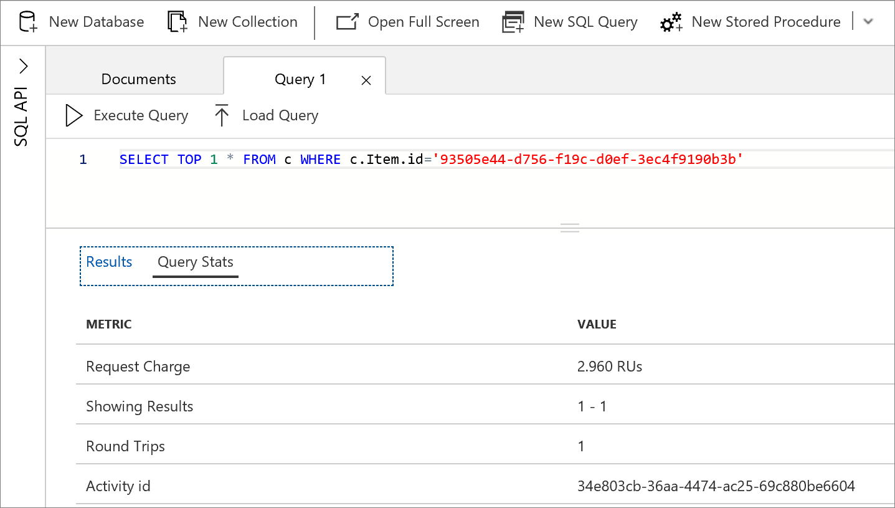

In the last unit, we added three collections to your Azure Cosmos DB account and populated them. In this unit, we'll look closely at these collections. We'll learn how to use the portal to check whether any of the collections are overloaded. We'll also run individual operations from the command line to model the capacity required for a specific workload.

## Measure throughput in Azure Cosmos DB

Recall that in Azure Cosmos DB, capacity or throughput is measured in Request Units (RUs). Every operation on a database has an RU value based on the throughput required to complete the operation. Operations can be simple, and require only a small number of RUs. Or, they can be complex, and require a large number of RUs. The sum of the RUs for all of your operations must stay within the throughput you've configured.

For example, let's say your configured throughput is 500 RUs per second (RU/s), and:

- You need to write 25 documents per second. 
- Each write requires 20 RUs.
- You're at capacity because the total throughput is 25 x 20 RUs = 500 RU/s.

## Review metrics for your database

1. Sign in to the [Azure portal](https://portal.azure.com/learn.docs.microsoft.com?azure-portal=true) by using your Microsoft Learn account.

1. Search for and select **Azure Cosmos DB**.

   

1. Select your Azure Cosmos DB account.

1. In the menu pane, scroll down, and under **Monitoring**, select **Metrics**. The Azure Cosmos DB **Metrics** panel appears.

1. Scroll to the top of the menu pane, select **Overview**, and observe the aggregated view of all your databases and collections. Here, you see:

   - Requests that you made over time.
   - How much storage you're using.
   - Any requests that exceeded capacity.

1. Review the chart **Number of request exceeded capacity**. We deliberately overloaded the **Small** collection. So you see that some of the requests exceeded capacity.

   

   The HTTP 429 error code indicates that there are too many requests. Future requests will be rate-limited. When you see HTTP 429 responses from Azure Cosmos DB, that means you've exceeded the allocated capacity.

   If the demand on one or more of your collections exceeds its allocated capacity, you have the following options to fix an overloaded collection:

   - Increase the overloaded collection's capacity.
   - Reduce the demand on your collection.
   - Increase the efficiency of the operations that overload your collection.

In the following sections, we'll show you how to measure the required capacity of individual operations. You can extrapolate from the individual operation performance costs to the scale of your database.

## Measure throughput that individual queries require by using Data Explorer

The exercises in this section have you use Data Explorer in Azure Cosmos DB. You'll compare the performance costs between a query that you run within a single partition, and one that you run across a partition.

### Review a database document in Data Explorer

1. In the Azure portal, in your Azure Cosmos DB account, go to **Data Explorer**.

1. Expand the **mslearn** database. You see the three collections that you created in the setup unit: **HotPartition**, **Orders**, and **Small**.

1. Expand the **Orders** collection and select **Items**. You see the first 100 documents.

1. Select the first document to see the JSON data for an order. It includes the following information:

   - Order time and date
   - Order status
   - Item that was ordered
   - Quantity
   - Details of the customer who placed the order
   - Other properties related to the order

### Find a document in a single partition

We're going to use the **Orders** collection, where the partition key is set to **/Item/id**. All orders with the same `Item.id` value are stored in the same partition. When we run a query for a specific `Item.id` value, the query runs within a single partition.

1. In JSON data for the document that you selected, under the `Item` field, copy the GUID value of `id`.

    `"Item": { "id": "..."}`

    

1. From the top menu bar, select the **New SQL Query** icon.

1. Create the query by using the `c.Item.id` value that you copied:

   ```sql
    SELECT TOP 1 * FROM c WHERE c.Item.id='<Copied Item id value>'
    ```

    

1. From the top menu bar, select **Execute Query**.

1. In the code block, select the **Query Stats** tab.

    

Notice how many RUs the operation took. The **Request Charge** value shown should be between 2.5 and 3.5 RUs. That's the performance cost of querying for a 1-KB document that uses the partition key `/Item/id`.

### Find a document by querying across partitions

In the previous section, we ran a query within a partition. This time, we'll choose a different property to query: `Customer.id`. Orders that the same customer makes aren't guaranteed to be in the same partition. Running a query across partitions takes more RUs than running a query in a single partition.

1. Go back to the **Orders** collection and select a different document.

1. Under the `Customer` field, copy the GUID value of `id`.

    `"Customer": { "id": "..."`

1. From the top menu bar, select the **New SQL Query** icon.

1. Run the following query. Replace the `c.Customer.id` value with the `id` value that you copied.

    ```sql
    SELECT TOP 1 * FROM c WHERE c.Customer.id='<Copied Customer id value>'
    ```

1. From the top menu bar, select **Execute Query**.

1. In the code block, select the **Query Stats** tab.

Notice that this time, the operation takes more RUs.

## Measure the throughput required for direct writes and reads for a single document

To look at the performance costs of detailed operations, like reading a document directly, use the ExerciseCosmosDB utility.

### Check your environment variables

If Azure Cloud Shell times out, you need to reset the `ENDPOINT`, `KEY`, and  `COSMOS_NAME` variables. The console application needs the environment variables to connect to the database. Refresh the Cloud Shell. If Cloud Shell hasn't timed out, you can skip these steps.

1. Reset the `COSMOS_NAME` value by running the following command.

    ```bash
    export COSMOS_NAME=$(az cosmosdb list --output tsv --query [0].name)
    ```

1. Reset your `ENDPOINT` and `KEY` variables by running the following commands.

    ```bash
    export ENDPOINT=$(az cosmosdb list \
        --resource-group <rgn>[sandbox resource group name]</rgn> \
        --output tsv \
        --query [0].documentEndpoint)
    ```

    ```bash
    export KEY=$(az cosmosdb keys list \
        --resource-group <rgn>[sandbox resource group name]</rgn>  \
        --name $COSMOS_NAME \
        --output tsv \
        --query primaryMasterKey)
    ```

### Write a single document

1. In Cloud Shell, if you need to, change the directory to `ExerciseCosmosDB`.

    ```bash
    cd ~/mslearn-monitor-azure-cosmos-db/ExerciseCosmosDB
    ```

1. Run the following command to insert a document into the **Orders** collection.

      ```bash
      dotnet run -- -c Orders -o InsertDocument -n 1
      ```

1. Review the output from this command.

      ```bash
      Performed 1 Write operations @ 1 operations/s, 14.1 RU/s (0B max monthly 1KB reads)
      ```

The consumption of this single write operation for a 1-KB document with the default indexing configuration is about 13 to 15 RUs.

### Query a single document

1. Run the following command to query for a single document from the **Orders** collection.

      ```bash
      dotnet run -- -c Orders -o QueryCollection -q "SELECT TOP 1 * FROM c" -n 1 -r
      ```

1. Review the output from this command.

    ```bash
    Order {"OrderTime":"1:00 PM","id":"07d34e38-bfab-90dc-6031-bcc9115d30e0","OrderStatus":"NEW","Item":{"id":"780115d0-a6a0-d62c-320e-bdf7b624d241","Title":"53cv9a679xdox7p","Category":"Kitchenware","UPC":"0xc0513acffa","Website":"i40l17h07w","ReleaseDate":"2019-01-02T13:00:25.724147-08:00","Condition":"NEW","Merchant":null,"ListPricePerItem":32.690356314503752,"PurchasePrice":26.271710114962897,"Currency":"USD"},"Quantity":73,"PaymentInstrumentType":0,"PurchaseOrderNumber":"System.Int32[]","Customer":{"id":"0dd52733-6497-d167-ef3a-6eed3809532f","FirstName":"Abner","LastName":"Connelly","Email":"Abner.Connelly@yahoo.com","StreetAddress":"651 Andrew Coves","ZipCode":"62304-5348","State":"NE"},"ShippingDate":"2019-01-12T13:00:25.738321-08:00","Data":"5YFvPRdWc4zsxg==","_rid":"doBFAKxb1QABAAAAAAAAAA==","_self":"dbs/doBFAA==/colls/doBFAKxb1QA=/docs/doBFAKxb1QABAAAAAAAAAA==/","_etag":"\"4f00e1a6-0000-0000-0000-5c2d266a0000\"","_attachments":"attachments/","_ts":1546462826}
        Performed 1 Query operations @ 1 operations/s, 4.6 RU/s (0B max monthly 1KB reads)
    ```

The complexity of a query affects how many RUs are consumed for an operation. In this case, the query is simple and the volume of data returned is small. The cost is 4.6 RUs.

### Read a single document

Reading a document directly from your Azure Cosmos DB collection by using its `id` and `partition key` values is the least expensive operation.

1. Note the `id` and `Item.id` fields from the results of the previous query. In the example output from the previous step, the `id` and `Item.id` values are:

   - `"id":"07d34e38-bfab-90dc-6031-bcc9115d30e0"`
   - `"Item":{"id":"780115d0-a6a0-d62c-320e-bdf7b624d241 ...}"`

1. Read a single document directly from the **Orders** collection by adding those values to the following command, and running it.

    ```bash
    dotnet run -- -o ReadDocument -l dbs/mslearn/colls/Orders/docs/<Document id value> -k <Item id value> -n 1
    ```

1. Review the output from this command.

    ```bash
    Performed 1 Query operations @ 1 operations/s, 1 RU/s (0B max monthly 1KB reads)
    ```

You see that it consumes 1 RU to directly read one document that's 1 KB.

Now you know how to monitor and measure the cost of your database operations. Next, we can look more closely at the design of your collections. It's essential that we model individual costs to understand how the design choices allow you to scale.
