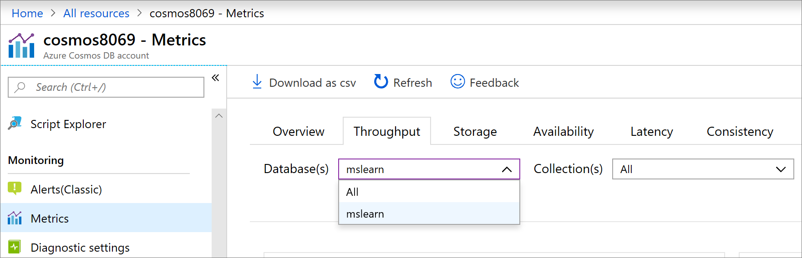
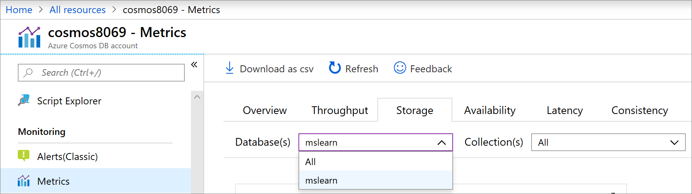

In the previous unit, you learned how to design an efficient partitioning strategy. Recall that you can't change the partitioning strategy of your Azure Cosmos DB collection after it's created. So, it's essential to understand how to partition the collection efficiently.

## Measure the impact of partitions on throughput

1. In the [Azure portal](https://portal.azure.com/learn.docs.microsoft.com?azure-portal=true), go to your Azure Cosmos DB account, and in the menu pane, under **Monitoring**, select **Metrics**.
1. Select the **Throughput** tab.

1. Filter on the **mslearn** database.

    

### Review unevenly distributed partitions for throughput

1. Filter on the **HotPartition** collection.

1. Review the results. You see that the collection is using two partitions with 7,000 RU/s divided between them.

1. On the **Number of requests** chart, find the time when you populated this collection. You should see a peak in requests at this time.

    :::image type="content" source="../media/6-request-peak.png" alt-text="Screenshot that shows the chart for Azure Cosmos DB requests over time." loc-scope="other"::: <!-- no-loc -->

1. Enter that time on the **Max consumed RU/s by each partition key range** chart and select **Apply**.

    

    Notice the imbalance between the two partitions. Most of the requests are for the first partition, which is being overused. The other partition is being underused. The **HotPartition** collection isn't configured to efficiently use its total allocated Request Units (7,000 RU/s). The first partition is in danger of being throttled, while the second has plenty of capacity available.

1. Select the blue column for the first partition (Partition 0). With the partition selected, you see a list to the right of the chart that shows the partition key values that are dominating the partition. In this case, `Books` values make up the largest logical partition.

### Review evenly distributed partitions for throughput

1. Filter on the **Orders** collection.

1. On the **Number of requests** chart, find the time that you populated this collection.

1. Enter that time on the **Max consumed RU/s by each partition key range** chart and select **Apply**.

    

    You see that the requests are balanced between the two partitions. The Orders collection has a more efficient partitioning scheme because it uses the available capacity.

    The line on the chart indicates the throughput limit of each partition. You see that you're well within the configured limit.

## Measure the impact of partitions on storage

1. Select the **Storage** tab.

1. Filter on the **mslearn** database.

    

### Review unevenly distributed partitions for storage

1. Filter on the **Hot Partition** collection.

1. Review the **Data + Index storage consumed per partition key range** chart. You see the uneven distribution of data among the partitions. When you have uneven storage, one partition will receive more requests than others.

    

1. Select the blue column for the largest partition. The dominant partition key values appear to the right of the chart. In this case, the **Books** category is dominant.

### Review evenly distributed partitions for storage

1. Filter on the **Orders** database.

1. Review the **Data + Index storage consumed per partition key range** chart.

    

    You see that the storage across partitions is balanced. There's no significant consumption by any partition key value.
