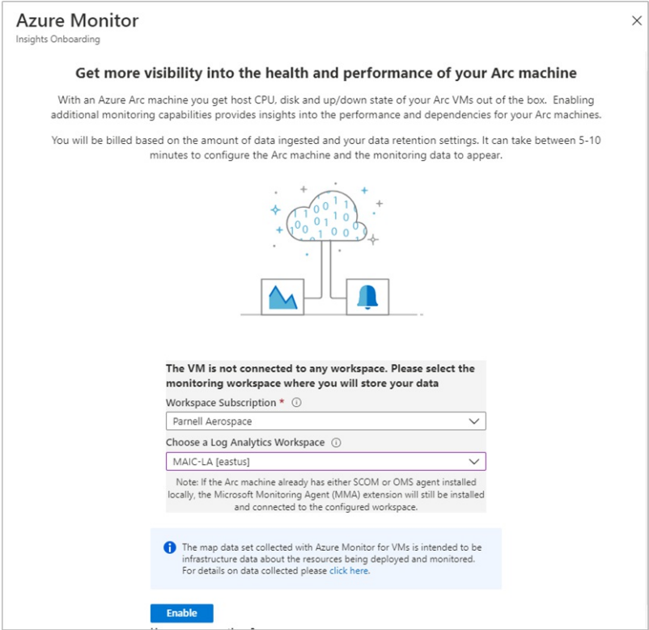
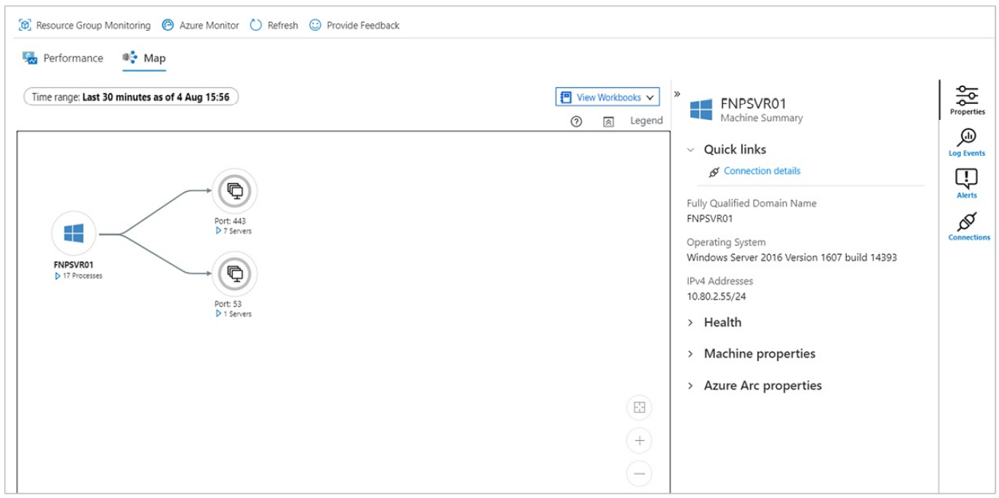

Tailwind Manufacturing has onboarded its machines to Azure Arc-enabled servers and now wants to use VM insights. In this Unit, you’ll learn how to configure and collect data from your Azure Arc-enabled servers by enabling VM insights.

## Enable VM insights

VM extensions can be applied to your Arc-enabled server via the Azure portal.

1. From your browser, go to the [Azure portal](https://portal.azure.com/).
1. In the portal, browse **Servers - Azure Arc** and select your hybrid machine from the list.
1. From the left-pane under the **Monitoring** section, select **Insights** and then **Enable**.

On the Azure Monitor Insights Onboarding page, you are prompted to create a workspace. You can either select an existing Log Analytics workspace or select the default. The default is a configured workspace with a unique name in the same region as the Azure Arc-enabled server. 

<kbd><kbd>

With VM insights enabled, you will get a message that the machine has been successfully onboarded to VM insights. This process takes a few minutes as extensions are installed on your connected machine.

## View collected data

After the deployment and configuration is completed, select **Insights**, and then select the **Performance** tab. You’ll see a select group of performance counters collected from the guest operating system of your machine at the top. Hover over a graph to view averages and percentiles taken starting from the time when the Log Analytics VM extension was installed on the machine.

<kbd><kbd>

Select **Map** to open the maps feature, which shows the processes running on the machine and their dependencies. Select **Properties** to open the property pane if it isn't already open.

<kbd><kbd>

Select your machine again and then select **Log Events**. You see a list of tables that are stored in the Log Analytics workspace for the machine. Select **Event** table. The **Event** table includes all events from the Windows event log. Log Analytics opens with a simple query to retrieve collected event log entries.
