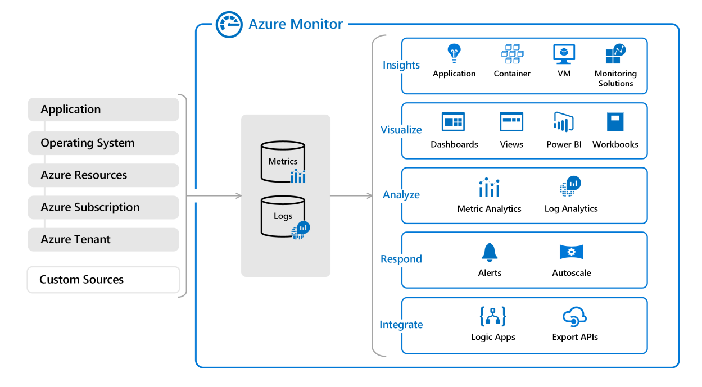
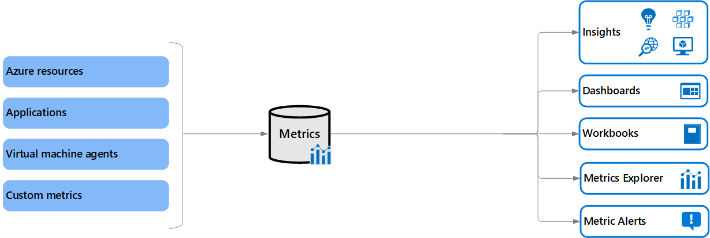
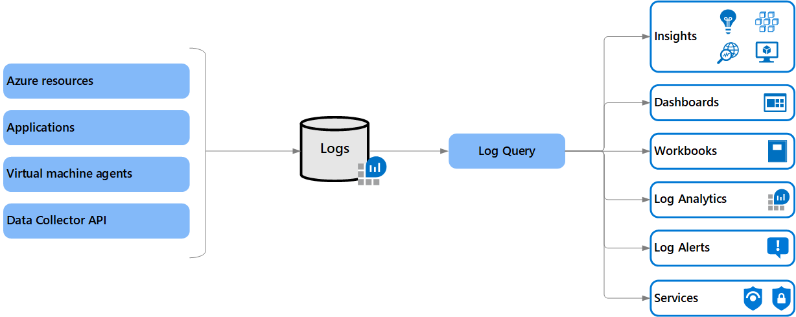
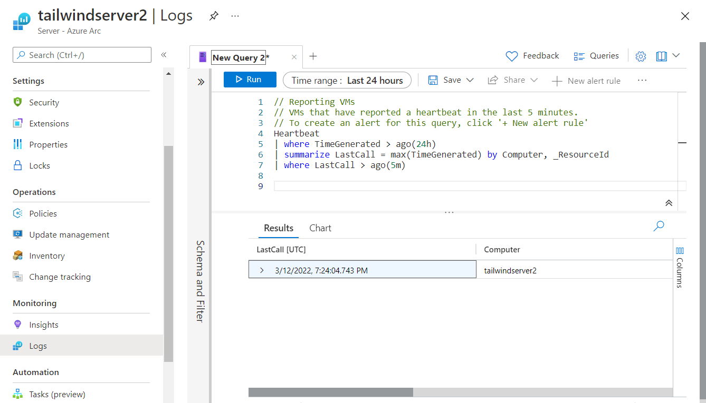

Tailwind Manufacturing is interested in collating its Azure Monitor data across its Azure Arc-enabled servers to provide a data foundation for analytics, reporting, and visualization. In this unit, you learn how Azure Monitor represents data across Metrics and Logs and Azure Monitor’s Log Analytics capabilities.

## Overview of observability data in Azure Monitor

Today's complex computing environments run distributed applications that rely on both cloud and on-premises services. Enabling observability across these environments requires collection of operational data from every layer and every component of the distributed system. You need to be able to perform deep insights on this data and consolidate it into a single pane of glass with different perspectives to support the stakeholders across your organization.

Azure Monitor collects and aggregates data from various sources into a common data platform where it can be used for analysis, visualization, and alerting. It provides a consistent experience on top of data from multiple sources, which gives you deep insights across all your monitored resources, and even with data from other services that store their data in Azure Monitor.

## Azure Monitor metrics

Metrics are numerical values that describe some aspect of a system at a particular point in time. They're collected at regular intervals and are identified with a timestamp, a name, a value, and one or more defining labels. Metrics can be aggregated using various algorithms, compared to other metrics, and analyzed for trends over time.

Metrics in Azure Monitor are stored in a time-series database that's optimized for analyzing time-stamped data. This optimization makes them useful for alerting and fast detection of issues. They can tell you how your system is performing, but they typically need to be combined with logs to identify the root cause of issues.

Metrics are available for interactive analysis in the Azure portal with Azure Metrics Explorer. You can add them to an Azure dashboard for visualization in combination with other data and use them for near-real time alerting.

- Analyze by using Metrics Explorer to analyze collected metrics on a chart and compare metrics from various resources.
- Alert by configuring a metric alert rule that sends a notification or takes automated action when the metric value crosses a threshold.
- Visualize by pinning query results as tables or charts in Azure dashboards, creating a workbook combining multiple data sets, or exporting results to Grafana.
- Automate using Autoscale to increase or decrease resources based on a metric value crossing a threshold.

## Azure Monitor Logs

Logs are records of events that occurred within the system. They can contain different kinds of data and may be structured or freeform text with a timestamp. They may be created sporadically as events in the environment generate log entries. A system under heavy load typically generates more log volume.

Logs in Azure Monitor are stored in a Log Analytics workspace that's based on Azure Data Explorer, which provides a powerful analysis engine and rich query language. Logs typically provide enough information to provide complete context of the issue being identified and are valuable for identifying the root cause of issues.

You can work with log queries interactively with Log Analytics in the Azure portal. You can also add the results to an Azure dashboard for visualization in combination with other data. You can also create log alerts, which trigger an alert based on the results of a scheduled query.

- Analyze using Log Analytics in the Azure portal to write log queries and interactively analyze log data by using a powerful analysis engine.
- Alert by configuring a log alert rule that sends a notification or takes automated action when the results of the query match a particular result.
- Visualize by pinning query results as tables or charts in Azure dashboards. Also by creating a workbook combining multiple data sets, or exporting results to Power BI or Grafana for visualization.

## Azure Log Analytics

Log Analytics is a tool in the Azure portal used to edit and run log queries with data in Azure Monitor Logs. You can write a query that returns a set of records. Then, you can use features of Log Analytics to sort, filter, and analyze them. Or, you can write a more advanced query to perform statistical analysis and visualize the results in a chart to identify a particular trend.

A Log Analytics workspace is a unique environment for log data from Azure Monitor, Microsoft Sentinel, and Microsoft Defender for Cloud. Each workspace has its own data repository and configuration, but may combine data from multiple services. You can use a single workspace for all your data collection, or you can create multiple workspaces based on various requirements.

For Azure Arc-enabled servers, select **Logs** from the left navigation pane to run queries on collected Azure Monitor Log Analytics data.

