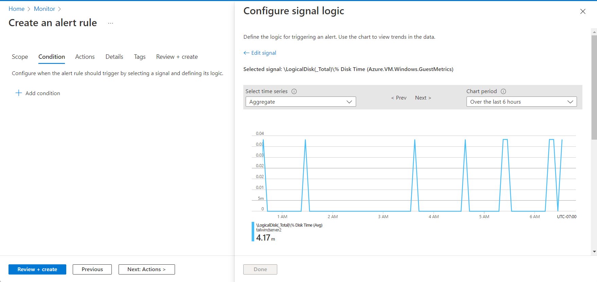
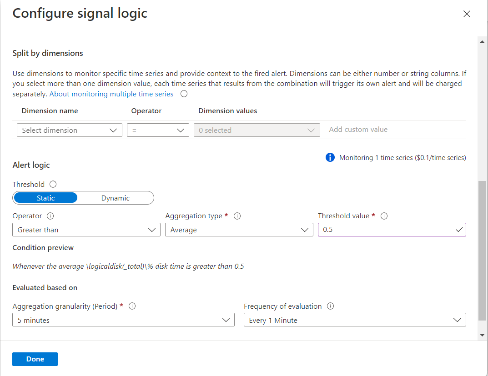
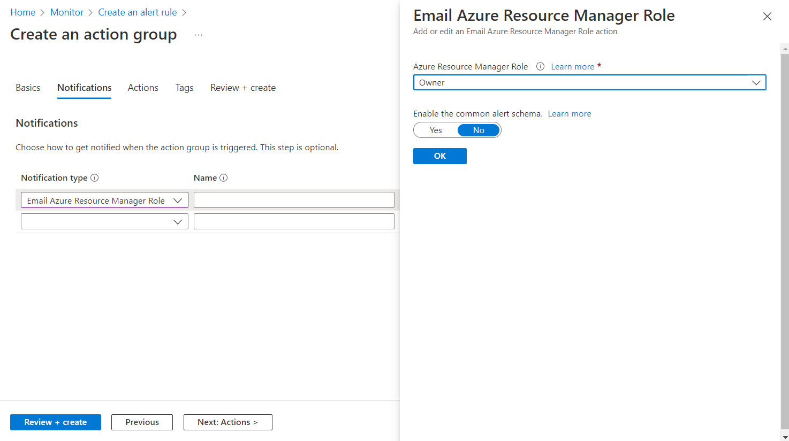

Tailwind Manufacturing is interested in setting up a system of alerts to respond to operational and connectivity signals from its Azure Arc-enabled servers. In this unit, you learn how Azure Monitor supports smart and scalable alerting through rules. Then, you walk through the creation of an Azure Monitor Alert Rule for Azure Arc-enabled servers. 

## Overview of Azure Monitor alerts and alert rules

Alerts proactively notify you when issues are found with your infrastructure or application by using your monitoring data in Azure Monitor. They allow you to identify and address issues before your system's users notice them. The core components of Azure Monitor alerts include alert rules, action groups, and monitor conditions.

Alert rules are separated from alerts and the actions taken when an alert fires. The alert rule captures the target and criteria for alerting. Key attributes of an alert include:

- **Target resource** defines the scope and signals available for alerting. A target can be any Azure resource. Azure Arc-enabled servers can be targets for Azure Monitor Alerts.
- **Signal** includes the metric, activity log, Application Insights, and log emitted by the target resource. For example, the heartbeats emitted by an Azure Arc-enabled server, or the CPU Utilization threshold of that server.
- **Criteria** specifies the combination of signal and logic applied on a target resource. For example, if the CPU utilization threshold passes 70%.  
- **Alert name, Alert description,** and **Severity** are configured by the user. Severity ranges from 0 to 4, where Severity 0 is *Critical*, Severity 1 is *Error*, Severity 2 is *Warning*, Severity 3 is *Informational*, and Severity 4 is *Verbose*.
- **Action** specifies the corresponding action group to be notified and respond. Main action types include Automation Runbook, Azure Function, ITSM, Logic App, Secure Webhook, and Webhook.

The default **Alerts** page provides a summary of alerts that are created within a particular time range. You can also manage the state of an alert to specify where it is in the resolution process. When all of criteria specified in the alert rule are met, an alert is created or fired, and it has a status of *New*. You can change the status when you acknowledge an alert and when you close it. All state changes are stored in the history of the alert.

You might want to query programmatically for alerts generated against your subscription. Through Azure Resource Graph, you can programmatically manage your alert instances. Additionally, you can use smart groups to reduce noise and improve troubleshooting. Smart groups are aggregations of alerts based on machine learning algorithms.

Azure Monitor’s robust alert management and resource framework can be extended to reporting of hybrid and multicloud machines through Azure Arc-enabled servers.

## Create an alert rule for Azure Arc-enabled servers

Follow these steps to define a new alert rule for Azure Arc-enabled servers. We assume that you have one or more Azure Arc-enabled servers with VM Insights enabled.

1. From your browser, go to the [Azure portal](https://portal.azure.com/).
1. In the portal, browse to **Monitor** and select **Alerts** from the left-navigation list.
1. From under the **Create** section, select **Alert Rule**.
1. From under the **Filter by Resource Type** section, select **Servers - Azure Arc**.
1. Select the target Azure Arc-enabled servers as the scope of the rule.
1. Select the signal **\LogicalDisk(\_Total)\% Disk Time (Azure.VM.Windows.GuestMetrics)**.

   
  
1. Enter the **Threshold value** of 0.5 and select **Done**.
  
   

1. Select **Create a new Action Group** to define the response to the alert.
1. For Basics, enter the Subscription, Resource Group, and Action Group Name.
1. For Notifications, select **Email Azure Resource Manager Role** and choose **Owner** from the dropdown options. 

   

1. Enter a **Notification Name** and select **Review + Create** for the Action Group.
1. Select **Review + Create** for the alert rule.
