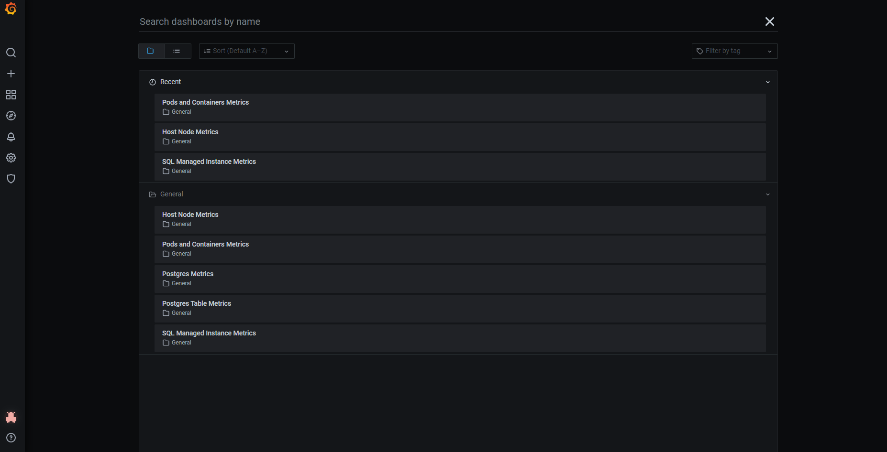
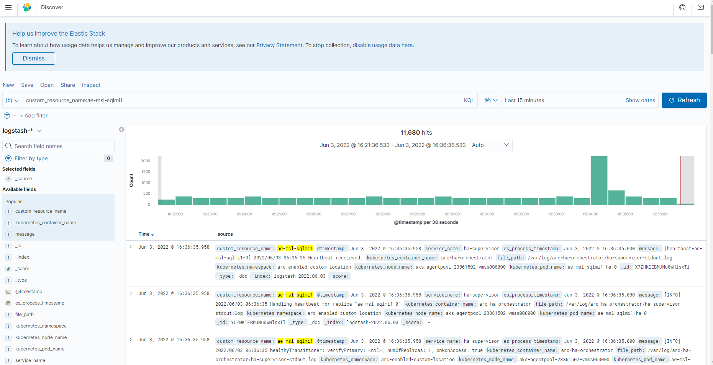

For production workloads running on your Arc-enabled SQL Managed Instance (MI) environments, it is very important to continuously understand the resource consumption and any potential performance issues to allow for your business operations to continue running smoothly.

Arc-enabled SQL MI provides out of the box the following monitoring capabilities:

- **Grafana**: Provides pre-built metrics dashboards for us to easily understand what is happening in our environment.
- **Kibana**: Provides easy access to the collected logs and easy search capabilities of the logs
- **Azure Monitor**: Provides pre-built in-sights to assist with understanding the overall health of our environment.

## Grafana

Grafana is an open-source analytics and monitoring solution for databases provided out of the box with Arc-enabled SQL MI. Whether your deployment is in directly or indirectly connected modes, Grafana is available locally for you to monitor your environment.

### Accessing Grafana dashboards

Open Azure Data studio, expanding the Connections tab to reveal the deployed Arc data controller. Right-click on an Arc-enabled SQL MI and select Manage.

Previously we deployed an Arc data controller. We configured `Metrics and Logs Dashboard Credentials`, which we use to log into the Grafana dashboards to monitor the performance of our Arc-enabled SQL MI. To access the Grafana dashboards, we use the Grafana Dashboard Endpoint from within Azure Data Studio as seen above or using the [`az sql mi-arc endpoint list`](/cli/azure/sql/mi-arc/endpoint?view=azure-cli-latest&preserve-view=true) CLI command.

From this central location, we have access to several dashboards that provide us with the metrics to monitor all of the following:

-   Kubernetes Host Node metrics.
-   Kubernetes Pods and Container metrics.
-   Arc-enabled SQL MI metrics.

## Kibana

Kibana is a free and open frontend application that sits on top of the Elastic Stack, providing search and data visualization capabilities for data indexed in Elasticsearch. Kibana is ideal for viewing, searching, and visualizing data coming from:

-   Logging and log analytics.
-   Infrastructure metrics and container monitoring.
-   Application performance monitoring.
-   Geospatial data analysis and visualization.
-   Security analytics.
-   Business analytics.

Like Grafana, if your Arc data controller deployment is in either directly or indirectly connected modes, Kibana is available locally for you to analyze the logs for the deployed environment.

[Kibana Query Language (KQL)](https://www.elastic.co/guide/en/kibana/master/kuery-query.html), not to be confused with [Kusto Query Language (KQL)](/azure/data-explorer/kusto/query/), is a simple syntax for filtering Elasticsearch data using free text search or field-based search.

Within Kibana, you can create dashboards and visualizations to cater to your environment and needs.

### Azure Monitor

[Azure Monitor](/azure/azure-monitor/overview) helps you maximize the availability and performance of your applications and services. It delivers a comprehensive solution for collecting, analyzing, and acting on telemetry from your cloud and on-premises environments.

In directly connected mode, you have the option to automatically export and import metrics and logs from the Arc data controller to Azure Monitor. In indirectly connected mode, you have the option to manually export and import metrics and logs to Azure Monitor.

Azure Monitor provides you with a single pane of glass to monitor your deployed Arc-enabled data service resources. We can view metrics in easy-to-understand graphs and create alerts to assist with managing the environment.

