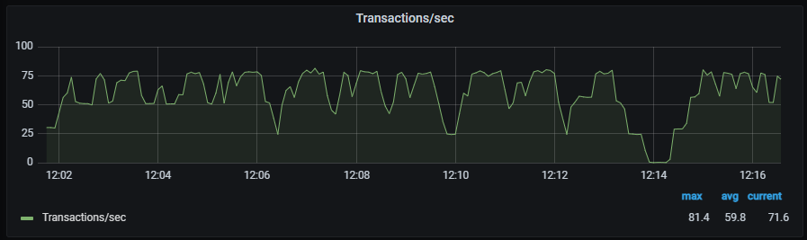
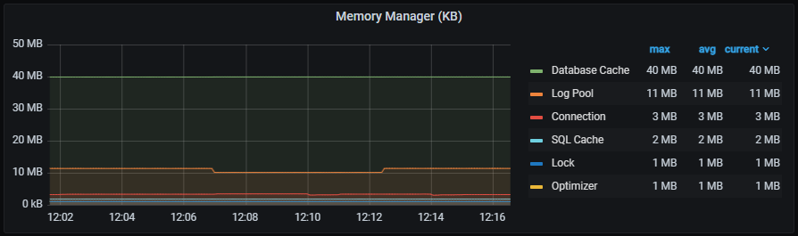

An Azure Arc-enabled SQL Managed Instance (MI) deployment out of the box provides the ability to monitor the environment locally using Azure Data Studio and Grafana. In this exercise, we look at how to access Grafana and what metrics are captured and provided by default. 

Utilizing the Grafana dashboards locally in your Arc-enabled SQL MI environment will provide you insights into the infrastructure (Kubernetes Cluster) as well as the performance of the Arc-enabled SQL MI.

1. Open Azure Data Studio.
2. Expand the Connections Tab.
3. Expand Azure Arc Controllers.
4. Expand your Arc data controller.
5. Right-click on your Arc-enabled SQL MI and select Manage.

6. Click on Grafana Endpoint.
7. Enter your `Metrics and Logs Dashboard credentials`
8. Discover the performance metric graphs for your Arc-enabled SQL MI:
    - Transactions/sec

    - Batch Requests/sec

    - Wait Statistics

    - Memory Broker Clerks

    - Database Activity

    - SQL Server Activity

    - Buffer Cache - Memory

    - Memory Manager

9. Swap to another deployed Arc-enabled SQL MI. Select the drop-down for Host.

10. Investigate the Kubernetes Host Node Metrics.

11. Investigate the Kubernetes Pods and Containers Metrics

