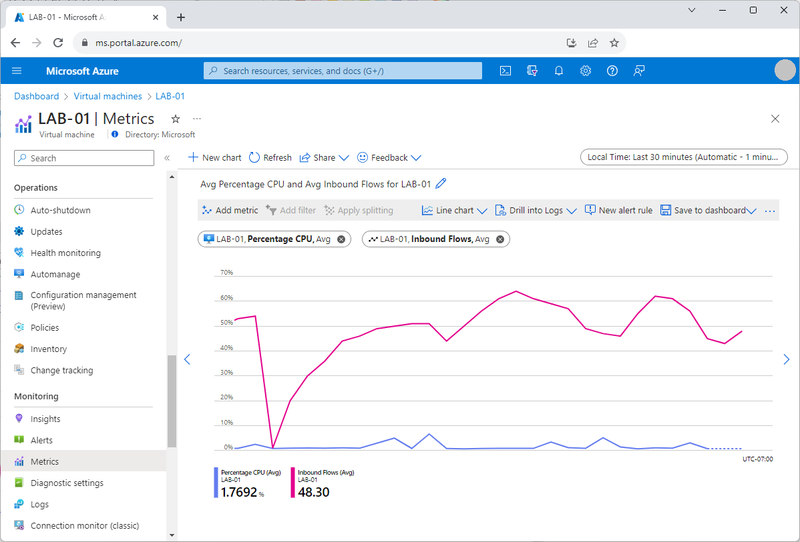

You can use Azure Monitor to view metrics on all of your Azure resources. 

Your band is going on tour next month, so you need to identify which metrics you want to use to monitor the health of your virtual machines (VMs).

In this unit, you'll look at how to use Azure metrics to monitor the health of a VM. You'll explore the metrics available in Azure.

## Basic metrics for Azure VMs

Metrics are numerical values that help you understand the health, operation, and performance of your VMs. You can choose a specific metric and see a graph of that metric in the Azure portal.

By default, you can get data like:

- CPU usage
- Network traffic
- OS disk usage
- Boot success

Azure can collect these metrics by default for hosted VMs without requiring you to install more software. To capture the boot diagnostics, you need to create and associate a storage account. You associate the storage account at the time you create your VM. Or, for an existing VM, you associate one later.

## View metrics

You can choose multiple metrics and plot them on a graph to see how much traffic hits your web server, and how the server performs. The Azure portal offers a flexible time range for graphs from the last 30 minutes, the last four hours, or the last 30 days. Azure also lets you pin these graphs to your dashboard so you can quickly view server health.

After you enable metrics, you can:

- Know when your VMs are reaching their disk and CPU limits.
- Detect trends.
- Control your operational costs by sizing according to usage and demand.

## Get more metrics

To get a full set of metrics, you need to install two tools directly on the VM: the *Azure Diagnostics extension* and the *Log Analytics agent*. Both tools are available for Windows and Linux. 

The tools need a storage account to save the data that they collect. After you've installed the tools, you can access near real-time metric alerts. You can also:

- Investigate boot issues with enhanced boot diagnostics.
- Archive logs and metrics for future analysis.
- Autoscale virtual machine scale sets, depending on VM performance.
- Get app-level metrics by using Application Insights.
- Automate OS updates.
- Track VM configuration changes over time.

You can install the tools programmatically or by using the Azure portal, the Azure CLI, or PowerShell.
