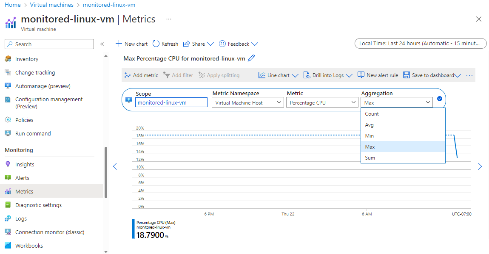

When you run your virtual machine (VM) on Azure, you can view basic metrics without installing any extra software. You can quickly create a VM by using the Azure portal, the Azure CLI, or PowerShell. You can connect boot diagnostics when you create the VM.

You want to move to a new version of Ubuntu, so you deploy a new VM. You need to monitor only the basic metrics. So you're going to create only a VM and a storage account.

In this exercise, you deploy a Linux VM and enable boot diagnostics. After the VM is created, you quickly set up a graph to view the CPU usage and inbound traffic. You also check that the boot diagnostics are working correctly.

[!include[](../../../includes/azure-subscription-prerequisite.md)]

## Task 1: Create a storage account and VM

1. Sign in to the [Azure portal](https://portal.azure.com?azure-portal=true).
1. From the top right-hand side of the Azure portal, select **Cloud Shell**.
1. In Cloud Shell, select **Bash**.
1. Create a resource group by running the following command where you replace the placeholders with a location like eastus2 and resource group name like learn-monitor-vm-rg.

    ```azurecli

    LOCATION=<region>
    RESOURCEGROUP=<resource-group-name>

    az group create \
    --name $RESOURCEGROUP \
    --location $LOCATION
   ```

1. Run the following command in Azure Cloud Shell to create a storage account to store boot diagnostics.

    ```azurecli
    STORAGE=metricsstorage$RANDOM

    az storage account create \
        --name $STORAGE \
        --sku Standard_LRS \
        --location $LOCATION \
        --resource-group $RESOURCEGROUP
    ```

1. Run the following command to create your VM with boot diagnostics enabled.

    ```azurecli
    az vm create \
        --name monitored-linux-vm \
        --image UbuntuLTS \
        --size Standard_B1s \
        --location $LOCATION \
        --admin-username azureuser \
        --boot-diagnostics-storage $STORAGE \
        --resource-group $RESOURCEGROUP \
        --generate-ssh-keys 
    ```

   Creating the VM might take a couple of minutes.

## Task 2: View basic metrics for the VM

1. Go to the [Azure portal](https://portal.azure.com?azure-portal=true).

1. On the Azure portal menu or from the **Home** page, select **Virtual machines**. The **Virtual machines** pane appears.

1. Select the **monitored-linux-vm** virtual machine that you created. The **monitored-linux-vm** virtual machine pane appears.

1. In the middle menu pane, scroll down, and under **Monitoring**, select **Metrics**. The **Metrics** pane appears for your **monitored-linux-vm** VM.

1. Select the following values for each setting:

   | Setting     | Value |
   |---------|---------|
   | Metric Namespace | Virtual Machine Host     |
   | Metric  | Percentage CPU  |
   | Aggregation |  Max     |

     

1. Select **Add metric**.

1. Select the following values for each setting:

   | Setting     | Value |
   |---------|---------|
   | Metric Namespace  |  Virtual Machine Host     |
   | Metric     | Inbound Flows  |
   | Aggregation  |    Avg     |  

1. In the upper right, select the **Local Time: Last 24 hours (Automatic - 5 minutes)** setting, and under **Time Range**, change to **Last 30 minutes**, and select **Apply**.

    You should now have a graph that looks something like the following screenshot:

    :::image type="content" source="../media/3-metric-graph.png" alt-text=" Screenshot that shows a graph of CPU usage and inbound traffic.":::

Azure collects this data without requiring you to install anything extra on Ubuntu or Windows VMs.

## Task 3: View boot diagnostics

1. In the middle menu pane, under **Help**, select **Boot diagnostics**.

1. In the upper menu bar, select **Settings**. The **Boot diagnostics** pane appears.

1. Under **Status**, select **Enable with managed storage account (recommended)**. In the top menu bar, select **Save**.

1. After you receive the notification **Successfully updated boot diagnostic settings**, return to the **Boot diagnostics** pane for your virtual machine. Select **Refresh** in the top menu bar, and review the screenshot to verify that your virtual machine has started correctly.

    :::image type="content" source="../media/3-boot-diagnostics.png" alt-text=" Screenshot that shows the boot diagnostic image captured.":::

You can also select **Serial log** to view log messages created when the VM started.
