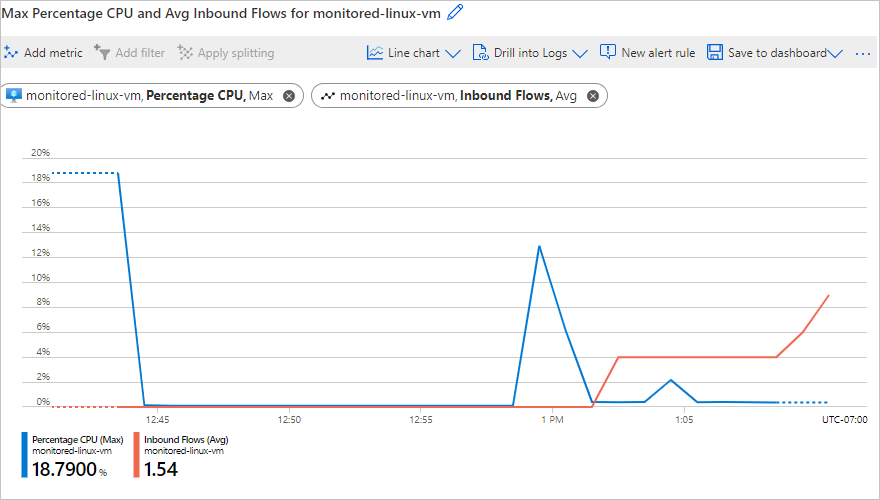
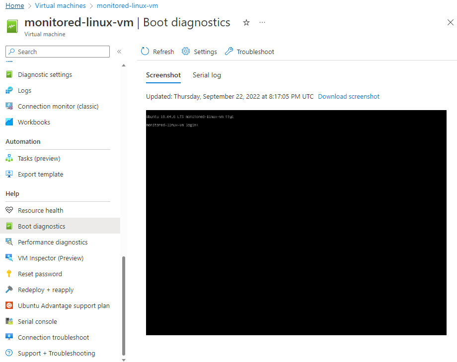

When you run your virtual machine (VM) on Azure, you can view basic metrics without installing any additional software. You can quickly create a VM by using the Azure portal, the Azure CLI, or PowerShell. You can connect boot diagnostics when you create the VM.

You want move to a new version of Ubuntu, so you deploy a new VM. You need to monitor only the basic metrics. So you're going to create only a VM and a storage account.

In this exercise, you'll deploy a Linux VM and enable boot diagnostics. After the VM is created, you'll quickly set up a graph to view the CPU usage and inbound traffic. You'll also check that the boot diagnostics are working correctly.

## Create a storage account and VM

1. On the right, use Azure Cloud Shell to create a storage account to store boot diagnostics.

    ```azurecli
    STORAGE=metricsstorage$RANDOM

    az storage account create \
        --name $STORAGE \
        --sku Standard_LRS \
        --location eastus2 \
        --resource-group <rgn>[sandbox resource group name]</rgn>
    ```

1. Create your VM with boot diagnostics enabled.

    ```azurecli
    az vm create \
        --name monitored-linux-vm \
        --image UbuntuLTS \
        --size Standard_B1s \
        --location eastus2 \
        --admin-username azureuser \
        --boot-diagnostics-storage $STORAGE \
        --resource-group <rgn>[sandbox resource group name]</rgn> \
        --generate-ssh-keys
    ```

   Creating the VM might take a couple of minutes.

## View basic metrics for the VM

1. Go to the [Azure portal](https://portal.azure.com/learn.docs.microsoft.com?azure-portal=true) and sign in with the account that you used to enable the sandbox.

1. On the Azure portal menu or from the **Home** page, select **Virtual machines**.

1. Select the **monitored-linux-vm** virtual machine that you created.

1. In the middle menu pane, scroll down, and under **Monitoring**, select **Metrics**.

1. Select the following values:

    

   |Field     |Value |
   |---------|---------|
   |Metric Namespace  |   Virtual Machine Host     |
   |Metric    |   Percentage CPU  |
   |Aggregation   |    Max     |  

1. Select **Add metric**.

1. Select the following values:

   |Field     |Value |
   |---------|---------|
   |Metric Namespace    |   Virtual Machine Host     |
   |Metric     |   Inbound Flows  |
   |Aggregation    |    Avg     |  

1. Select the **Finish editing** check mark.

1. You should now have a graph that looks something like the following:

    

Azure collects this data without requiring you to install anything extra on Ubuntu or Windows VMs.

## View boot diagnostics

1. On the left menu pane, under **Support + troubleshooting**, select **Boot diagnostics**.

1. Review the screenshot to verify that your virtual machine started correctly.

    

You can also select **Serial log** to view log messages created when the VM started.