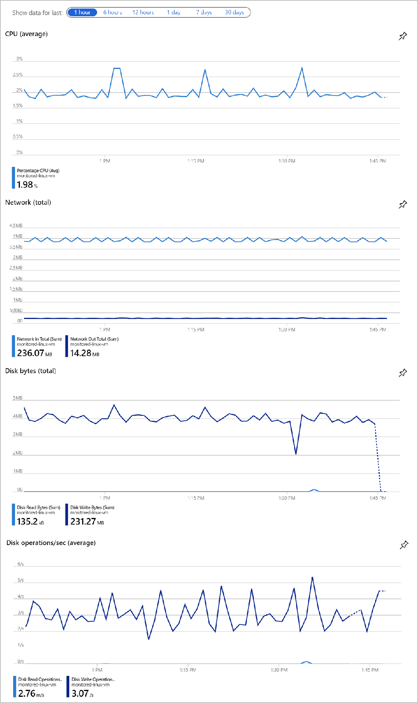
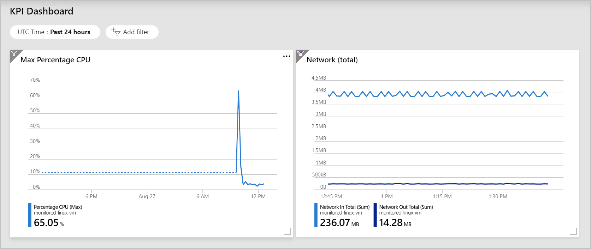
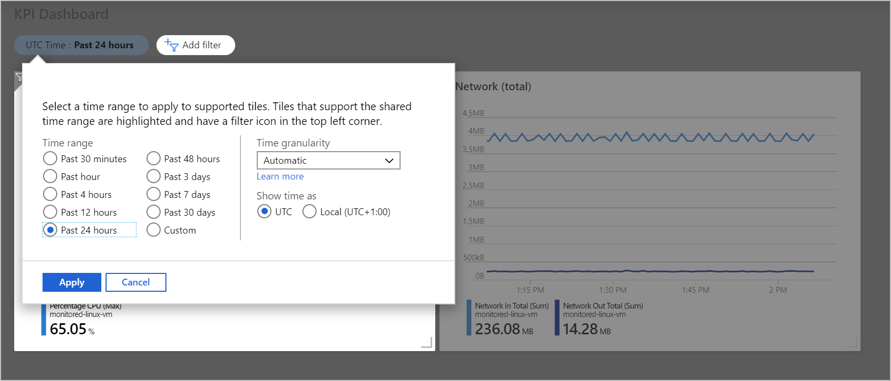

Now that you've created a virtual machine (VM), you'd like to check its health quickly. You decide to save some metric charts to a new dashboard on the portal.

In this unit, you'll see how to build rich charts using the host-level metrics, and then pin these charts to a new dashboard.

## Metrics available

Azure metrics are numerical values available from the Azure portal that help you understand the health, operation, and performance of your VMs. You can choose specific metrics and get a graph of that metric.

The following table lists the host-level metrics that are available.

|Kind  | Host-level metric  | Description  |
|---------|---------|---------|
| CPU     | CPU Credits Consumed [or Remaining]  | Number of credits consumed, or number of credits available to burst       |
|      | Percentage CPU        | Percentage of allocated compute units that are currently in use        |
| All Disks     | Disk Read [or Write] Bytes        | Bytes read [or written] from disk during monitoring period        |
|       | Disk Read [or Write] Operations/Sec        | Read [or write] IOPS during monitoring period        |
| OS Disk     | OS Disk Queue Depth        |  Length of the queue to be written to the OS disk (will increase when disk is being throttled)       |
|      | OS Disk Read [or Write] Bytes/Sec       | Read [or writes] from the OS disk during monitoring period in bytes per second       |
|      | OS Disk Read [or Write] Operations/Sec        |  Read [or writes] from the OS disk during monitoring period in IOPS       |
|      | Premium OS Disk Cache Read Hit [or Miss]       | How often is data read from cache versus the OS disk        |
| Data Disk     | Data Disk Queue Depth       | Length of the queue to be written to the data disk (will increase when disk is being throttled)         |
|      | Data Disk Read [or Write] Bytes/Sec       | Read [or writes] from the data disk during monitoring period in bytes per second        |
|      | Data Disk Read [or Write] Operations/Sec        | Read [or writes] from the data disk during monitoring period in IOPS        |
|      | Premium Data Disk Cache Read Hit [or Miss]      | How often is data read from cache versus the data disk        |
| Network     | Inbound [or Outbound] Flows        | Number of current flows in the inbound [or outbound] direction        |
|      | Network In [or Out] Billable        | Number of billable bytes received [or sent] on all network interfaces        |
|      | Network In [or Our] Total        |  Number of bytes received [or sent] on all network interfaces       |

You can choose multiple metrics and plot them on the graph to get a better understanding of the traffic hitting your web server. Azure also offers flexible time ranges. You can choose  the last 30 minutes to the last 30 days, or specify a custom range with any start and end date. You can specify a granularity from one minute to one month. This data enables you to see trends or patterns.

Azure metrics complement boot diagnostics. Boot diagnostics can display a screenshot of the boot sequence of the VM, and you can view the serial log. Azure captures all these metrics without installing extensions on the VM. Remember that you do need to create a storage account to store the boot diagnostics data, boot screenshots, and logs.

## Overview graphs

You don't need to build metric graphs for your VM manually. The Azure portal creates four graphs for your VM on the Overview page.

The Overview page also allows you to change the range of all the graphs.

## KPI dashboard

You can have greater control, with more options, by creating a custom key performance indicator (KPI) dashboard for your VM. For our scenario, the two questions you'd like answered with graphs are:

- How hot is the VM or how much CPU is being used?
- How busy is the VM or how much network traffic is the VM processing?

You can reuse the prebuilt graph for network traffic. However, the average CPU usage isn't the most useful metric. The maximum CPU usage is a better metric to use.

In the Monitor > Metrics section of the VM, you'll create a new maximum CPU graph and pin it to a new shared dashboard. Now that you have a KPI dashboard, you pin the Network (total) graph to that dashboard. You can add more, but with these two graphs you have a quick way to view the performance of your VM. The dashboard also allows you to change the time range shown on both graphs at the same time and has many more options than what's on the Overview pageS.

A custom dashboard is especially helpful when you have to monitor more than one VMs' performance. You can add graph for each VM, or use splitting to draw the same metric on one graph.