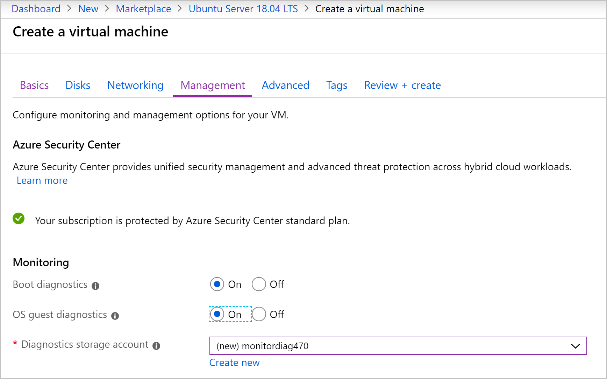
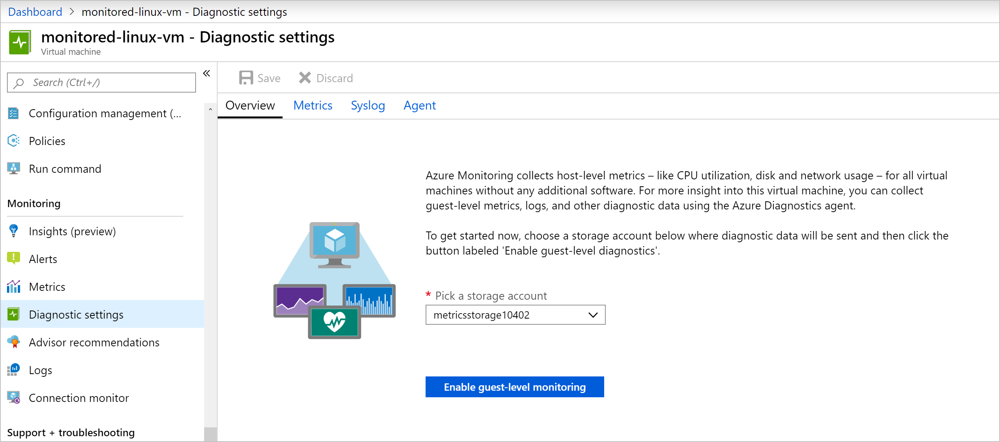
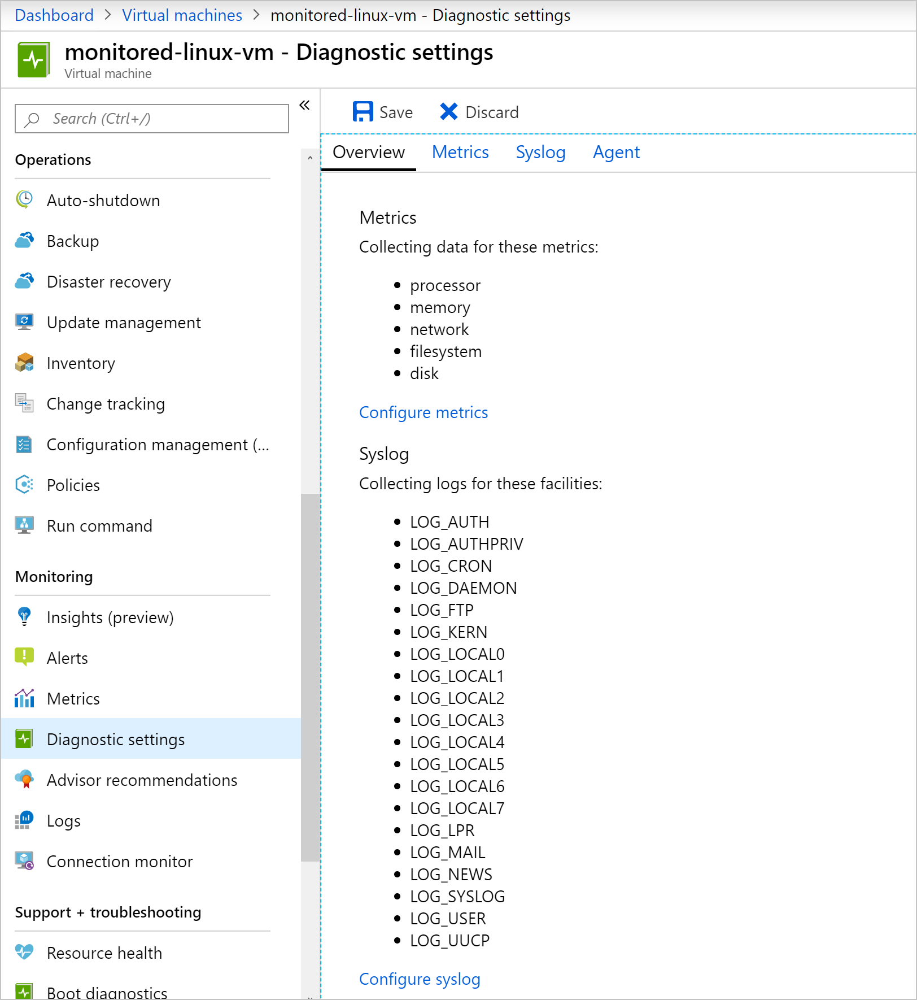

If you need to capture more detailed performance metrics, or you need them in near real time, install the Azure Diagnostics extension. After it's installed, you can configure it to capture what you need.

Your band is on tour next month, and you have identified specific metrics that will help you monitor the health of your virtual machine (VM). The metrics that you want to monitor go beyond the basic metrics available in the Azure portal. You've decided to enable guest diagnostics to get more data.

In this unit, you'll see how to install the Azure Diagnostics extension to monitor the health of a VM. You'll learn how to enable guest diagnostics when you create a VM and for an already created VM.

## Install the Azure Diagnostics extension

The Azure Diagnostics extension allows you to collect real-time performance metrics from the guest operating system, along with log events, and store the results in an Azure storage account.

You can add the extension for Linux or Windows when you create the VM in Azure. In the **Monitoring** section, you set **OS guest diagnostics** to **On**.

If you've already created the VM, the easiest way to add the extension is by going to **Diagnostic settings** for the VM. Select the storage account, and then select **Enable guest-level monitoring**.

You can also add the extension by using the Azure CLI or PowerShell. In the Azure CLI, you run the `az vm extension set` command. In PowerShell, you run the `Set-AzVMDiagnosticsExtension` command.

You can use the extension to collect data about the CPU, disk, and memory values of the VM.

## Configure the extension

You have different configuration options depending on the OS installed on the VM. At the basic level, these options are:

| Windows  |Linux  |
|---------|---------|
| Performance counters: CPU, Memory, Disk, Network, ASP.NET, SQL Server *(60-second sample)*    |  Metrics: Processor, Memory, Network, Filesystem, Disk *(15-second sample)*      |
| Logs: Application, Security, System, Event tracing    | Syslog        |
| Crash dumps     | Not available        |
| Sink data: Azure Monitor, Application Insights     | Not available        |

However, you can choose to collect custom metrics like percentage of free disk space on Windows, or the amount of swap available on Linux.

You can configure the extension in the Azure portal. The configuration is changed in the same place for both operating systems on the **Diagnostic settings** pane.

Because each feature provides specific information, you choose the ones that meet your needs. When you've collected diagnostic logs for a VM, you have a few places where you can use them:

   - Keep the logs in a storage account for auditing or manual inspection of application issues.
   - Use other services to ingest the logs (Azure Event Hubs, Power BI).
   - Use Azure Monitor to analyze the logs.
