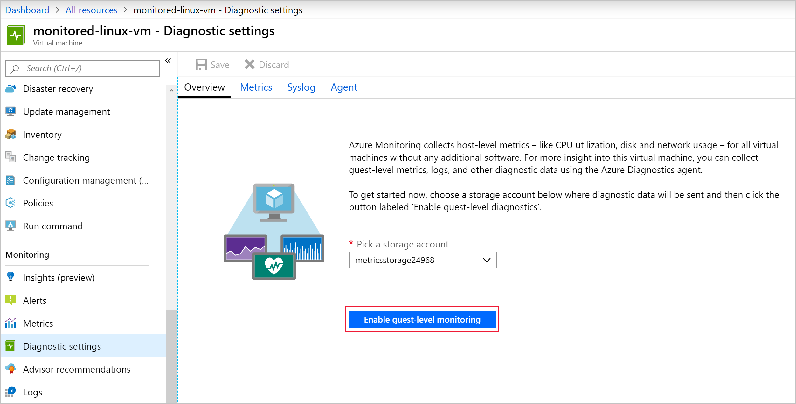
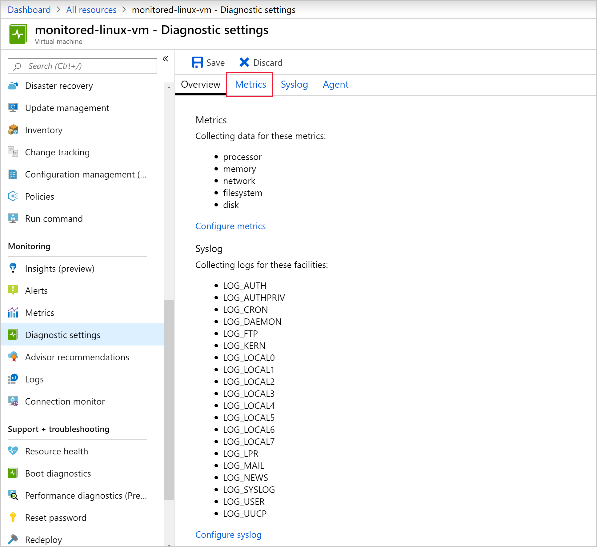
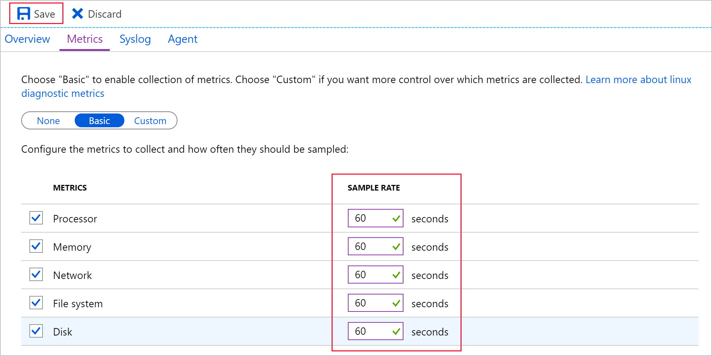
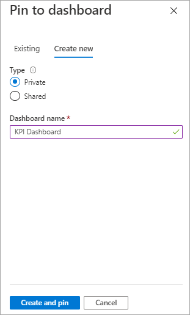
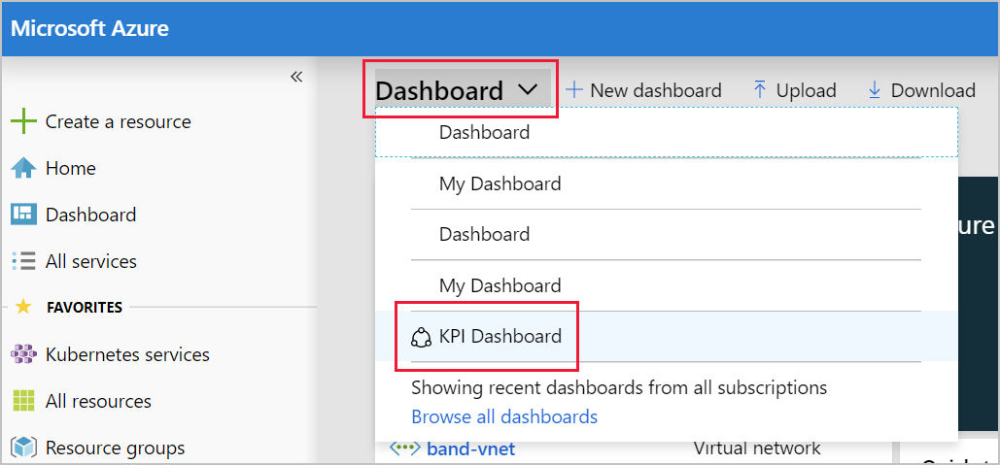
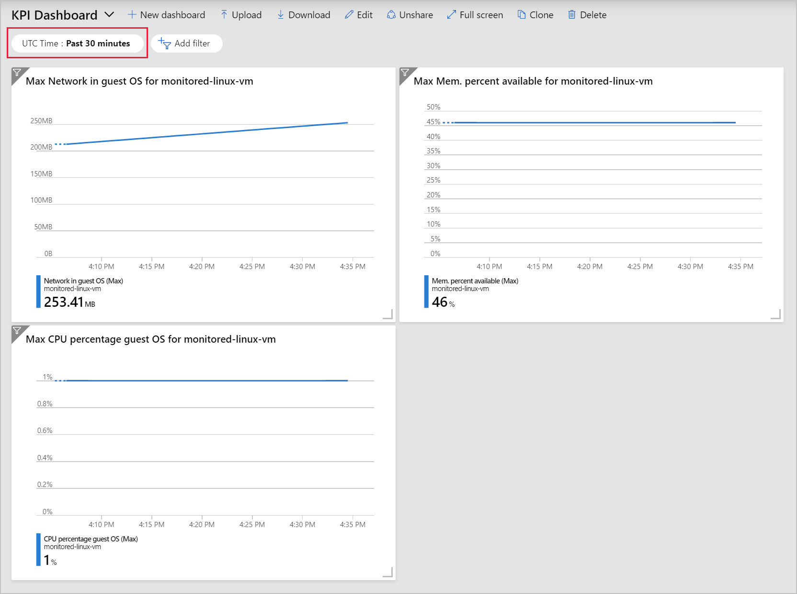

The last time your band went on tour, your website went down while your fans were trying to buy tickets. You're not sure if the web server ran out of memory, or if the VM wasn't the right size. For your new tour, you'd like a dashboard to keep track of the VM's traffic, memory, and CPU usage.

In this exercise, you'll install the Azure Diagnostics extension on your new VM to collect near real-time metrics for the OS level. After you install the extension, you'll change the sample rate to every minute. Then, you'll create a KPI dashboard to view the new metrics being captured.

## Install the Azure Diagnostics extension

Use the portal to enable guest-level metric monitoring of the VM. When you enable this monitoring, Azure installs and configures the Azure Diagnostics extension for you.

1. Go to the [Azure portal](https://portal.azure.com/learn.docs.microsoft.com?azure-portal=true) and sign in with the account that you used to enable the sandbox.
1. On the Azure portal menu or from the **Home** page, select **Virtual machines**.
1. Select the **monitored-linux-vm** virtual machine that you created.
1. On the left, scroll down until you see the **Monitoring** section, and then select **Diagnostic settings**.

    

1. Select **Enable guest-level monitoring**.

    

1. Wait until the diagnostic settings are configured. This process might take a minute.

## Configure the extension

1. After the extension is installed, you'll see the **Overview** page.
1. Select **Metrics**.

    

1. Change all the sample rates to **60** seconds, and then select **Save**.

    

   It might take a minute to save your update.

## Create a custom KPI dashboard

1. On the left, select **Metrics**.
1. Select the following values:

   |Field     |Value |
   |---------|---------|
   |METRIC NAMESPACE    |   Guest (classic)      |
   |METRIC     |   Network in guest OS  |
   |AGGREGATION    |    Max     |

1. Select the **Finish editing** check mark.
1. At the top of the chart, select **Pin to dashboard**.
1. In the **Pin to another dashboard** pane, select **Create new**.
1. Select **Private**. If you're using your own subscription, you can create a shared dashboard.
1. Enter **KPI Dashboard**.

    
1. Select **Create and pin**.

### Add a free memory percentage graph

1. Select **+ New chart**.
1. Select the following values:

   |Field     |Value |
   |---------|---------|
   |METRIC NAMESPACE    |   Guest (classic)      |
   |METRIC     |   Mem. percentage available  |
   |AGGREGATION    |    Max     |

1. Select the **Finish editing** check mark.
1. At the top of the chart, select **Pin to dashboard**.
1. Under **Dashboard**, select **KPI Dashboard**.
1. Select **Pin**.

### Add a CPU usage graph

1. Select **+ New chart**.
1. Select the following values:

   |Field     |Value |
   |---------|---------|
   |METRIC NAMESPACE    |   Guest (classic)      |
   |METRIC     |   CPU percentage guest OS   |
   |AGGREGATION    |    Max     |

1. Select the **Finish editing** check mark.
1. At the top of the chart, select **Pin to dashboard**.
1. Under **Dashboard**, select **KPI Dashboard**.
1. Select **Pin**.

### View the new dashboard

1. At the top of the portal, select **Dashboard**, and then select **KPI Dashboard**.

    

1. Explore the dashboard. Try changing the **UTC Time** range to **Past 30 minutes**.

    
