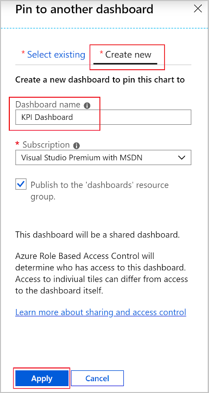

The last time your band went on tour your website went down while your fans were trying to buy tickets. You're not sure if the web server ran out of memory, or the VM wasn't the right size. For your new tour, you'd like a dashboard to keep track of the VM's traffic, memory, and CPU usage.

In this exercise, you'll install the Azure diagnostic extension on your new VM to collect near real-time metrics for OS level metrics. With the extension installed, you'll change the sample rate to every minute. With the guest OS level metrics being captured, you'll create a KPI dashboard to view them.

## Install Azure diagnostic extension

Use the portal to enable guest-level metric monitoring of the VM. When you enable this monitoring, Azure installs and configures the Azure diagnostic extension for you.

1. Go to the [Azure portal](https://portal.azure.com/) and sign in with the account you used to enable the sandbox.
1. In the navigation on the left, select **Virtual machines**.
1. Select the **monitored-linux-vm** virtual machine you created.
1. On the left, scroll down until you see the **Monitoring** section, then select **Diagnostic settings**.

    

1. Select **Enable guest-level monitoring**.

    

1. Wait until the diagnostics settings are configured. This process may take a minute.

## Configure the extension

1. After the extension is installed, you'll see the **Overview** page.
1. Select **Metrics**.

    

1. Change all the sample rates to **60** seconds, then select **Save**.

    

   It may take a minute to save your update.

## Create a custom KPI dashboard

1. On the left, select **Metrics**.
1. Select the following values:

   |Field     |Value |
   |---------|---------|
   |METRIC NAMESPACE    |   Guest (classic)      |
   |METRIC     |   Network in guest OS  |
   |AGGREGATION    |    Max     |

1. Select the **Finish editing** check mark.
1. At the top of the chart, select **Pin to dashboard** > **Select another dashboard**.
1. In the **Pin to another dashboard** pane, select **Create new**.
1. Use the following values:

    

   |Field  |Value  |
   |---------|---------|
   |Dashboard name     |KPI Dashboard         |
   |Subscription   |   Concierge Subscription    |
   |Publish to the dashboard resource group   |    Deselect the check box     |
   |Resource group     |  <rgn>[sandbox resource group name]</rgn>       |

1. Select **Apply**.
1. Close the pane.

### Add a free memory percentage graph

1. Select **+ New chart**.
1. Select the following values:

   |Field     |Value |
   |---------|---------|
   |METRIC NAMESPACE    |   Guest (classic)      |
   |METRIC     |   Mem. percentage available  |
   |AGGREGATION    |    Max     |

1. Select the **Finish editing** check mark.
1. At the top of the chart, select **Pin to dashboard** > **Select another dashboard**.
1. Expand **Browse dashboards**.
1. Under **Dashboard**, select the **KPI Dashboard**.

    

1. Select **Apply** and close the pane.

### Add a CPU usage graph

1. Select **+ New chart**.
1. Select the following values:

   |Field     |Value |
   |---------|---------|
   |METRIC NAMESPACE    |   Guest (classic)      |
   |METRIC     |   CPU percentage guest OS   |
   |AGGREGATION    |    Max     |

1. Select the **Finish editing** check mark.
1. At the top of the chart, select **Pin to dashboard** > **Select another dashboard**.
1. In the **Pin to another dashboard** pane, expand **Browse dashboards**.
1. Under **Dashboard**, select the **KPI Dashboard**.
1. Select **Apply** and close the pane.

### View the new dashboard

1. At the top of the portal, select **Dashboard**, then select the **KPI Dashboard**.

    

1. Explore the dashboard. Try changing the **UTC Time** range to **Past 30 minutes**.

    
