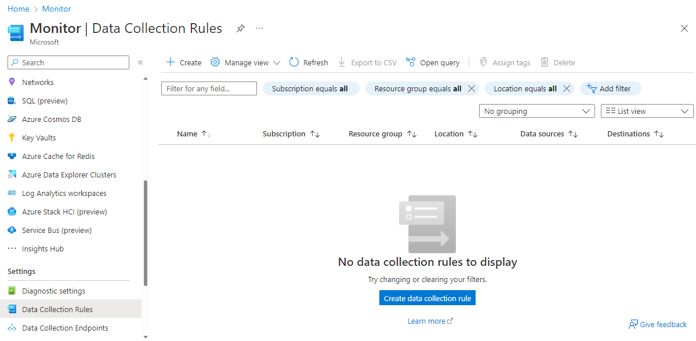
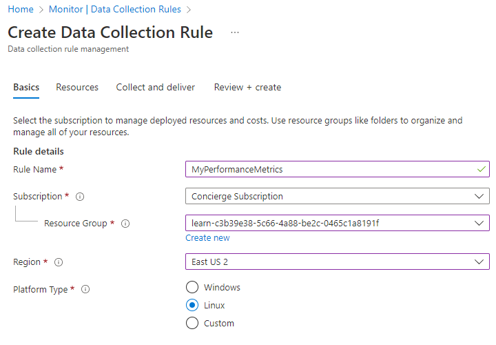
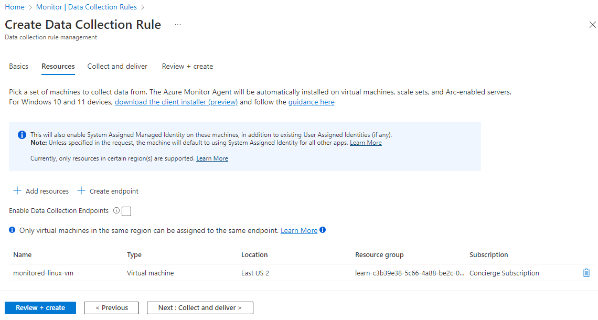
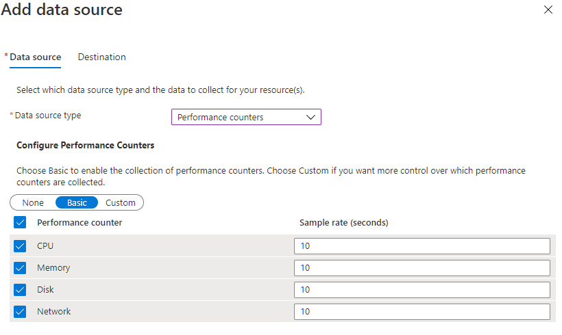
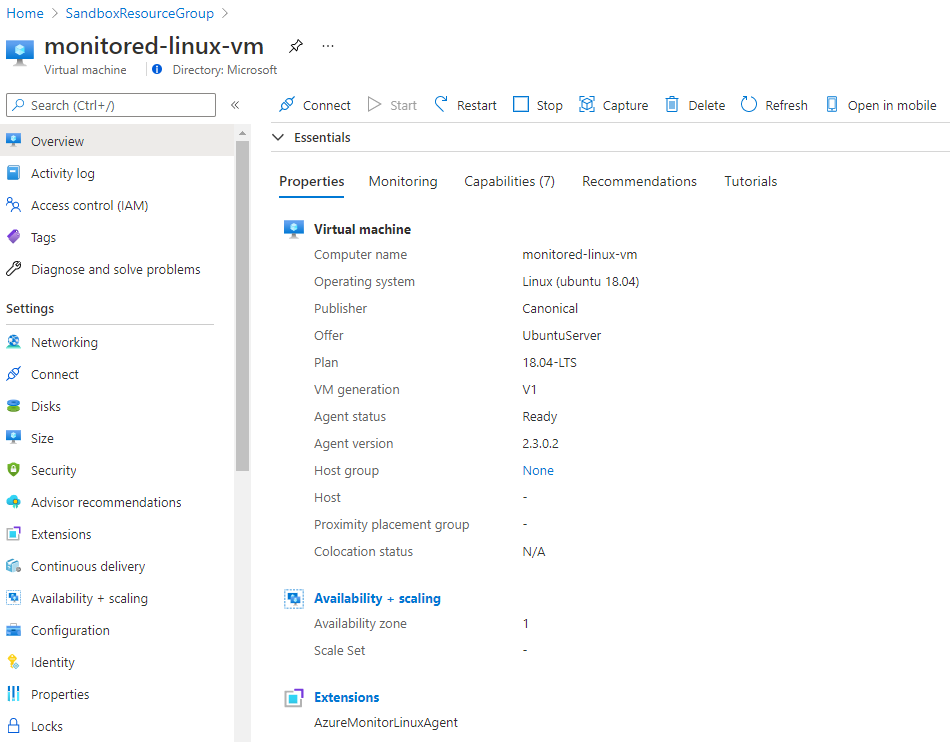
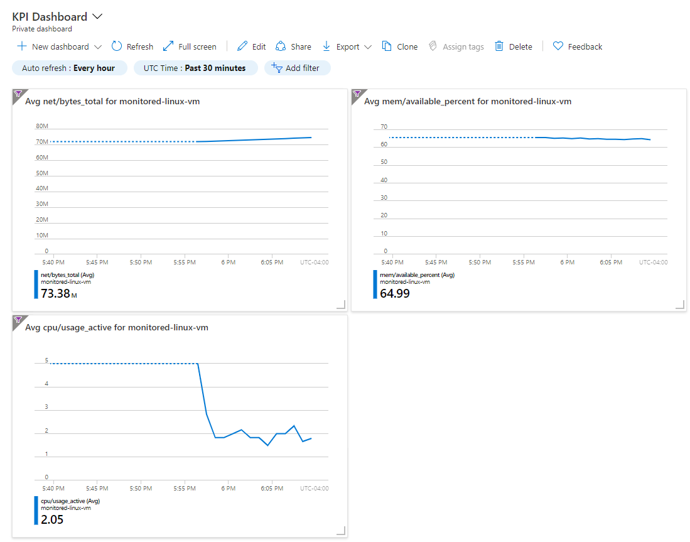

The last time your band went on tour, your website went down while your fans were trying to buy tickets. You're not sure if the web server ran out of memory, or if the virtual machine (VM) wasn't the right size. For your new tour, you'd like a dashboard to keep track of the VM's traffic, memory, and CPU usage.

In this exercise, you'll install the Azure Monitor Agent on your new VM to collect near real-time metrics at the guest OS level. After you install the agent, you'll create a KPI dashboard to view the new metrics being captured.

## Install the Azure Monitor agent using Data Collection rules

1. In the Portal, Search for Azure Monitor. Click on **Data Collection Rules** and click **Create new rule**.

    

1. Next, you specify the basics, the **Rule Name** and select the **Subscription**, **Resource group**, **Region** and **Platform Type**.

    

1. Next, you add the resource(s) to be monitored. Click on **Add resources** Find and select the your VM, the monitored-linux-vm.

    

    Next, you configure the data to be collected and the destination where it will be sent. Click on **Add data source**.
    You have different configuration options depending on the OS installed on the VM. At the basic level, these options are performance counters (CPU, Memory, Disk and Network) which can be sent to Azure Monitor Metrics and/or Azure Monitor Logs.

    However, you can also choose to collect custom metrics like percentage of free disk space on Windows, or the amount of swap available on Linux.

1. Set the data source type to **Performance Counters**, leave the default for the **Basic** performance counters and Sample rate.

    

1. Select the Destination tab to view the default destination for Performance Counters, Azure Monitor Metrics. 
1. Select on **Add data source**.

    

    Confirm your settings include a Destination Type of Azure Monitor Metrics for the Collect and deliver step of the wizard.

1. Select **Review and create**. This installs the Azure Monitor Agent on the selected VM, and start data collection with the parameters defined in the rule created above.

## Confirm that the agent is installed on the VM

1. Return to your VM to ensure that the Azure Monitor Agent was successfully installed.

    

## Create a custom KPI dashboard

1. In the left menu pane, under **Monitoring**, select **Metrics**. The **Metrics** pane appears for your VM.

1. Select the following values:

   | Setting     | Value |
   |---------|---------|
   |Metric Namespace    |   azure.vm.linux.guestmetrics |
   |Metric    |   net/bytes_total  |
   |Aggregation    |    Max     |

1. Select the **Finish editing metric** check mark.

1. At the top right of the chart, select **Pin to dashboard**. The **Pin to dashboard** pane appears.

1. Select the **Create new** tab.

1. For **Type**, select **Private**. If you're using your own subscription, you can create a shared dashboard.

1. In the **Dashboard name** field, enter *KPI Dashboard*.

    

1. Select **Create and pin**. The **Metrics** pane reappears.

### Add a free memory percentage graph

1. In the top menu bar, select **New chart**.

1. Select the following values:

   | Setting     | Value |
   |---------|---------|
   |Metric Namespace    |   azure.vm.linux.guestmetrics      |
   |Metric     |   mem/available_percent  |
   |Aggregation    |    Max     |

1. Select the **Finish editing metric** check mark.

1. At the top right of the chart, select **Pin to dashboard**. The **Pin to dashboard** pane appears.

1. In the **Dashboard** dropdown field, select **KPI Dashboard**.

1. Select **Pin**. The **Metrics** pane for your VM reappears.

### Add a CPU usage graph

1. Select **New chart**.

1. Select the following values:

   | Setting     | Value |
   |---------|---------|
   |Metric Namespace    |   azure.vm.linux.guestmetrics  |
   |Metric     |   cpu/usage_active  |
   |Aggregation    |    Max     |

1. Select the **Finish editing metric** check mark.

1. At the top right of the chart, select **Pin to dashboard**.

1. In the **Dashboard** dropdown field, select **KPI Dashboard**.

1. Select **Pin**. The The **Metrics** pane for your VM reappears.

### View the new dashboard

1. At the top left of the portal, select the **&#9776;** icon, and then select **Dashboard**. The **KPI Dashboard** appears.

    

1. Explore the dashboard. Try changing the **UTC Time** range to **Past 30 minutes**, and select **Apply**.

    

