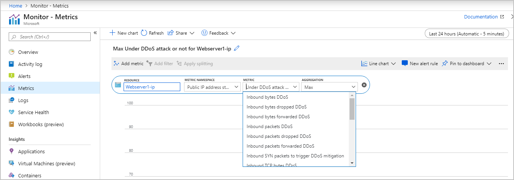
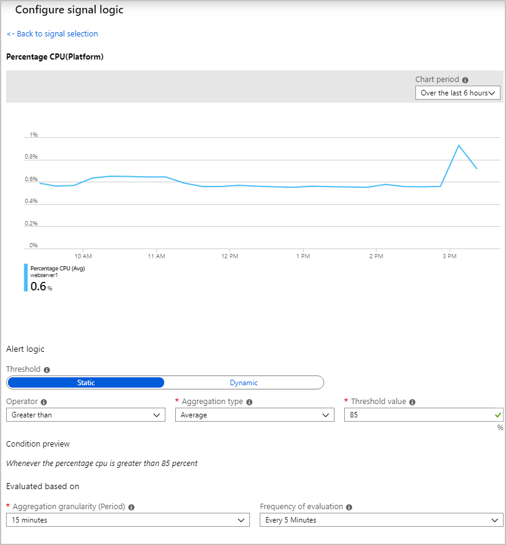
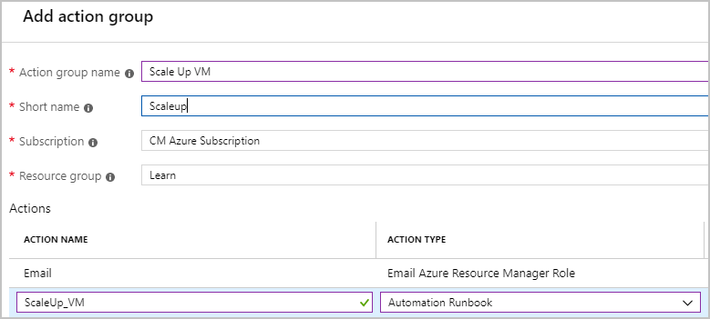

Your band is on tour next month, and you have identified issues that, in some cases, can be surfaced by using metrics and alerts. Your primary areas of concern are potential DDoS attacks and increased CPU load that would require another server.

In this unit, you'll look at some scenarios where you might use the data you're collecting to diagnose and fix problems.

## DDoS attack

To create a chart or alert for a DDoS attack, in the Azure portal, you'd go to **Monitor** > **Metrics**. You then specify your public IP address as the resource to monitor and add DDoS metrics including **Under DDoS attack**. You then add an alert to be notified of an attack. You don't have to install the Azure diagnostic extensions to be alerted about DDoS attacks because the alert is on the public IP address resource, not the VM.

## Increased CPU Load

Monitor CPU activity, memory availability, and CPU activity to see if you need to scale up your web server. To monitor the CPU load, you can use the host-level metric **Percentage CPU**. If you want more granularity, use the guest-level **CPU percentage guest OS** metric.

To respond to a high load, you could create an alert rule for the virtual machine with a condition for the CPU metric. For example, you could monitor to see if the average value over any 15 minutes is higher than 85%.

Then add an action and create an action group. The action group sends you an email and could then scale up your virtual machine.

