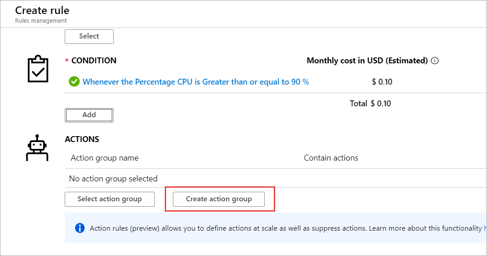
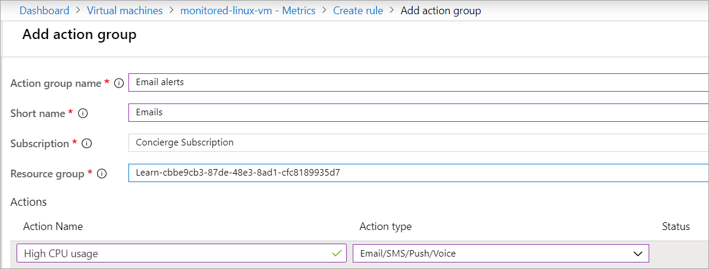
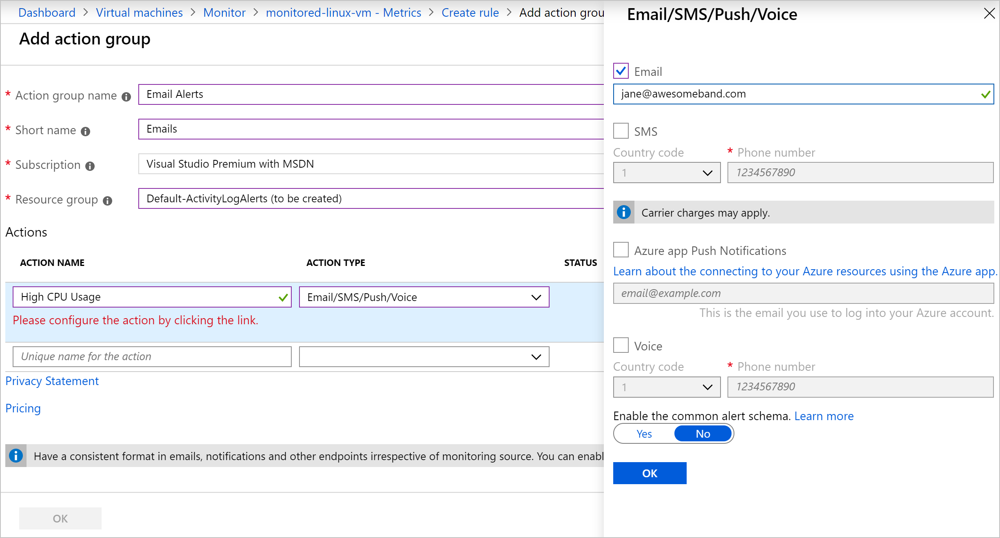
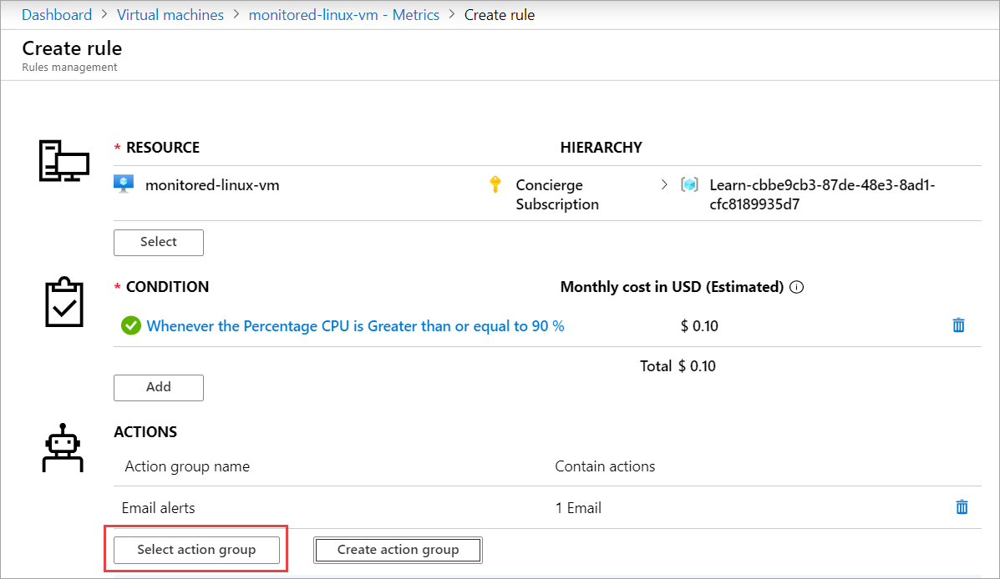
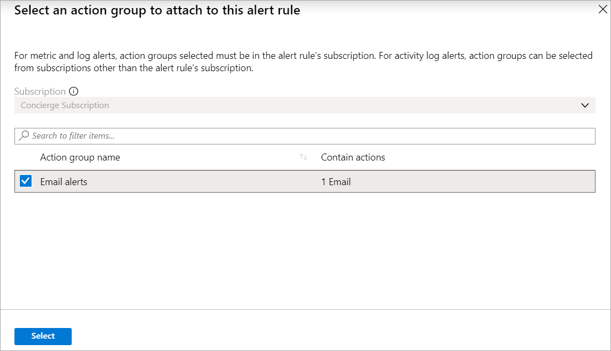
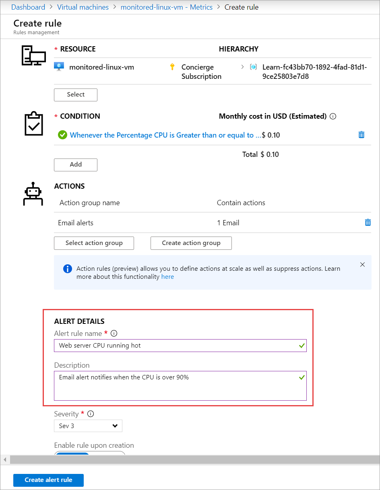

Azure allows you to take action on the metrics you're capturing. You can create alerts that email you, or start automations with runbooks. 

Now you'll create an alert based on your web server's CPU usage. If the CPU usage goes above the set threshold of 90 percent for five minutes, you get an email.

In this unit, you'll add an alert for your VM. Then you'll cause the VM CPU usage to spike, and receive the alert email.

## Create an alert based on CPU usage

If CPU usage goes above 90 percent for one minute, you'd like to get a notification. 

1. Go to the [Azure portal](https://portal.azure.com/learn.docs.microsoft.com?azure-portal=true) and sign in with the account that you used to enable the sandbox.
1. Select **Virtual machines**.
1. Select the **monitored-linux-vm** virtual machine that you created.
1. On the left, scroll down and select **Metrics**.
1. Select **New alert rule**.

    

### Select the resource

1. Under **RESOURCE**, click the **Select** button.
1. In the **Filter by resource type** field, select **Virtual machines**.
1. Under **Resource**, select **monitored-linux-vm**.

    

1. Select **Done**.

### Create the condition

1. Under **CONDITION**, select **Add**.
1. Under **Signal name**, select **Percentage CPU**.

    

1. Under **Alert logic**, use the following values:
   
    

   |Field |value  |
   |---------|---------|
   |Operator |    Greater than or equal to     |
   |Aggregation type   |  Average       |
   |Threshold value   |    90     |


1. Select **Done**.

### Add an action

1. Under **ACTIONS**, select **Create action group**.

    

1. Use the following values:

   

    |Field  |Value  |
    |---|---|
    |Action group name | Email alerts         |
    |Short name        | Emails              |
    |Subscription       | Concierge Subscription               |
    |Resource group       | <rgn>[sandbox resource group name]</rgn>                |
    |Action name     | High CPU usage       |
    |Action type      | Email/SMS/Push/Voice |

1. In the **Email/SMS/Push/Voice** pane, select **Email**, and enter your email address to receive the alert notification.
  
   

1. Select **OK**.
1. In the **Add action group** pane, select **OK**.
1. Under **ACTIONS**, select **Select action group**.

   

1. Under **Action group name**, select **Email alerts**.

   

1. Click **Select**.
1. For **Alert Details**, use the following values:

   

    |Field  |Value  |
    |---|---|
    |Alert rule name | Web server CPU running hot    |
    |Description     | Email alert notifies when the CPU is over 90%|

1. Select **Create alert rule**.

## Activate the alert

1. Go to the VM **Overview** pane.
1. Select **Connect**.

   

1. Copy the **Login using VM local account** field.
1. In Azure Cloud Shell to the right, right-click and paste the value that you copied. If Cloud Shell times out, select **Reconnect**.
1. When you're prompted, enter **yes** to connect to the VM.
1. Run the following command to install the stress tool on the VM.

    ```bash
    sudo apt-get install stress
    ```
1. Run the following command to stress the VM's CPU.

    ```bash
    sudo stress --cpu 16 -v -t 10m
    ```
1. Return to the Azure portal.
1. Go to **Dashboard** > **KPI Dashboard**.
1. On the **Max CPU percentage guest OS for monitored-linux-vm** graph, select the ellipses (**...**) on the upper right, and then select **Refresh**.
1. After a few minutes, the CPU should approach 100 percent and you'll receive an alert email.

    