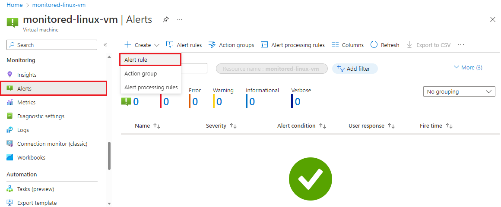
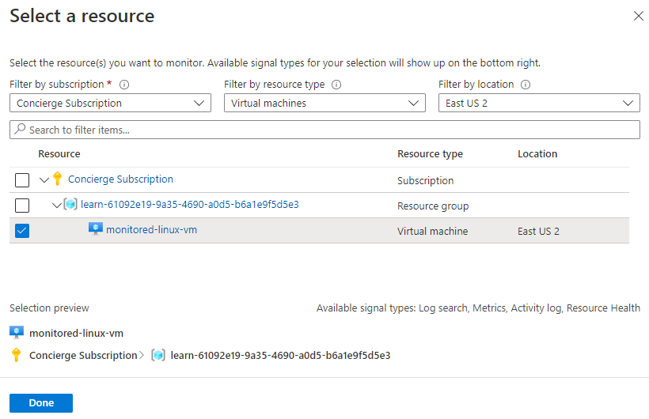
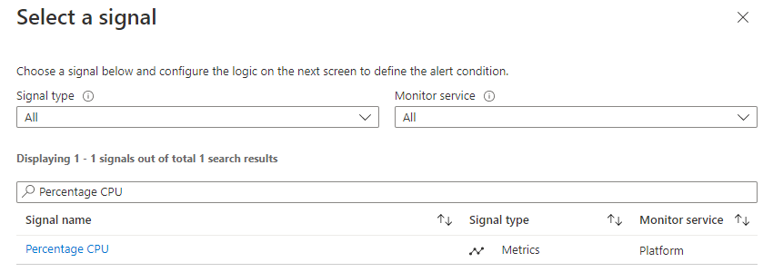
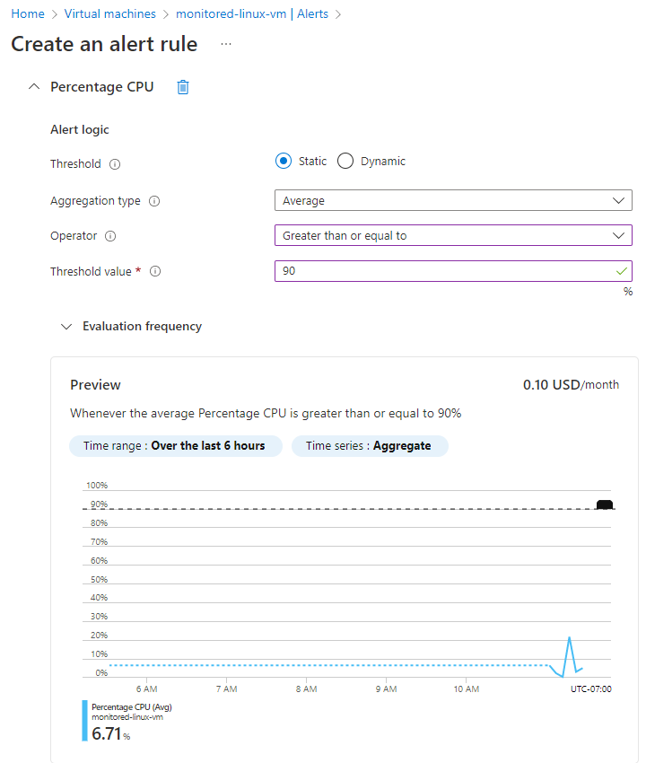
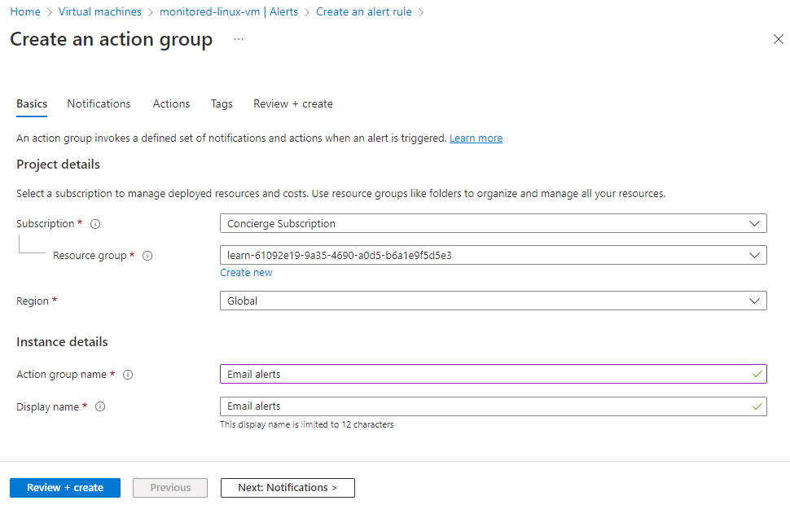
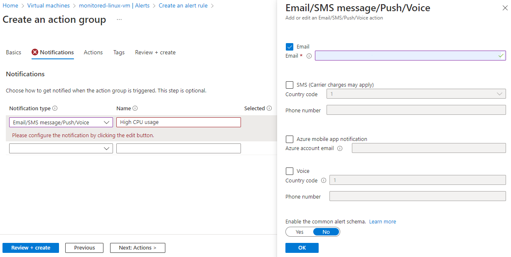
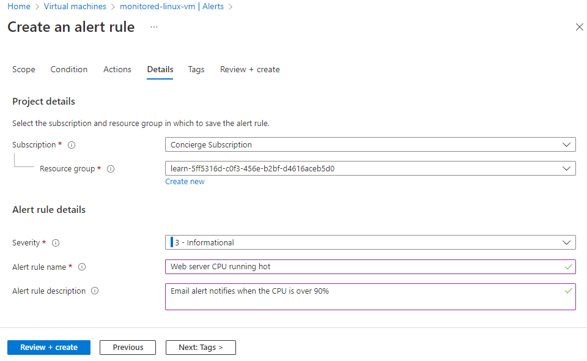
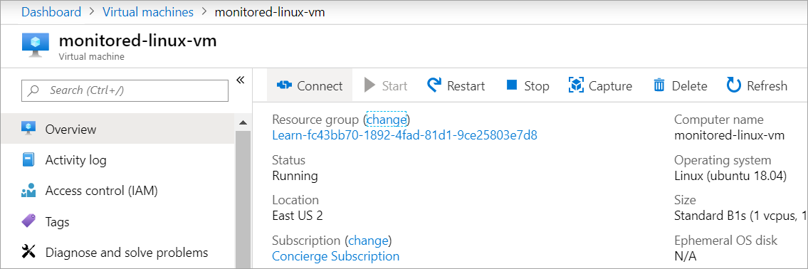
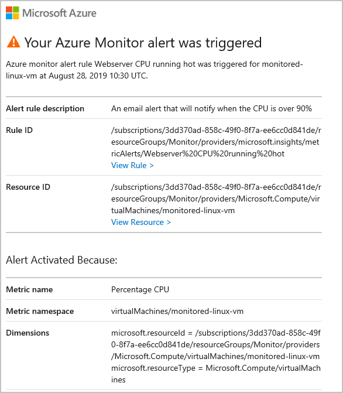

Azure enables you to take action on the metrics you're capturing. You can create alerts that email you, or start automations with runbooks.

Now, you'll create an alert based on your web server's CPU usage. If the CPU usage goes above the set threshold of 90 percent for five minutes, you get an email.

In this unit, you'll add an alert for your virtual machine (VM). Next, you'll cause the VM CPU usage to spike, and receive the alert email.

## Create an alert based on CPU usage

If CPU usage goes above 90 percent for one minute, you'd like to get a notification.

1. Go to the [Azure portal](https://portal.azure.com/learn.docs.microsoft.com?azure-portal=true) and sign in with the account that you used to enable the sandbox.

1. On the Azure portal menu, or from the **Home** page, select **Virtual machines**.

1. Select the **monitored-linux-vm** virtual machine that you created. The **monitored-linux-vm** virtual machine appears.

1. On the left menu pane, scroll down, and select **Metrics**. The **Metrics** pane appears for the **monitored-linux-vm** virtual machine.

1. To the right, select **New alert rule**. The **Create alert rule** pane appears.

    

### Select the resource

1. Under **Scope**, select the **Select resource** link. The **Select a resource** pane appears.

1. In the **Filter by resource type** field, scroll down and select **Virtual machines**.

1. Under **Resource**, select **monitored-linux-vm**.

    

1. Select **Done**.

### Create the condition

1. Under **Condition**, select the **Add condition** link. The **Select a signal** pane appears.
1. In the search box, enter **Percentage CPU**.
1. Select **Percentage CPU**.

    

    The **Configure signal logic** pane appears.

1. Under **Alert logic**, enter the following values.

   | Setting | Value  |
   |---------|---------|
   | Operator |    Greater than or equal to     |
   | Aggregation type   |  Average       |
   | Threshold value   |    90     |

    

1. Select **Done**. The **Create alert rule** pane reappears.

### Add an action

1. Under **Actions**, select the **Add action groups** link. The **Add action groups** pane appears.

1. Select **Create action group**. The **Create action group** pane appears.

1. On the **Basics** tab, enter the following values for each setting.

    | Setting  |Value  |
    |---|---|
    | **Project details** |
    | Subscription  | Concierge Subscription |
    | Resource group  | <rgn>[sandbox resource group name]</rgn> |
    | **Instance details** |
    | Action group name | Enter *Email alerts* |

   

1. Select **Next: Notifications**, and enter the following values for each setting.

    | Setting  |Value  |
    |---|---|
    | **Notifications** |
    | Notification type      | Email/SMS/Push/Voice |
    | Name     | High CPU usage       |

    

    The **Email/SMS message/Push/Voice** pane appears.

1. Tick the **Email** checkbox, and enter your email address to receive the alert notification. If this pane doesn't appear, select **Edit** for the notification type.
  
   

1. Select **OK**.

1. Select **Review + create**, and then select **Create**. The **Create alert rule** pane appears.

### Enter alert rule details

1. Under **Alert rule details**, enter the following values for each setting.

    | Setting  | Value  |
    |---|---|
    | Alert rule name | Enter *Web server CPU running hot*    |
    | Description     | Enter *Email alert notifies when the CPU is over 90%* |

   

1. Select **Create alert rule**.

Wait a few minutes for this rule to activate.

## Trigger the alert

1. In the left menu pane, go to the **Overview** pane for the **monitored-linux-vm** virtual machine.

1. In the upper menu bar, select **Connect**, and then select **SSH**. The **Connect** pane for your VM appears.

   

1. Under step 4 on the **Connect** page, copy the **azureuser**@ and IP address that follows.

1. In Azure Cloud Shell to the right, enter *SSH*, and paste what you copied in the previous step. It should look like the following command.

    ```bash
    ssh azureuser@<ipaddress>
    ```

    If Cloud Shell times out, select **Reconnect**.

1. When you're prompted, enter *yes* to connect to the VM.

1. Run the following command to update the list of available updates.

    ```bash
    sudo apt-get update
    ```

1. Run the following command to install the stress tool on the VM.

    ```bash
    sudo apt-get install stress
    ```

1. Run the following command to stress the VM's CPU.

    ```bash
    sudo stress --cpu 16 -v -t 10m
    ```

1. Return to the Azure portal and in the upper left corner, select the **&#9776;** icon, and then select **Dashboard**. The **KPI Dashboard** appears.

1. On the **Max cpu/usage_active for monitored-linux-vm** graph, select the ellipses (**...**) on the upper right, and then select **Refresh**.

1. After a few minutes, the CPU should approach 100 percent, and you'll receive an alert email.

    
