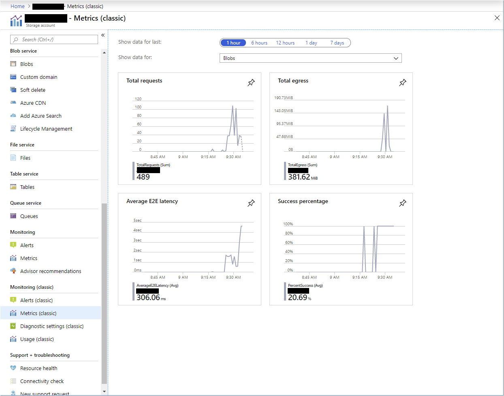
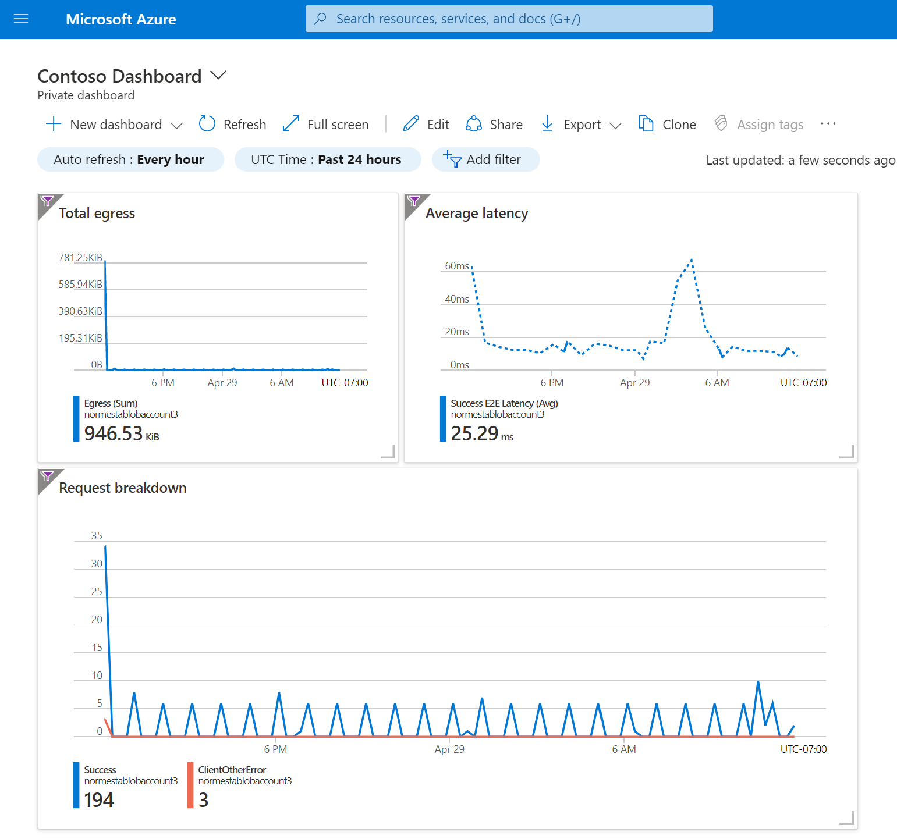
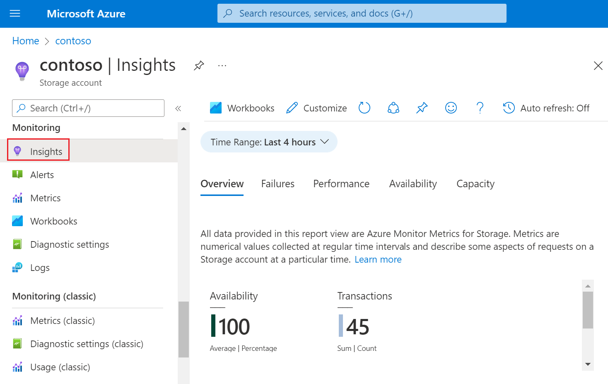
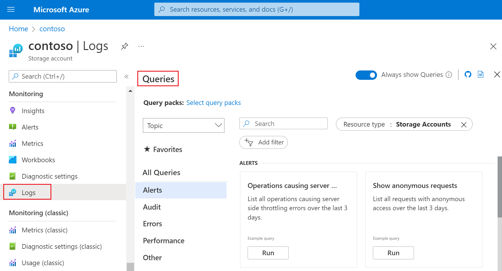

Diagnosing and troubleshooting issues for an application hosted in a cloud environment can be more complicated than in traditional environments. To support these types of applications successfully, you should monitor them and understand how to diagnose and troubleshoot any aspects of those applications and their dependent technologies. You can use a combination of tools and logging to identify issues. 

In this unit, you'll learn about some of the different tools you can use to analyze issues with Azure Storage.

## Tools available for monitoring metrics

Azure Monitor collects numeric data (*metrics*) from your storage account and makes that data available in a time-series database. Metrics are numerical values that describe some aspect of a storage account at a particular time. The Azure portal gives you a graphical way to view these metrics in near real time. There can be a delay of a few minutes between the time a metric is recorded to the time that they appear on the Azure portal. In the Azure portal, you can:

- Configure metrics (*and logging*)

- View graphs and charts and select which metrics to visualize

- Assess how your applications are doing over some time

- Configure alerts to notify you of any behavior that is out of the ordinary

### Overview page Monitoring tab

You can obtain snapshot view of common metrics by opening the **Monitoring** tab on the storage account's **Overview** page. The following image shows an example that includes the ingress and egress for a storage account:

> [!div class="mx-imgBorder"]
> 

### Custom dashboards

You can create **dashboards** and add charts that closely monitor key metrics, such as latency or the number of transactions being processed. You can also present other information from your Azure subscription, such as virtual machine information or other web-based content like notices or video content. These dashboards can be shared with other users in your Microsoft Entra organization. The following image shows an example dashboard.

> [!div class="mx-imgBorder"]
> 

### Storage insights

Storage insights provide a unified view of your Azure Storage services performance, capacity, and availability. You can observe storage capacity, and view performance in two ways: directly from a storage account or from Azure Monitor to see across groups of storage accounts.

> [!div class="mx-imgBorder"]
> 

### Tools and SDKs

You can process metric values by creating batch jobs in Azure CLI, PowerShell scripts, or by writing code that uses a storage client library. You can also archive transaction metrics to a storage account, and then view or process them by using these same tools.

If you choose to archive transaction metrics to a storage account, metric data will be collected and stored inside a single blob as a line-delimited JSON payload. You can view those blobs by opening the relevant log container in the Azure portal or by using [Storage Explorer](https://azure.microsoft.com/features/storage-explorer/). You can also download those blobs your local computer and process them by using tools and SDKs.

## Tools available for reviewing log data

There are two types of logs in Azure Monitor: activity logs and resource logs.

Activity logs provide insight into the operations on each Azure resource in the subscription from the outside (*the management plane*) in addition to updates on Service Health events. This module doesn't explore activity logs.

Resource logs (commonly referred to as *diagnostic logs*) capture detailed information about operations on storage account resources such as blobs or files. To view these logs, you need to route them to a location in Azure. Then, you can use tools to view and analyze them.

### Azure Monitor log queries

If you route logs to Log Analytics, then you can review log data by running queries in the Azure portal. You can use predefined queries, modify predefined queries, or write new custom queries.

> [!div class="mx-imgBorder"]
> 

### Tools that process archived logs

If you choose to archive your logs to a storage account, you can view those logs by opening the relevant log container in the Azure portal or by using [Storage Explorer](https://azure.microsoft.com/products/storage/storage-explorer/). To download logs to your local computer, you can use either of those tools as well as the [AzCopy](/azure/storage/common/storage-use-azcopy-v10) utility.

Viewing individual logs can be time consuming so might consider processing logs by using some sort of automation. You can process logs by creating batch jobs in Azure CLI, PowerShell scripts, or by writing code that uses a storage client library.
