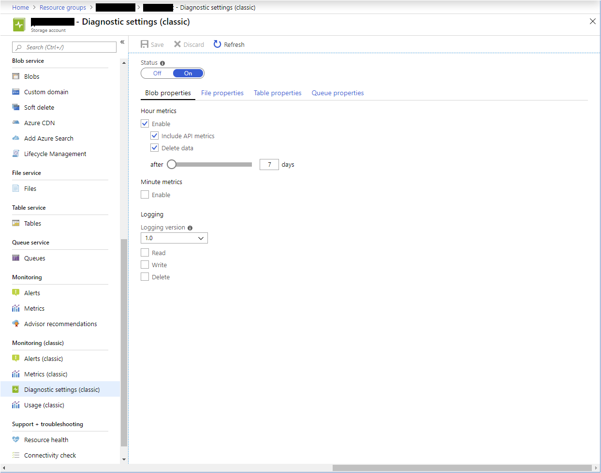
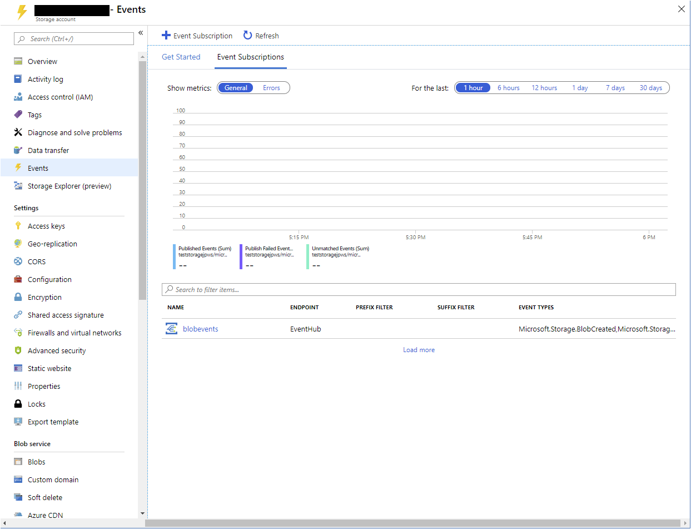

It's important to understand storage metrics so you know which metrics to examine and what these metrics indicate about the state of a storage account. Using Azure storage metrics, you can analyze usage trends by your applications and diagnose possible issues with your storage account.

The automobile parts distributor is experiencing issues with file uploads to the Customer Portal. Collecting metrics for the storage accounts the Automobile Distribution Customer Portal uses will let you visualize how storage requests are being processed, examine trends in performance, and spot any issues that might lead to failures in the application.

In this unit, you'll learn about Azure Storage Analytics, what information it reports on, and how you can use the metrics it provides to identify problems with how your applications are using Azure storage.

## Understand Storage Analytics metrics

Storage Analytics captures transactional metrics for all types of storage and capacity metrics for blob storage. The metrics provide an aggregated view of the work applications request in the storage account. If you need detail on individual requests, turn on storage logging (described in unit 5).

### Transaction metrics

Storage operations are transactional. If a write operation fails, its effects are undone. If a write succeeds, the changes are committed to storage. The metrics summarize information about each type of request; whether it's a read, a write, or a delete operation, and whether the operation succeeded or failed, and if it failed, what error occurred. Storage analytics also records information about rates of ingress and egress to and from storage, and storage availability. This information is useful if errors occur because storage is temporarily unavailable. Transactions are summarized for each type of storage service (blob, file, queue, table) by default, but you can also choose to summarize metrics for each storage API call. For example, if you enable API metrics, you'll see metrics for API calls such as `GetBlob`, `PutBlob`, `ListBlobs`, and so on, as well as the overall metrics for the service.

At the service level, operations are aggregated hourly, even with zero requests made to the service. At the API operation level, statistics are only recorded when invoking an operation. For example, if you do a `GetBlob` operation in your blob storage, Storage Analytics will log a request and include it in the aggregated data for the Blob service as well as the `GetBlob` operation. However, if no `GetBlob` operation is requested within the hour, no summary will be generated for that operation.

### Capacity metrics

Capacity metrics are only available for blob storage. Capacity data is sent to the analytics service hourly, but the aggregated statistics are only updated daily.

The statistics reported are:

- **Capacity**, which records the sum total of the storage occupied by the blobs in your storage account.
- **Container count**, which shows how many containers have been created across blob storage in your storage account.
- **Object count**, which displays the total number of blobs created across all of your containers.

## Capture Storage Analytics metrics

Storage Analytics records aggregated transaction statistics and capacity data about requests made to the Azure Storage service. The metrics data is stored in a set of tables in your storage account. Each table is named after the type of storage monitored and whether the transaction occurred in primary or secondary storage. For example, the metrics for blob storage are stored in tables named **\$MetricsHourPrimaryTransactionsBlob** and **\$MetricsHourSecondaryTransactionsBlob**. Similarly, the metrics for table storage are recorded in tables named **\$MetricsHourPrimaryTransactionsTable** and **\$MetricsHourSecondaryTransactionsTable**. Capacity metrics, which are only available for blob storage, are held in the **\$MetricsCapacityBlob** table.

Metrics capture for all storage types (blob, file, table, queue) is automatically enabled when you create a new storage account. You can selectively disable (and re-enable) metrics captured in several ways:

- Using the Azure portal. Select **Diagnostic settings (classic)** on the page for your storage account, select the storage type and change the **Status** to **On** or **Off** as required. By default, the data captured includes the metrics for each type of storage API call. You can also set the retention period for the metrics data. When this period expires, the metrics are deleted from table storage.

    

- Using PowerShell. The `Set-AzureStorageServiceMetricsProperty` cmdlet allows you to enable and disable metrics capture for each type of storage in your account. The snippet below shows an example

    ```PowerShell
    $context = New-AzureStorageContext -StorageAccountName <storage account name> -StorageAccountKey <storage account key>

    Set-AzureStorageServiceMetricsProperty -Context $context -ServiceType Blob -MetricsType Hour -MetricsLevel ServiceAndApi -PassThru -RetentionDays 7
    ```

- Using the Azure CLI. Use the `az storage metrics update` command. The `services` flag specifies the type of storage for which you want to enable metrics capture. It can be **b** (blob), **f** (file), **t** (table), **q** (queue), or any combination of these characters (**bt** means *blob and table*, for example):

    ```azurecli
    az storage metrics update \
        --hour true \
        --api true \
        --services b \
        --retention 7 \
        --connection-string <storage account connection string>
    ```

By default, the Storage Analytics service aggregates data by the hour. You may have to wait for several minutes before you see any results. You can also generate metrics broken down by the minute if you require a more detailed analysis.

Switch to the Azure portal. Select **Enable** on the **Diagnostic settings (classic)** page, under **Minute metrics**. If you're using the PowerShell `Set-AzureStorageServiceMetricsProperty` cmdlet, set the `MetricsType` option to `Minute`. If you're using the Azure CLI `az storage metrics update` command, specify `--minute true`. The following snippets show examples:

```PowerShell
# PowerShell
$context = New-AzureStorageContext -StorageAccountName <storage account name> -StorageAccountKey <storage account key>

Set-AzureStorageServiceMetricsProperty -Context $context -ServiceType Blob -MetricsType Minute -MetricsLevel ServiceAndApi -PassThru -RetentionDays 7
```

```azurecli
# Azure CLI
az storage metrics update \
    --minute true \
    --api true \
    --services b \
    --retention 7 \
    --connection-string <storage account connection string>
```

When you enable minute-level metrics, Storage Analyzer creates additional tables in your storage account to hold this data. These tables are named **\$MetricsMinutePrimaryTransactionsBlob**, **\$MetricsMinuteSecondaryTransactionsBlob**, and so on. Again, there will be a lag of several minutes before you see these metrics start to appear.

## View Storage Analytics metrics

As described earlier, you can view the metrics gathered for a storage account using the **Metrics** page for the account in the Azure portal. This pane displays the information captured by Azure Monitor. This data is managed separately, and isn't derived from the statics held in the **\$Metrics** tables in your storage account.

The **Overview** page provides a useful overview of the performance of your storage account, but you may need more detail, especially if there are errors and failures in your applications. You can see a more detailed breakdown of the metrics by examining the data in the **\$Metrics** tables directly. A useful tool for gaining a quick view of this data is the desktop version of Azure Storage Explorer. The statistics gathered are broken down by requester (**user** for requests made by applications, and **system** for requests made by the Storage Analytics service). If you haven't captured metrics by API, you will see **user: All** and **system: All** for each hour's worth of metrics.

If you have chosen to capture metrics by API, you'll see aggregated data for each API for each hour (or minute, if you're collecting minute-level metrics). There are a large number of values gathered for each API, including the success and failure rate, and the reasons for failure, such as timeouts, throttling, network errors, authorization failure, and so on. This information can give you a good insight as to why the performance of your applications may be suffering. For example, frequent throttling and timeout errors can indicate a high level of contention occurring for limited resources, and you might need to re-architect your system to the use the **Premium** rather than the **Standard** tier for your storage accounts. You might also need to spread the load across multiple storage accounts or select a different organization for any blob containers and tables that your application is using.

 

For a description of the metrics gathered by Storage Analytics, visit [Storage Analytics Logged Operations and Status Messages](/rest/api/storageservices/storage-analytics-logged-operations-and-status-messages).

## Analyze Storage Analytics metrics

Microsoft provides the `WindowsAzure.Storage` client library you can use to retrieve the metrics for a storage account. The key class in this library is `CloudAnalyticsClient`. You can use this class to run queries over the metrics held in the **\$Metrics** tables. The code below shows an example that fetches all the metrics for each service in a storage account.

```C#
using Microsoft.WindowsAzure.Storage;
using Microsoft.WindowsAzure.Storage.Analytics;
using Microsoft.WindowsAzure.Storage.Auth;
using Microsoft.WindowsAzure.Storage.Shared.Protocol;
using System;
using System.Collections.Generic;
using System.Linq;
using System.Text;

namespace StorageAnalytics
{
    class Program
    {
        static void Main(string[] args)
        {
            StorageUri blobStorageUri = new StorageUri(new Uri("https://<your storage account name>.blob.core.windows.net"));
            StorageUri tableStorageUri = new StorageUri(new Uri("https://<your storage account name>.table.core.windows.net"));
            StorageCredentials credentials = new StorageCredentials("<your storage account name>", "<your account key>");
            CloudAnalyticsClient client = new CloudAnalyticsClient(blobStorageUri, tableStorageUri, credentials);

            PrintMinuteMetrics(client);
        }

        private static void PrintMinuteMetrics(CloudAnalyticsClient analyticsClient)
        {
            var services = Enum.GetValues(typeof(StorageService));
            foreach (StorageService service in services)
            {
                Console.WriteLine($"Minute Metrics for Service {service}");
                var metricsQuery = analyticsClient.CreateMinuteMetricsQuery(service, StorageLocation.Primary);
                var t = analyticsClient.GetMinuteMetricsTable(service);
                var opContext = new OperationContext();
                var query =
                        from entity in metricsQuery
                        select entity;

                var results = query.ToList().Where(m => m.RowKey.StartsWith("user"));
                var resultString = results.Aggregate(new StringBuilder(), (builder, metrics) => builder.AppendLine(MetricsString(metrics, opContext))).ToString();
                Console.WriteLine($"{resultString}");
            }
        }

        private static string MetricsString(MetricsEntity entity, OperationContext opContext)
        {
            var entityProperties = entity.WriteEntity(opContext);
            var entityString =
                    string.Format("Time: {0}, ", entity.Time) +
                    string.Format("AccessType: {0}, ", entity.AccessType) +
                    string.Format("TransactionType: {0}, ", entity.TransactionType) +
                    string.Join(",", entityProperties.Select(e => new KeyValuePair<string, string>(e.Key.ToString(), e.Value.PropertyAsObject.ToString())));
            return entityString;
        }
    }
}
```

The output from this application will be similar to this output:

```Text
Minute Metrics for Service Blob
Time: 24/06/2019 11:07:00 +00:00, AccessType: user, TransactionType: All, [TotalIngress, 1241],[TotalEgress, 1356],[TotalRequests, 2],[TotalBillableRequests, 2],[Availability, 100],[AverageE2ELatency, 3],[AverageServerLatency, 3],[PercentSuccess, 100],[PercentThrottlingError, 0],[PercentTimeoutError, 0],[PercentServerOtherError, 0],[PercentClientOtherError, 0],[PercentAuthorizationError, 0],[PercentNetworkError, 0],[Success, 0],[AnonymousSuccess, 1],[SASSuccess, 1],[ThrottlingError, 0],[AnonymousThrottlingError, 0],[SASThrottlingError, 0],[ClientTimeoutError, 0],[AnonymousClientTimeoutError, 0],[SASClientTimeoutError, 0],[ServerTimeoutError, 0],[AnonymousServerTimeoutError, 0],[SASServerTimeoutError, 0],[ClientOtherError, 0],[SASClientOtherError, 0],[AnonymousClientOtherError, 0],[ServerOtherError, 0],[AnonymousServerOtherError, 0],[SASServerOtherError, 0],[AuthorizationError, 0],[AnonymousAuthorizationError, 0],[SASAuthorizationError, 0],[NetworkError, 0],[AnonymousNetworkError, 0],[SASNetworkError, 0]
Time: 24/06/2019 11:07:00 +00:00, AccessType: user, TransactionType: BlobPreflightRequest, [TotalIngress, 619],[TotalEgress, 332],[TotalRequests, 1],[TotalBillableRequests, 1],[Availability, 100],[AverageE2ELatency, 3],[AverageServerLatency, 3],[PercentSuccess, 100],[PercentThrottlingError, 0],[PercentTimeoutError, 0],[PercentServerOtherError, 0],[PercentClientOtherError, 0],[PercentAuthorizationError, 0],[PercentNetworkError, 0],[Success, 0],[AnonymousSuccess, 1],[SASSuccess, 0],[ThrottlingError, 0],[AnonymousThrottlingError, 0],[SASThrottlingError, 0],[ClientTimeoutError, 0],[AnonymousClientTimeoutError, 0],[SASClientTimeoutError, 0],[ServerTimeoutError, 0],[AnonymousServerTimeoutError, 0],[SASServerTimeoutError, 0],[ClientOtherError, 0],[SASClientOtherError, 0],[AnonymousClientOtherError, 0],[ServerOtherError, 0],[AnonymousServerOtherError, 0],[SASServerOtherError, 0],[AuthorizationError, 0],[AnonymousAuthorizationError, 0],[SASAuthorizationError, 0],[NetworkError, 0],[AnonymousNetworkError, 0],[SASNetworkError, 0]
...
Minute Metrics for Service Queue
...
Minute Metrics for Service Table
...
Minute Metrics for Service File
...
```

The `WindowsAzure.Storage` client library is available as a NuGet package. However, the .NET Core version of this application doesn't include support for cloud analytics. This feature is only available to the .NET SDK.

If you're monitoring the lifetimes of blobs and you're interested in when they're added and deleted, you can create an event subscription for your storage account. The subscription can post events to several types of destination, such as an Azure Storage Queue or an Event Hub. If you select an Event Hub, you can connect it as an input to an analytics solution such as Azure Stream Analytics.

