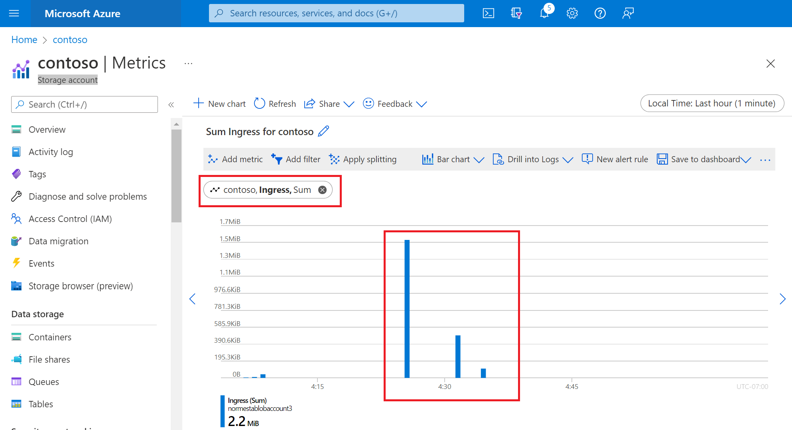
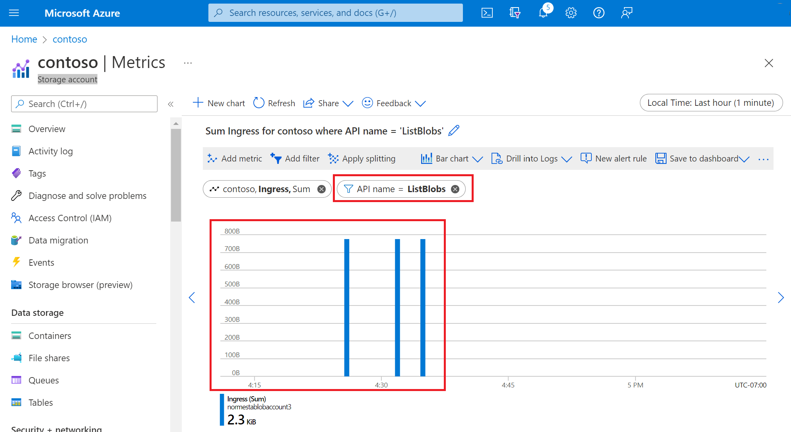
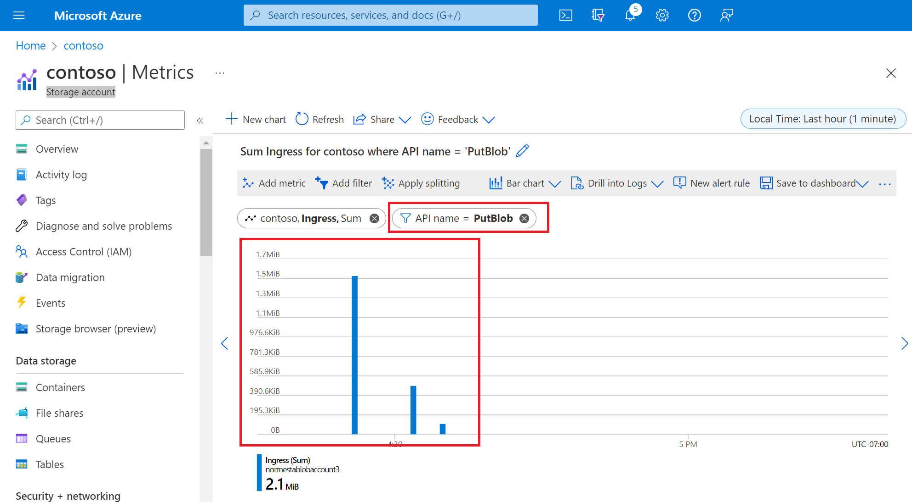

You've decided that the issues the new Customer Portal is experiencing could have something to do with the way files are stored or uploaded. You want to determine why the problem occurs by capturing the metrics for blob storage. You can use these metrics to find out how many errors occur, and whether the errors are associated with a particular time of day (possible peak periods), or some other factor.

In this exercise, we'll use Azure portal and PowerShell to configure storage metrics for our storage account. We'll upload some files to Blob Storage, and then look at metrics in Metrics Explorer.

## Create a storage account

1. Sign in to the [Azure portal](https://portal.azure.com/learn.docs.microsoft.com?azure-portal=true) by using the same account with which you activated the sandbox.

2. In the Azure portal, select **Create a resource**.

3. In the **Search services and Marketplace** box, search for and select **Storage account**.

   The **Storage account** panel appears.

4. Select **Create**.

   The **Create storage account** panel appears.

5. On the **Basics** tab, fill in the following values for each setting.

    | Setting  | Value  |
    |---|---|
    | **Project details** |
    | Subscription | **Concierge Subscription**  |
    | Resource group | <rgn>[Sandbox resource group]</rgn> |
    | **Instance details** |
    | Storage account name | *\<your-storage-account-name\>*, which is 3 to 24 characters and consists of only lowercase letters and numbers; for example, **monitorstorageaccount** |
    | Region | Use the default region |
    | Performance | **Standard** |
    | Redundancy | **Geo-redundant storage (GRS)** |

6. Select the **Advance** tab. In the **Blob storage** section, make sure that **access tier** is set to **Hot**.

7. Select **Review + create**. After validation passes, select **Create**.

8. On the **Your deployment is complete** panel, select **Go to resource**.

## Add a blob container

Before you can add blobs to a storage account, you need to create a blob container.

1. Under **Data storage**, select **Containers**.  

2. In the **Containers** panel, select **Container**.

3. In the **Name** field, enter **monitor-blobs-container**, and then select **Create**.

## Upload files to the blob container

To upload a single file to the blob container:

1. Open the **monitor-blobs-container** container, and then select **Upload**.

2. On the **Upload blob** pane, select the folder icon.

3. In the **Open** dialog box, select a small text file from your local file system, and select **Open**.

4. Wait for one minute, and then repeat these steps to upload a different file.

5. Wait for another minute, and then repeat these steps to upload another file.

6. Wait for several more minutes before continuing with the next section.

## Visualize metrics in the Azure portal

Transaction metrics are emitted on every request to a storage account, so you should see changes in these values relatively quickly. To create a transaction metrics chart, complete the following steps:

1. In the Azure portal, navigate to the page for your storage account.

2. In the menu pane, under **Monitoring**, select **Metrics**.

3. In the top right, select **Last Hour** for the time range.

4. Under **Time** granularity, select **1 minute**, and then select **Apply**.

5. On the bar that appears beneath the chart title, select **Line chart**, and then **Bar chart**.

6. Under **Chart Title**, select **Add metric**.

7. Change the **metric namespace** to **Blob**, select **ingress** for **metric**.

   The following image shows a bar for every file upload operations in the last hour.

   > [!div class="mx-imgBorder"]
   > 

   Most likely, one upload operation requires multiple API calls (For example: a container listing operation). When you uploaded a file, the Azure portal made several API calls to complete the upload. You can use splitting and filtering to look closer at API calls, the bytes transferred by those calls etc. Splitting and filtering leverage metric dimensions to give you a finer grain view of your metrics. 

## Add a filter

Filtering enables you to look at the metrics with greater granularity. You can use a filter to look only at specific API calls used for your upload operation.

1. Select **Add filter**.

2. Under **Property**, select **API name**.

3. Under **Values**, select **ListBlob**.

   The chart shows transactions related to listing blobs in container view. When you list blobs, the **ListBlob** REST API was called.

   > [!div class="mx-imgBorder"]
   > 

4. Under **Values**, clear the **ListBlob** check box. Then, select **PutBlob**.

   The chart shows bars that represent the REST call to the **Put Blob** API. These bars represent the actual upload of a file.

   > [!div class="mx-imgBorder"]
   > 

   To see all of the APIs called in a period of time, you can use the **Apply splitting** feature.

5. Select the **X** to the right of the filter oval to remove the filter.
