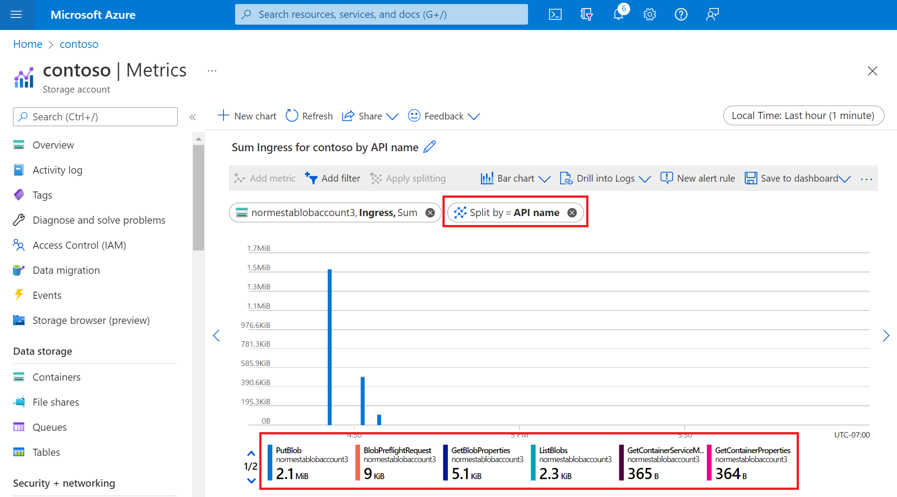

In this exercise, we use the Azure portal to create a storage account and configure storage metrics. Next, we upload some files to Blob Storage, and then look at our storage metrics in Metrics Explorer.

## Create a storage account

1. Select [this link](https://portal.azure.com/learn.docs.microsoft.com?azure-portal=true) to sign in to the Azure portal by using the same account with which you activated the sandbox.

1. In the Azure portal, select **Create a resource**.

1. In the **Search services and Marketplace** box, search for and select **Storage account**.

   The **Storage account** panel appears.

1. Select **Create**.

   The **Create a storage account** panel appears.

1. On the **Basics** tab, fill in the following values for each setting.

    | Setting  | Value  |
    |---|---|
    | **Project details** |
    | Subscription | **Concierge Subscription**  |
    | Resource group | <rgn>[Sandbox resource group]</rgn> |
    | **Instance details** |
    | Storage account name | *\<your-storage-account-name\>*, which is 3 to 24 characters and consists of only lowercase letters and numbers; for example, **monitorstorageaccount** |
    | Region | Use the default region |
    | Performance | **Standard** |
    | Redundancy | **Geo-redundant storage (GRS)** |

1. Select the **Advanced** tab. In the **Blob storage** section, make sure that **access tier** is set to **Hot**.

1. Select **Review + Create**. After validation passes, select **Create**.

1. When you see the message **Your deployment is complete**, select **Go to resource**.

## Add a blob container

Before you can add blobs to a storage account, you need to create a blob container.

1. In the menu pane, under **Data storage**, select **Containers**.  

1. In the **Containers** tool bar, select **+ Add container**.

1. In the **Name** field, enter **monitor-blobs-container**, then select **Create**.

## Upload files to the blob container

To upload a single file to the blob container:

1. Open the **monitor-blobs-container** container, then select **Upload**.

1. Select the **Browse for files** link.

1. In the **Open** dialog box, select a small text file from your local file system, and select **Open**.

1. Select **Upload**.

1. Wait for one minute, and then repeat these steps to upload a different file.

1. Wait for another minute, and then repeat these steps to upload another file.

1. Wait for several more minutes before continuing with the next section.

## Visualize metrics in the Azure portal

Transaction metrics are emitted on every request to a storage account, so you should see changes in these values fairly quickly. To create a transaction metrics chart, complete the following steps:

1. In the Azure portal, navigate to the page for your storage account.

1. In the menu pane, under **Monitoring**, select **Metrics**.

1. In the top right, select **Last hour** for the time range.

1. Under **Time granularity**, select **Automatic**, then select **Apply**.

1. On the bar that appears beneath the chart title, select **Line chart**, and then **Bar chart**.

1. Change the **metric namespace** to **Blob** and select **Ingress** for the **Metric**.

   The following image shows a bar for every file upload operation in the last hour.

   > [!div class="mx-imgBorder"]
   > 

## Split a metric

Splitting a metric lets you view other dimensions in the data. For each file that you uploaded, the Azure portal made several API calls. Each request resulted in bytes transferred. You can split the ingress metric by the API dimension to see the breakdown of bytes transferred by API call. To split a metric, complete the following steps:

1. Select **Apply splitting**.

1. In the **Splitting** box, from the **Values** drop-down list, select **API name**.

   View the output in the chart window. The following image shows bytes transferred by API call.

   > [!div class="mx-imgBorder"]
   > 

## Add a filter

Filtering lets you look at the metrics with greater granularity. You can use a filter to look only at specific API calls used for your upload operation. In this case, we're interested only in bytes related to the file transfer. We want to exclude traffic related to other API calls used to complete the transfer.

1. Select **Add filter**.

1. Under **Property**, select **API name**.

1. Under **Values**, select **PutBlob**.

   The chart shows bars that represent the REST call to the **PutBlob** API.

   > [!div class="mx-imgBorder"]
   > 

1. Select the **X** to the right of the filter box to remove the filter.
