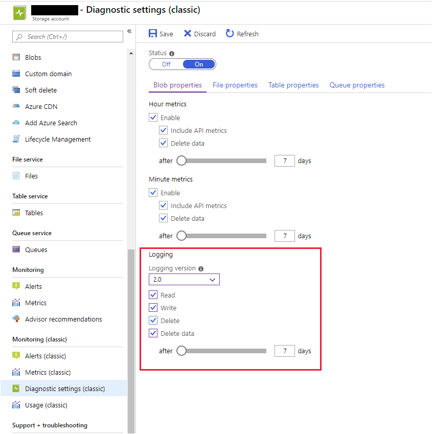

Storage Analytics logging records each operation performed in your storage account, as well as the outcome of these operations. The storage log provides details about each request made rather than providing the minute-by-minute summary of operations that the metrics show. Using the logging information, you can examine the nature of requests made to a storage account and whether these requests are successful.

In the example scenario, you've decided that you need to trace each file upload and download operation done against the new Customer Portal. Azure Storage Analytics logging provides an ideal way to capture this information.

In this unit, you'll learn about Storage Analytics logging. You'll see how to enable logging, the different types of information captured when you enable logging, and how you might use this information to detect problems that might occur when an application uses Azure Storage.

## Azure Storage Analytics logging

Storage Analytics logs detailed information about requests to your storage service. This information is used to monitor individual requests and to diagnose issues with a storage service. Log entries are created when requests are made against the service endpoint. However, requests are recorded on a *best effort* basis. Occasionally, a small number of requests might not be logged, and others might be duplicated. You shouldn't treat the log as a definitive list of operations, but rather a means of examining the workload for the storage account.

Storage Analytics logs record authenticated and anonymous requests made to a storage account. The following types of authenticated requests are logged:

- Successful requests
- Failed requests, including timeout, throttling, network, authorization, and other errors
- Requests using a Shared Access Signature (SAS) or OAuth, including failed and successful requests

Details for the following types of anonymous requests are also recorded:

- Successful requests
- Server errors
- Time out errors for both client and server
- Failed GET requests with error code 304 (*Not Modified*)

Requests made by the Storage Analytics service itself aren't recorded.

Diagnostic data the Storage Analytics service collects is written to blobs in the **\$logs** blob container in your storage account. The data in the container is structured as a hierarchical collection of blobs, organized by storage service (blob, file, queue, table) and the date, in the format **\<storage service\>/YYYY/MM/DD/hhmm/\<counter\>.log**.

## Enable Storage Analytics logging

Unlike Storage Analytics metrics, Storage Analytics logging isn't enabled by default for your storage account. You can enable it in the Azure portal from the **Diagnostic settings (classic)** page. You can specify whether you want to record read, write, and delete operations performed against your storage account. You enable logging individually for each service (blob, file, table, queue).



> [!NOTE]
> The portal gives you a choice in the format of the data written to the log records. You can select Logging version 1.0 or Logging version 2.0. Logging Version 2.0 provides additional fields to support authentication mechanisms such as OAuth 2.0 and Azure Active Directory. It is recommended for all new storage accounts to use Logging version 2.0. For more information on these formats, see [Storage Analytics log format](/rest/api/storageservices/storage-analytics-log-format).

You can also enable Storage Analytics programmatically via PowerShell or the Azure CLI. If you're using PowerShell, run the `Set-AzureStorageServiceLoggingProperty` cmdlet:

```powershell
$context = New-AzureStorageContext -StorageAccountName <storage account name> -StorageAccountKey <storage account key>

Set-AzureStorageServiceLoggingProperty -Context $context -ServiceType Blob -LoggingOperations read,write,delete -RetentionDays 7
```

You can disable logging for a service by running the same command and setting the `LoggingOperations` parameter to `none`.

If you're using the Azure CLI, run the `az storage logging update` command to enable logging. The example below enables read, write, and delete (`rwd`) logging for blob (`b`) storage:

```azurecli
az storage logging update \
    --log rwd \
    --services b \
    --retention 7 \
    --version 2 \
    --connection-string <storage account connection string>
```

## Download logs

Like the **\$Metrics** tables, the **\$logs** container isn't visible to many tools. However, you can read blobs in the **\$logs** container using the desktop version of Azure Storage Explorer, using PowerShell, using the AzCopy command as described in unit 2, or by writing your own code. The example below shows PowerShell. The storage account is specified by using the **New-AzureStorageContext** cmdlet.

```PowerShell
$context = New-AzureStorageContext -StorageAccountName <your-storage-account-name> -StorageAccountKey <storage account key>

$logBlobs = Get-AzureStorageBlob -Container '$logs' -Context $context
$destination = "C:\Logs"

foreach ($logFile in $logBlobs)
{
      Get-AzureStorageBlobContent -Container '$logs' -Blob $logFile.Name -Destination $destination -Context $context
}

```

Each blob holding diagnostic information includes metadata you can query to filter the diagnostic information. This metadata includes type of operation (read, write, or delete), and the earliest and latest time for operations in the blob. The following example shows the PowerShell `Get-AzureStorageBlob` command with a filter to list all blobs that contain diagnostic information about blob requests made on 20 June 2019 between 3:00 pm and 3:59 pm. 

```PowerShell
Get-AzureStorageBlob -Context $context -Container '$logs' |  
Where-Object {  
    $_.Name -match 'blob/2019/06/20/1500'
} |  
ForEach-Object {  
    "{0}  {1}  {2}" –f $_.Name,
    $_.ICloudBlob.Metadata.StartTime,
    $_.ICloudBlob.Metadata.EndTime  
}
```

In this case, the output below shows three blobs named **000000.log**, **000001.log**, and **000002.log**. You can see the exact periods that they encompass.  

```Text
blob/2019/06/20/1500/000000.log  2019-06-20T15:03:38.2255816Z  2019-06-20T15:09:13.9255710Z
blob/2019/06/20/1500/000001.log  2019-06-20T15:13:26.1037441Z  2019-06-20T15:13:26.2978805Z
blob/2019/06/20/1500/000002.log  2019-06-20T15:19:05.7895237Z  2019-06-20T15:19:05.8135391Z
```

As well as using PowerShell, you can download these blobs from the **\$logs** container using the AzCopy utility, as described in the previous unit.