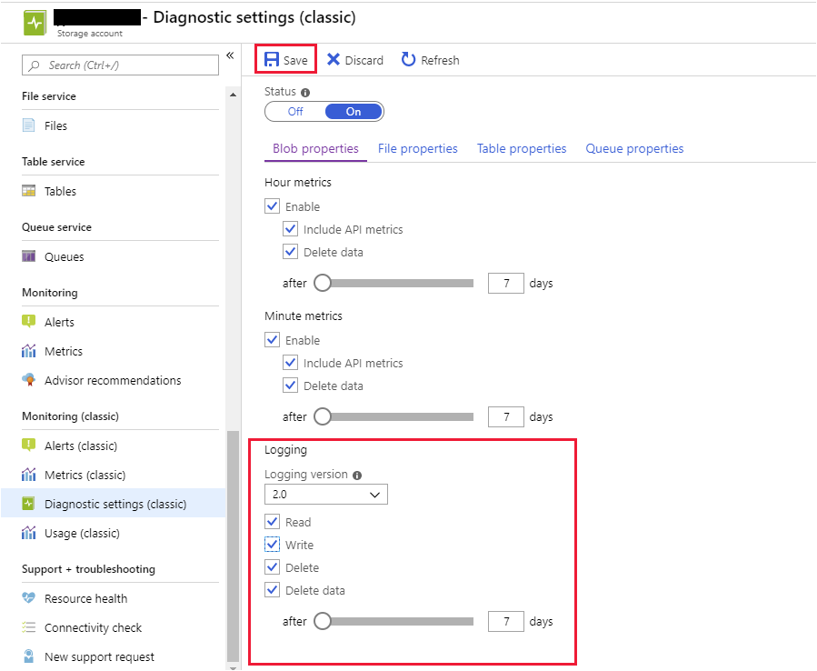
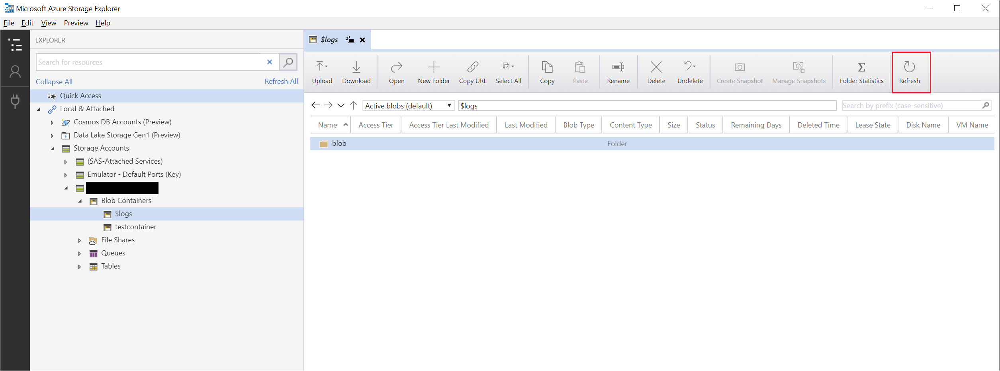
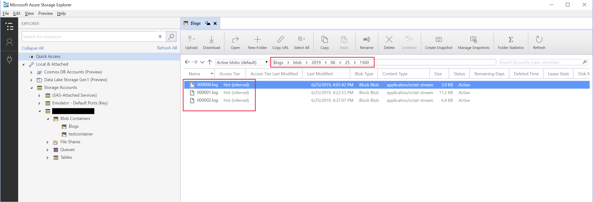

In the Customer Portal scenario, you've decided you need more detailed information on the operations in progress rather than just the metrics that summarize performance. In this exercise, you'll enable logging for your storage account, rerun the sample application, and then download the log data that is generated.

## Enable Storage Analytics logging

1. In the [Azure portal](https://portal.azure.com/learn.docs.microsoft.com?azure-portal=true), navigate to the storage account that you created in the previous exercise.

1. In the menu pane, under **Monitoring (classic)**, select **Diagnostic settings (classic)**.

1. Verify that **Status** is still set to **On**.

1. On the **Blob properties** tab, set **Logging version** to **2.0**, select **Read**, **Write**, **Delete**, and **Delete data**. Set the retention period to seven days.

1. Select **Save**.

    

1. Switch to the Cloud Shell running PowerShell.

1. To verify that logging for blob storage has been enabled successfully, run the following command. Specify your storage account name, and account key where indicated.

    ```powershell
    $context = New-AzureStorageContext -StorageAccountName <your-storage-account-name> -StorageAccountKey <your-storage-account-key>

    Get-AzureStorageServiceLoggingProperty -Context $context -ServiceType Blob
    ```

    The output should look like this.

    ```Text
    Version              LoggingOperations              RetentionDays
    -------              -----------------              -------------
    2.0                  All                            7
    ```

## Run the sample app

1. Move to the **storageapps/StorageTest** folder. This folder contains the code for the sample app that you ran in the previous exercise. The app simulates uploading and downloading files to and from blob storage.

    ```powershell
    cd $HOME/storageapps/StorageTest
    ```

1. Run the sample app as follows. Replace *\<your connection string\>* with the connection string for your storage account. Ensure that you surround your connection string with double-quotes.

    ```powershell
    dotnet run "<your connection string>" testcontainer
    ```

## Download log data

1. On your desktop, return to Azure Storage Explorer.

1. Under **Storage Accounts**, under your storage account, expand **Blob Containers**, and you should see a container named **\$logs**, with a folder named **blob**. If this container doesn't appear, wait for a few minutes while Storage Analytics processes the log data, and then select **Refresh** in the toolbar.

    [](../media/6-storage-explorer-logs.png#lightbox)
  
1. Select **blob** in the detail panel, and then navigate through the folder structure to the folder containing the latest set of log files. You should see a set of files similar to the files in the following example image.

    [](../media/6-storage-explorer-log-files.png#lightbox)
