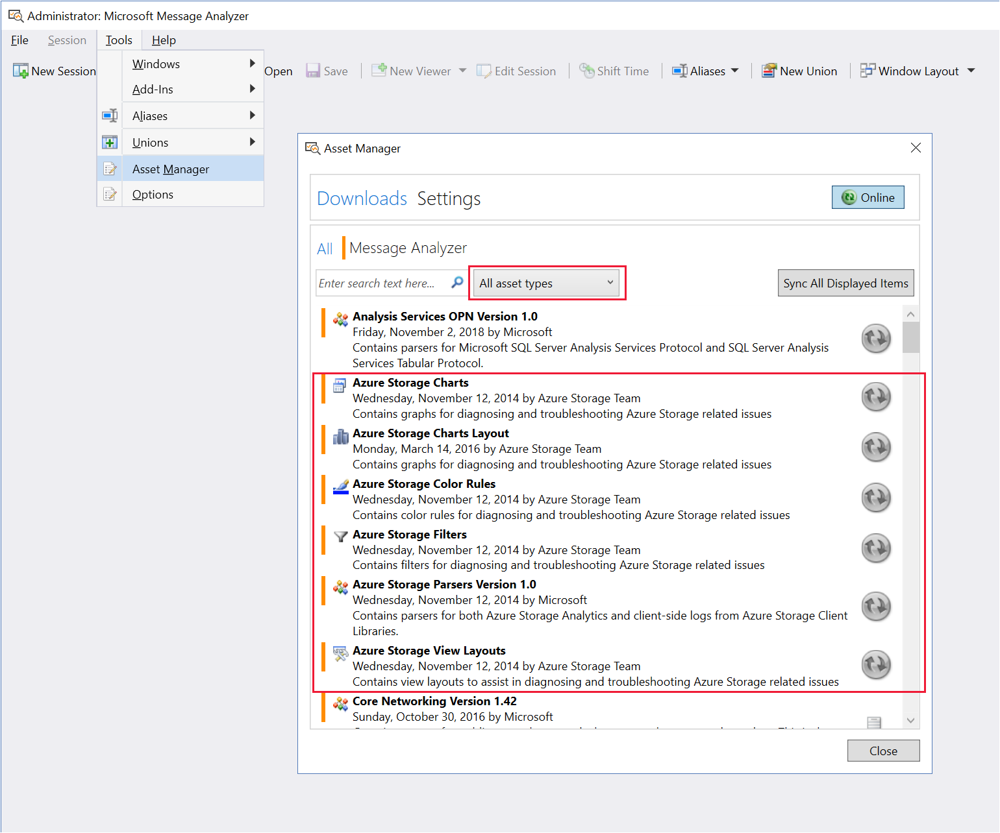
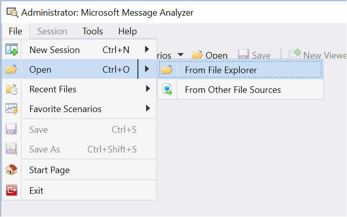
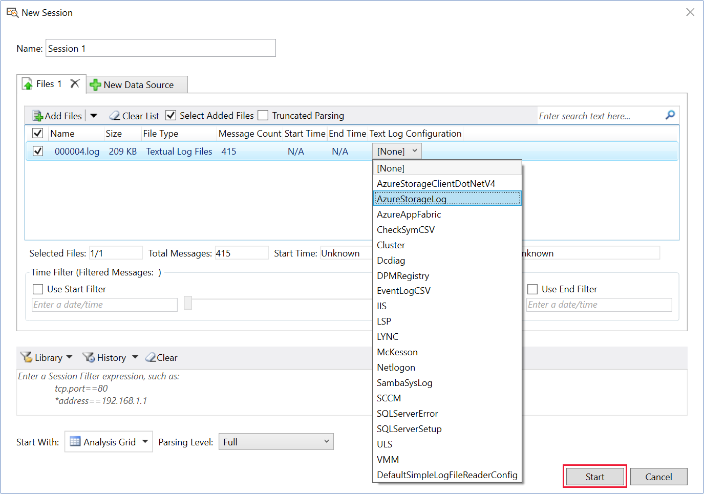
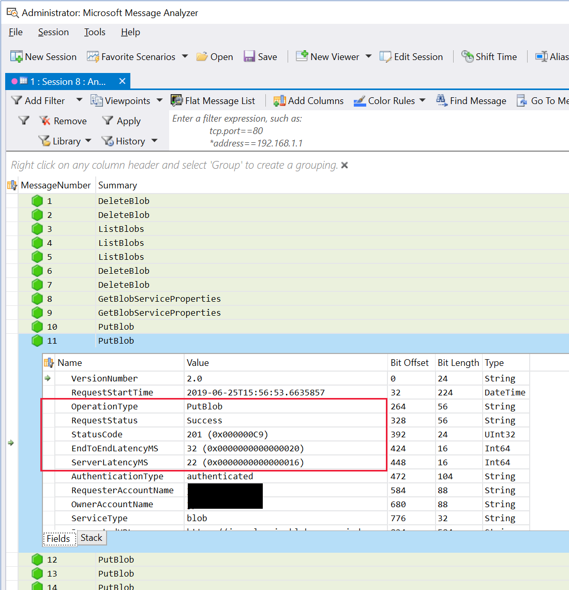
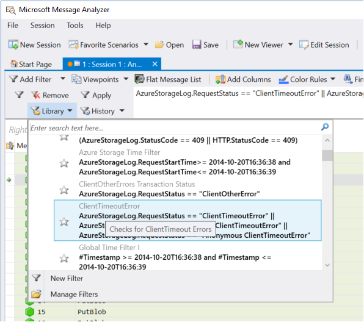
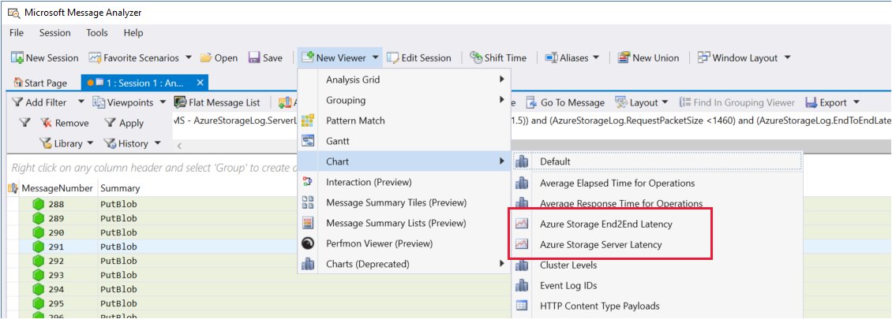
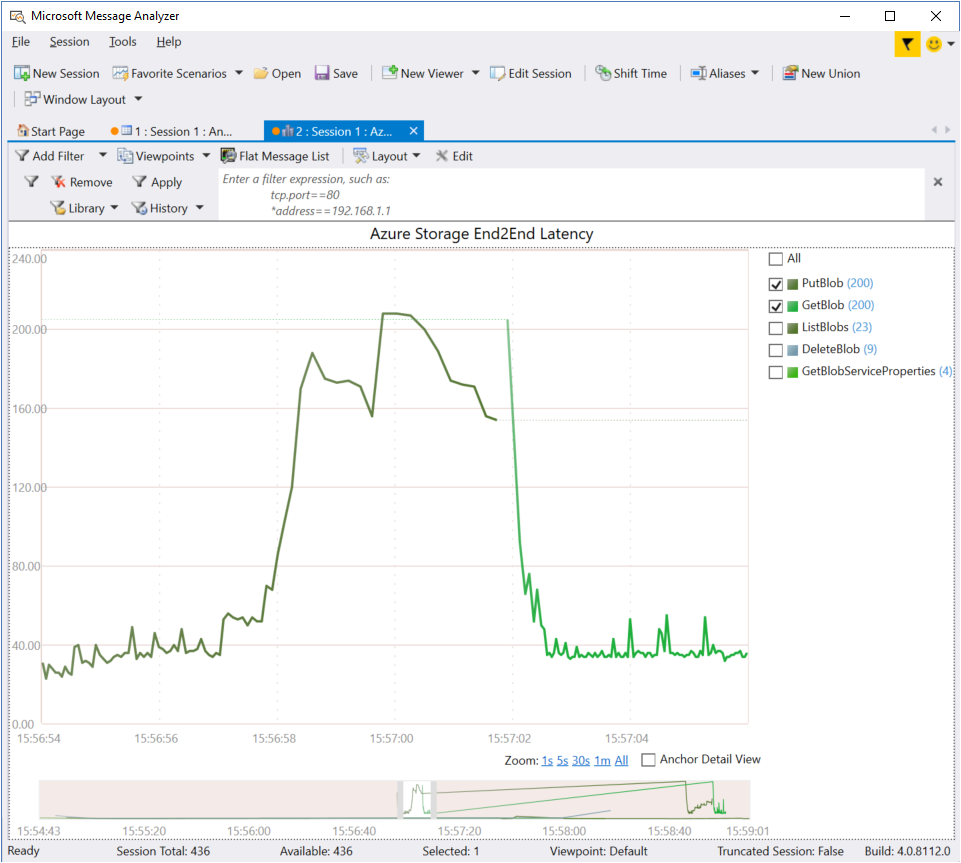
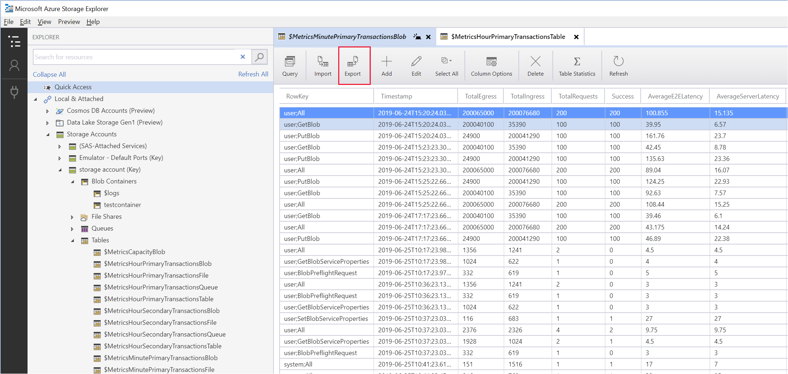
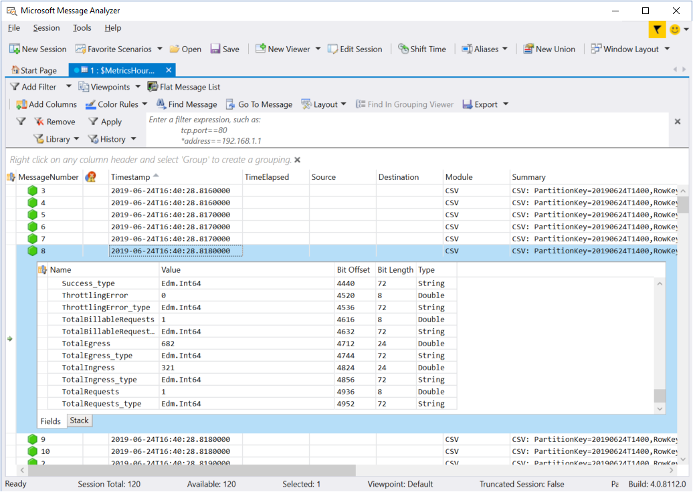

There are a number of ways that you might become aware of a problem or issue in your applications, including:

- A failure that causes an application to crash or to stop working.
- Significant changes from baseline values in your metrics that are being monitored.
- Reports from your application that some operation didn't complete as expected, or that a feature isn't working.
- Errors generated within an application that appear in the log files, or through some other notification method.

In a production environment, the issues related to Azure storage services typically fall into one of the following broad categories:

- An application has a performance issue, reported either by your users, or observed in changes in the performance metrics.
- An application is causing an error, reported either by your users, or noticed by changes in one of the error count metrics.
- There’s a problem with the Azure Storage infrastructure in one or more regions.

The key task in resolving these problems is understanding the data that the metrics and diagnostic logs contain, and how they relate back to the way in which your application runs.

In the Customer Portal scenario, the metrics show a decreasing percent success rate over time when users run the application to upload and download files held in blob storage. The percent success rate metric tracks operations that return an HTTP status code that is greater than 299. The Customer Portal is consistently returning errors in the HTTP 400 range when files are transferred to or from the portal. You have obtained metrics and log data using the Azure Storage Analysis service. You want to analyze this data to determine the cause of the problems the system has been experiencing.

In this unit, you'll learn how to use Microsoft Message Analyzer to examine the log files describing the operations performed by the sample application.

## Examine Storage Analytics logs

The diagnostic logs generated by the Azure Storage Analysis service contain data in a raw text format, which makes them difficult to read using a basic editor such as Notepad. The data in the log files are in a semi-colon-delimited format, and have a well-defined schema. If you understand this schema, you can parse the log data and make it more presentable. Additionally, tools such as Microsoft Message Analyzer can utilize custom parsers that process and display the data in a more meaningful way.

> [!NOTE]
> The schema used by the diagnostic logs is documented at [Log entry format 2.0](https://docs.microsoft.com/rest/api/storageservices/storage-analytics-log-format#log-entry-format-20)

### Download and configure Message Analyzer

Microsoft Message Analyzer can perform a number of tasks, including actively intercepting messages sent between an application and a service across a network. When working with Azure storage, Message Analyzer is best suited for examining log files and metrics downloaded *after the fact* rather than attempting to examine messages as they flow between a storage client application and the various Azure storage services.

You can download Message Analyzer from the [Microsoft Message Analyzer](https://www.microsoft.com/download/details.aspx?id=44226) page.

Message Analyzer is extensible through the use of *Assets*. An asset contains tools for parsing, filtering, and presenting the data for a given schema. Microsoft provides a set of assets specifically for examining storage metrics and log files. You can download and enable these assets from the **Tools** \> **Asset Manager** menu. Download the following assets:

- Azure Storage Charts.
- Azure Storage Charts Layout.
- Azure Storage Color Rules.
- Azure Storage Filters.
- Azure Storage Parsers Version 1.0.
- Azure Storage View Layouts.



### View Storage Analytics logs in Message Analyzer

You can download blob from the **\$logs** container using AzCopy, as described in the previous modules. You can import the data in a log file into Message Analyzer; on the **File** menu, click **Open**, select **From File Explorer**, navigate to the folder containing your log file, and select the file.



When the **New Session** dialog box appears, in the **Text Log Configuration** drop-down list box, select **AzureStorageLog**, and then click **Start**.



Message Analyzer will load the file and parse the log data. It will display the results on the screen, listing each operation that was recorded. You can click any operation to display the details. Possibly the most significant fields are the **OperationType**, **RequestStatus**, **StatusCode**, **EndToEndLatencyMS**, and **ServerLatencyMS**.



### Examine blob storage error responses

If the **RequestStatus** field indicates of a log record a failure, the **StatusCode** field will contain the HTTP response code of the error. If you're uploading and downloading files, you'll be primarily concerned with error responses for the blob service. These errors include:

- 401 (Unauthorized) and 403 (Forbidden). These errors arise if a client attempts to access your storage account without credentials, with invalid credentials, or with insufficient privileges. If you see a large number of these errors, your system may be under some form of brute-force attack.

- 404 (Not Found). This error typically occurs when a container or blob is not found, possibly because it has been deleted by another client before this request was processed. Not all HTTP 404 errors are bad. For example, if your application uses the **CreateIfNotExists** APIs when creating a container a blob, these APIs invoke an HTTP HEAD request to check for the existence of the container or blob. If there isn't match, the request returns an HTTP 404 error. The APIs then send an HTTP PUT request to create the container or blob.

- 409 (Conflict). This error often indicates that a blob or container already exists, but an application is attempting to create them again. This error can occur if an application attempts to create a blob with the same name as one that is subject to a delete request, but the delete operation hasn't yet completed. It can also occur if an application attempts to obtain a lease on a blob when another lease for that blob already exists. Applications frequently use blob leases to obtain a short-term lock on a blob for write or delete operations.

- 412 (Precondition Failed). The most common cause of this error is an attempt by an application to update a blob by specifying an ETag to detect whether the blob has been changed by another application since it was retrieved. Many applications use ETags rather than leases to implement optimistic concurrency.

A full list of error codes that can be raised by using blob storage is available at [Blob Service Error Codes](https://docs.microsoft.com/rest/api/storageservices/blob-service-error-codes)

### Filter data

The filter pane directly below the toolbar enables you to home in on specific operations and error conditions. The **Library** drop-down list includes a number of useful built-in filter expressions (and what these expressions do) that you can apply to your log data. For example, if you want to find all operations that have resulted in a client timeout error, you can select the following filter expression:

```Text
AzureStorageLog.RequestStatus == "ClientTimeoutError" ||
AzureStorageLog.RequestStatus == "SASClientTimeoutError" ||
AzureStorageLog.RequestStatus == "Anonymous ClientTimeoutError"
```



Another useful filter in the library concerns *Nagling* requests. If your application frequently uploads and downloads very small blobs, then this can have an impact on the overall throughput of your system; the latency of your requests can become disproportionately large compared to the volume of data involved. Blobs work best when handling large data items, and are not optimized for holding small items. The *Nagle warning* filter identifies operations on blobs that have a small size and a comparatively large latency:

```Text
((AzureStorageLog.EndToEndLatencyMS - AzureStorageLog.ServerLatencyMS) > (AzureStorageLog.ServerLatencyMS * 1.5)) and
 (AzureStorageLog.RequestPacketSize <1460) and
 (AzureStorageLog.EndToEndLatencyMS - AzureStorageLog.ServerLatencyMS >= 200)
```  

### Look for trends in performance

The Azure Storage assets for Message Analyzer include a pair of charts that you can use to view trends in end-to-end latency, and server latency, from the data in your log files. On the **New Viewer** menu, select **Chart**, and then click either **Azure Storage End2End Latency** or **Azure Storage Server Latency**.



You can filter the chart that is generated to display the latency for selected operations only, and zoom in to a given time period. The example below shows a sudden increase in end-to-end latency in **PutBlob** operations, although the period shown is very short. If you notice a trend in latency for specific operations over a longer period of time, it is worth cross-referencing this trend against the metrics obtained for your system. An increase in latency may be caused by a corresponding increase in requests, or it may be due to errors, possibly caused by contention (if applications are accessing the same blobs). There may be other causes; maybe clients are competing for network bandwidth in your organization. In this case, you should also examine the server latency. If the server latency remains flat, but end-to-end latency is growing, then the problem is more likely to be an issue outside of Azure storage.



## View Storage Analytics metrics

You can't retrieve the metrics data in the **\$logs** tables using AzCopy. However, the desktop version of Azure Storage Explorer provides the export command, which you can use to download metrics. The data is saved as a CSV file.



The structure of the metrics data is reasonably self-explanatory when you view metrics using a tool such as Azure Storage Explorer, as shown in the previous unit. 

> [!NOTE]
> You find find a description of the schema for the the **\$Metrics** tables at [Storage Analytics Metrics Table Schema (classic)](https://docs.microsoft.com/rest/api/storageservices/storage-analytics-metrics-table-schema). 

You can also examine Azure storage metrics using Message Analyzer; just open the CSV file. Message Analyzer doesn't provide a specific parser for Azure storage metrics, so the data is treated as a collection of rows containing CSV fields. This means that the data is presented in a rather basic format. However, if you click any row, you'll see a detailed view of the metrics from the **Summary** field in that row.




