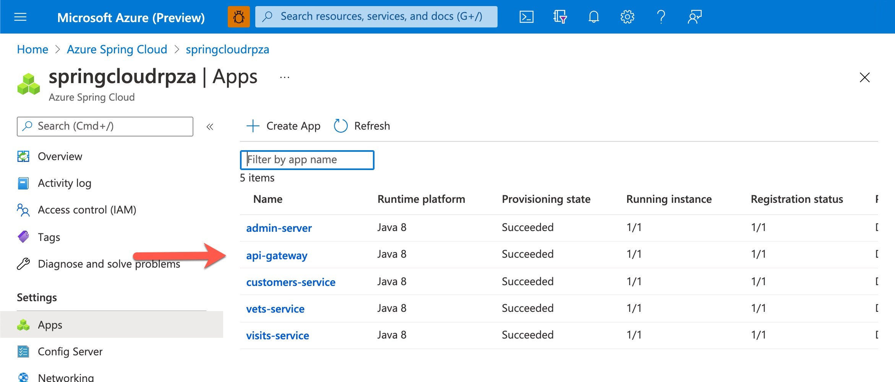
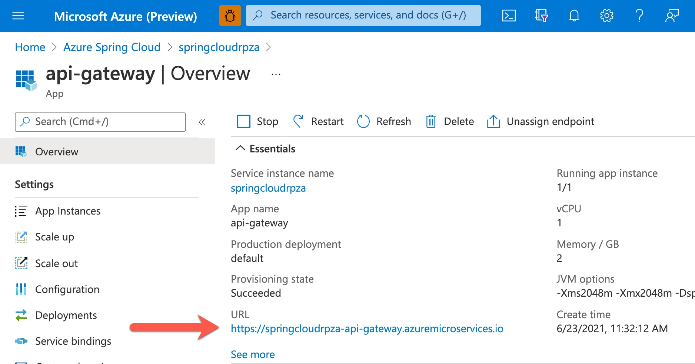

In this exercise, you'll configure a sample Application to be ready for monitoring. Later, you'll access the collected monitoring data and view it in the Azure portal.

## Introduction

In this exercise, you'll clone a GitHub repository and run a script that sets-up a sample Azure Spring Cloud architecture.
The script deploys existing well-known sample app PetClinic and is built around small independent services (a few hundred lines of code), running in their own JVM and communicating over HTTP via a REST API.

Azure Spring Cloud is a fully managed service for Spring Boot apps that lets you focus on building the apps that run your business without the hassle of managing infrastructure. Simply deploy your JARs or code and Azure Spring Cloud will automatically wire your apps with the Spring service runtime. Once deployed you can easily monitor application performance, fix errors, and rapidly improve applications.

## The sample application

The PetClinic application is decomposed into 4 core microservices. All of them are independently deployable applications organized by business domains.

- Customers service: Contains general user input logic and validation including pets and owners information (Name, Address, City, Telephone).
- Visits service: Stores and shows visits information for each pets' comments.
- Vets service: Stores and shows Veterinarians' information, including names and specialties.
- API Gateway: The API Gateway is a single entry point into the system, used to handle requests and route them to an appropriate service or to invoke multiple services, and aggregate the results. The three core services expose an external API to client. In real-world systems, the number of functions can grow very quickly with system complexity. Hundreds of services might be involved in rendering of one complex webpage.

## Setup the  sample application

Open https://shell.azure.com and run the following to clone the sample repository and open the Monaco code editor:

   ```bash
   git clone https://github.com/roryp/azure-spring-cloud-reference-architecture.git
   cd petclinic
   code deployPetClinicApp.sh
   ```

## Setup and run the Setup script

When you run the above command, a window will pop up with the build in Monaco editor with the file deployPetClinicApp.sh opened.
"Edit the variables in the `deployPetClinicApp.sh` and customize the parameters for your environment

| Variable | Description |
|-|-|
| resource_group | Provide a new or existing resource group name |
| region | The Azure region you'll use. You can use `westeurope` by default, but we recommend that you use a region close to where you live and that also support Azure Spring Cloud. To see the full list of available regions, see the Summary unit at the end of this module |
| spring_cloud_service | Name of your Azure Spring Cloud instance |
| mysql_server_name | The name of your MySQL server. It should be unique across Azure |
| mysql_server_admin_name | Username for the MySQL Administrator. The admin name can't be "azure_superuser", "admin", "administrator", "root", "guest, or "public" |
| mysql_server_admin_password | A new password for the server admin user. The password must be 8 to 128 characters long and contain a combination of uppercase or lowercase letters, numbers, and non-alphanumeric characters (!, $, #, %, and so on).|

## Run the setup script

Next we will run the setup script. The script takes 15-30 minutes to run and includes the creation of an Azure spring Cloud and a MySQL instance to set up the environment for this module's exercises. This sample script also populates some sample data for the monitoring logs, traces, and metrics.

Open Azure Cloud Shell, and run the shell script. Leave the browser window and Azure Cloud Shell open while running. Store the URL it returns as the public endpoint for your environment:

```bash
sh deployPetClinicApp.sh
```

## Test the application

The Navigate to the URL provided by the previous command to open the Pet Clinic microservice application.

> [!TIP]
> Access the app gateway and customers service from a browser with the Public Url in the format of "https://> <your-app>-api-gateway.azuremicroservices.io".

Verify your apps are installed and registered via the Azure Portal.

- Open the Azure Portal
- Select "Azure Spring Cloud" from the list of Azure services
- Select your Azure Spring Cloud instance
- On the right hand side select "Apps" under settings
- Verify all the apps are running and registered



- On the left hand side select the "api-gateway" app
- The URL for your app is listed on the left hand side properties as "URL"



Next, navigate to the "Owners" tab and select "Find all owners".
Confirm your sample app is up and running, populated with data and now ready for you to explore.


## Next steps

In the next exercise, you'll explore logging for your sample application.
