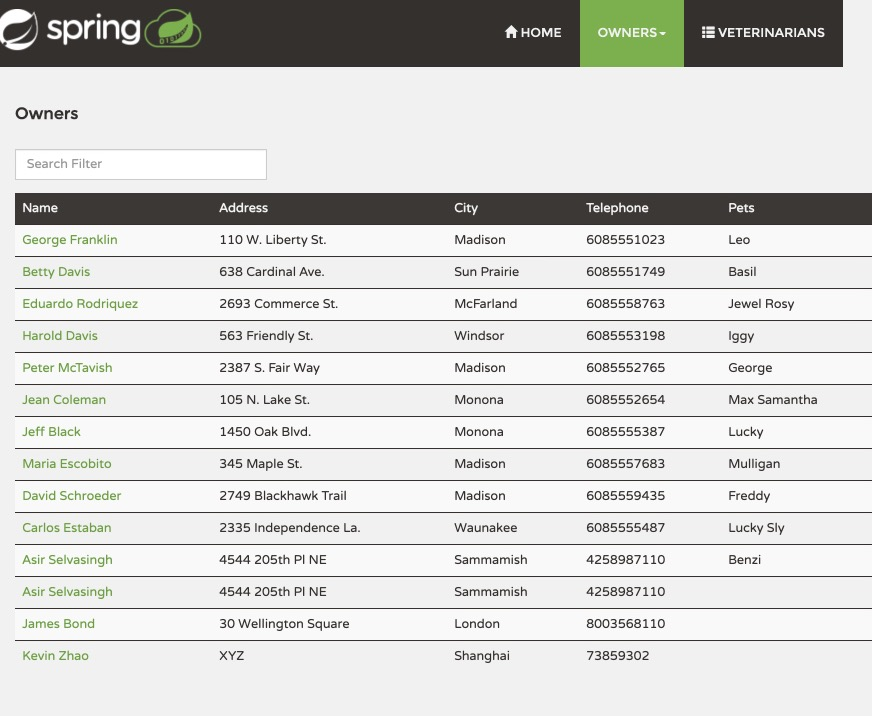

In this exercise, you'll configure a sample Application to be ready for monitoring. Later, you'll access the collected monitoring data and view it in the Azure portal.

## Access the sample application

In this exercise, you'll clone a GitHub repository that contains all the code for Monitoring.

On the Azure portal, open https://shell.azure.com and run the following to clone the sample repository and open the Monaco code editor:

   ```bash
   git clone https://github.com/roryp/azure-spring-cloud-reference-architecture.git
   cd petclinic
   code .
   ```

## Setup and run the Setup script

Edit the `deployPetClinicApp.sh` and customize the below parameters for your environment

| Variable | Description |
|-|-|
| resource_group | Provide a new or existing resource group name |
| region | The Azure region you'll use. You can use `westeurope` by default, but we recommend that you use a region close to where you live. To see the full list of available regions, enter `az account list-locations` |
| spring_cloud_service | Name of your Azure Spring Cloud instance |
| mysql_server_name | The name of your MySQL server. It should be unique across Azure |
| mysql_server_admin_name | Username for the MySQL Administrator. The admin name can't be "azure_superuser", "admin", "administrator", "root", "guest, or "public" |
| mysql_server_admin_password | A new password for the server admin user. The password must be 8 to 128 characters long and contain a combination of uppercase or lowercase letters, numbers, and non-alphanumeric characters (!, $, #, %, and so on).|

## Run the setup script

The below script takes 20-30 minutes to run and includes the creation of an Azure spring Cloud and a MySQL instance that will incur a nominal cost. Open the Azure Cloud Shell and Run the following script to setup the environment for this modules exercises:

```bash
sh deployPetClinicApp.sh
```


## Test the application

Navigate to the URL provided by the previous command to open the Pet Clinic microservice application.

Next, navigate to the "Owners" tab, Find all owners and add some sample owner, pet and visit data to ensure the monitoring logs, traces and metrics are populated.



## Next steps

In the next exercise, you'll explore logging for your sample application.
