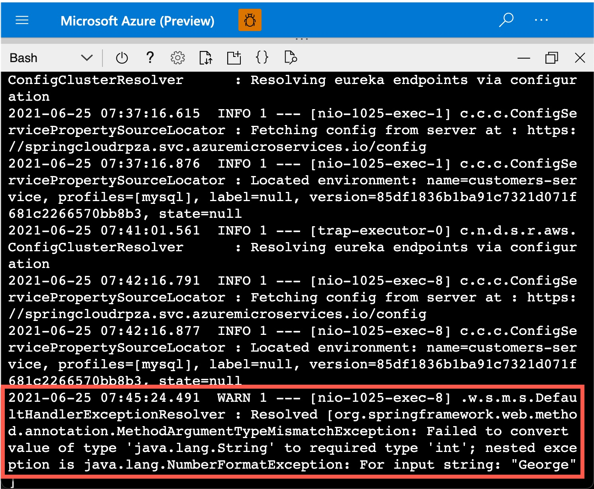

In this exercise, we look at logging and Log Analytics.

## Streaming logs exercise

### Tail log

You can view the log of the application instance with the following command:

```azurecli
az spring-cloud app logs --name customers-service --resource-group <resource group name> --service <service instance name>
```

This command will return logs:

```output
...
2021-04-23 09:13:59.516  INFO [customers-service,,,] 1 --- [           main] o.s.s.p.c.CustomersServiceApplication    : Started CustomersServiceApplication in 48.032 seconds (JVM running for 79.933)
2021-04-23 09:14:05.385  INFO [customers-service,,,] 1 --- [nio-1025-exec-2] o.a.c.c.C.[Tomcat].[localhost].[/]       : Initializing Spring DispatcherServlet 'dispatcherServlet'
2021-04-23 09:14:05.385  INFO [customers-service,,,] 1 --- [nio-1025-exec-2] o.s.web.servlet.DispatcherServlet        : Initializing Servlet 'dispatcherServlet'
2021-04-23 09:14:05.410  INFO [customers-service,,,] 1 --- [nio-1025-exec-2] o.s.web.servlet.DispatcherServlet        : Completed initialization in 25 ms
...
```

### Continuously stream new logs

By default, `az spring-cloud app log tail` prints only existing logs streamed to the app console and then exits. If you want to stream new logs, add `-f` (`--follow`):  

```azurecli
az spring-cloud app logs --name customers-service --resource-group <resource group name> --service <service instance name> -f
```

## Errors and Warnings exercise

We'll create an error to show the value of how developers can quickly see it, debug and find a root cause.

1. Open the customers-service and follow the logs, in shell.azure.com or your local environment:

```azurecli
az spring-cloud app logs --name customers-service --resource-group <resource group name> --service <service instance name> -f
```

2. Next, in a web browser, trigger a warning with the following command:
(Replace the "<spring-cloud-name"> with the name of your spring cloud instance)

```html
https://<spring-cloud-name>-api-gateway.azuremicroservices.io/api/customer/owners/George
```

The URL triggers a warning as the variable "George" cannot be cast into a number to search for a customer.
You will now be able to see a warning similar to the below screen:



3. To resolve this warning, in a web browser, rather search for the customer using the customer ID:

```html
https://<spring-cloud-name>-api-gateway.azuremicroservices.io/api/customer/owners/1
```

In the next unit, we'll discuss Application Performance Monitoring (APM).
